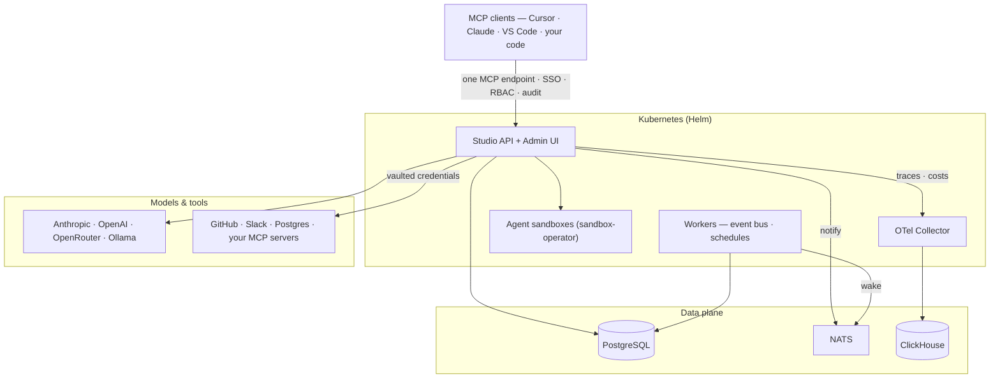

<h1 align="center">deco Studio</h1>

<p align="center">
<em>Open-source · TypeScript-first · Deploy anywhere</em><br/><br/>
<b>Open-source private AI workspace for organizations.</b>
</p>

<p align="center">
<a href="https://docs.decocms.com/">Docs</a> ·
<a href="https://decocms.com/discord">Discord</a> ·
<a href="https://decocms.com/studio">decocms.com/studio</a>
</p>

> **TL;DR:** Your team needs a secure internal vibecoding platform. You just found it. Configure agents with team context. Connect private MCPs once — share capabilities, not credentials. Keep the model layer interchangeable. Roll out across the organization with SSO, RBAC, audit logs, and cost controls — all through one MCP endpoint. Local-first. Self-host or use the cloud.

---

## What is deco Studio?

Studio packages the infrastructure behind an internal AI rollout: model routing, MCP authentication, agent configuration, SSO, RBAC, audit logs, and usage accounting. Your teams get chat. You keep control.

Under the hood it's one control plane for your AI agents — one MCP endpoint for all your agents, tools, and models. Agents package context, tools, and policy into something you publish to the organization. Connections give them governed access to your systems — GitHub, Slack, Postgres, Sentry, anything that speaks MCP — with tokens stored in an encrypted vault. Models stay interchangeable: OpenRouter or direct providers, chosen per agent and per tool.

Start with one team. Standardize approved models, tools, and context. Expand across the organization without copying secrets or rebuilding the platform. Install locally and it stays private; sync to the cloud for remote access, team roles, and shared billing.

```
┌─────────────────────────────────────────────────────────────────┐
│                             Clients                             │
│            Cursor · Claude · VS Code · Custom Agents            │
└───────────────────────────┬─────────────────────────────────────┘
                            │
                            ▼
┌─────────────────────────────────────────────────────────────────┐
│                           DECO STUDIO                           │
│      Agents · Connections · Models · Vault · Observability      │
└───────────────────────────┬─────────────────────────────────────┘
                            │
                            ▼
┌─────────────────────────────────────────────────────────────────┐
│                       Tools & MCP Servers                       │
│       GitHub · Slack · Postgres · OpenRouter · Your APIs        │
└─────────────────────────────────────────────────────────────────┘
```

---

## Quick Start

```bash
bunx decostudio
```

Or clone and run from source:

```bash
git clone https://github.com/decocms/studio.git
bun install
bun run dev
```

> runs at [http://localhost:4000](http://localhost:4000) (client) with API routes proxied to the Bun server

---

## What you get

### Agents

Package context, tools, and policy into an agent. Define instructions, add skills and files, grant approved MCP access, choose a model policy, then publish the agent to the organization. Each agent is its own MCP endpoint — callable from Cursor, Claude Desktop, your own code, or another agent. Agents compose, and every action is tracked with cost attribution.

### Connections

Connect private systems once, securely. Register MCP servers at the organization level through a web UI with one-click OAuth — no JSON configs. Tokens live in the encrypted vault, and you grant tool-level access by organization, role, or agent. Share MCP capabilities — not credentials.

As tool surfaces grow, Studio exposes **Virtual MCPs** — one endpoint, different strategies for which tools to surface:

- **Full-context:** expose everything (simple, deterministic, good for small toolsets)
- **Smart selection:** narrow the toolset before execution
- **Code execution:** load tools on demand in a sandbox

### Models

Keep the AI layer interchangeable. Use OpenRouter or connect Anthropic, OpenAI, Google, or any compatible provider directly — the best model for each agent and tool, behind one router. For coding work, engineers can link their own Claude Code or Codex session and use the subscription already authenticated on their machine.

### Projects

Projects bring agents and connections together around a goal. The project's UI adapts to what's inside — add a content agent and a CMS connection, the sidebar shows content management; add an analytics agent and a database, it shows dashboards and queries. The UI you see is the UI that's relevant for operating that project.

### Observability

Account for every model and tool call. Trace the user, agent, model, tools, latency, errors, tokens, and cost for every thread. Break usage down by agent, connection, organization, or teammate — one dashboard.

### From your desktop to your org

| | |
|---|---|
| **Local** | `bunx decostudio` on your desktop. Embedded PostgreSQL. Private. |
| **Cloud** | Log in to studio.decocms.com. Control local projects from any browser. |
| **Team** | Invite people. SSO and role-based access. Shared connections. Cost attribution. |
| **Enterprise** | Self-hosted. Organization isolation, tool-scoped API keys, audit logs. Your infra, your rules. |

---

## Core Capabilities

| Capability | What it does |
|---|---|
| **Agents** | Package context, tools, and policy into publishable agents with cost attribution |
| **Connections** | Route MCP traffic through one governed endpoint with auth, proxy, and encrypted token vault |
| **Models** | Interchangeable AI layer — OpenRouter or direct providers, model policy per agent |
| **Projects** | Organize agents and connections around goals with an adaptive UI |
| **Virtual MCPs** | Compose and expose governed toolsets as new MCP endpoints |
| **Observability** | Traces, costs, errors, and latency per user, agent, and connection — one dashboard |
| **Access Control** | SSO + RBAC via Better Auth — OAuth 2.1 and tool-scoped API keys per workspace/project |
| **Multi-tenancy** | Organization/project isolation for config, credentials, policies, and audit logs |
| **Event Bus** | Pub/sub between connections with scheduled/cron delivery and at-least-once guarantees |
| **Bindings** | Capability contracts so tools target interfaces, not specific implementations |
| **Store** | Discover and install agents, tools, and templates |

---

## Define Tools

Type-safe, audited, observable, callable via MCP.

```ts
import { z } from "zod";
import { defineTool } from "~/core/define-tool";

export const CONNECTION_CREATE = defineTool({
  name: "CONNECTION_CREATE",
  description: "Create a new MCP connection",
  inputSchema: z.object({
    name: z.string(),
    connection: z.object({
      type: z.enum(["HTTP", "SSE", "WebSocket"]),
      url: z.string().url(),
      token: z.string().optional(),
    }),
  }),
  outputSchema: z.object({
    id: z.string(),
    scope: z.enum(["workspace", "project"]),
  }),
  handler: async (input, ctx) => {
    await ctx.access.check();
    const conn = await ctx.storage.connections.create({
      projectId: ctx.project?.id ?? null,
      ...input,
      createdById: ctx.auth.user!.id,
    });
    return { id: conn.id, scope: conn.projectId ? "project" : "workspace" };
  },
});
```

Every tool call gets input/output validation, access control, audit logging, and OpenTelemetry traces automatically.

---

## Project Structure

```
├── apps/
│   ├── mesh/                # Full-stack deco Studio (Hono API + Vite/React)
│   │   ├── src/
│   │   │   ├── api/         # Hono HTTP + MCP proxy routes
│   │   │   ├── auth/        # Better Auth (OAuth + API keys)
│   │   │   ├── core/        # StudioContext, AccessControl, defineTool
│   │   │   ├── tools/       # Built-in MCP management tools
│   │   │   ├── storage/     # Kysely DB adapters
│   │   │   ├── event-bus/   # Pub/sub event delivery system
│   │   │   ├── encryption/  # Token vault & credential management
│   │   │   ├── observability/  # OpenTelemetry tracing & metrics
│   │   │   └── web/         # React 19 admin UI
│   │   └── migrations/      # Kysely database migrations
│   └── docs/                # Astro documentation site
│
└── packages/
    ├── bindings/            # Core MCP bindings and connection abstractions
    ├── runtime/             # MCP proxy, OAuth, and runtime utilities
    ├── ui/                  # Shared React components (shadcn-based)
    ├── std/                 # Isomorphic async primitives (sleep, retry, backoff)
    ├── sandbox/             # Isolated per-agent containerized environments
    ├── mesh-sdk/            # SDK for external apps integrating with Studio
    └── create-deco/         # Project scaffolding (npm create deco)
```

---

## Development

```bash
bun install          # Install dependencies
bun run dev          # Run dev server (client + API)
bun test             # Run tests
bun run check        # Type check
bun run lint         # Lint
bun run fmt          # Format
```

### Studio commands (from `apps/mesh/`)

```bash
bun run dev:client     # Vite dev server (port 4000)
bun run dev:server     # Hono server with hot reload
bun run migrate        # Run database migrations
```

### Worktrees

`dev:worktree` routes `http://<WORKTREE_SLUG>.localhost` via Caddy — useful for running multiple workspaces without port conflicts.

```bash
# One-time setup
brew install caddy && caddy start

# Start
WORKTREE_SLUG=my-feature bun run dev:worktree

# Conductor adapter (sets WORKTREE_SLUG from CONDUCTOR_WORKSPACE_NAME)
bun run dev:conductor
```

---

## Deploy Anywhere

```bash
# Docker (embedded PostgreSQL)
docker compose -f deploy/docker-compose/docker-compose.yml up

# Docker (PostgreSQL)
docker compose -f deploy/docker-compose/docker-compose.postgres.yml up

# Bun
bun run build:client && bun run build:server && bun run start

# Kubernetes (Helm)
helm install deco-studio oci://ghcr.io/decocms/chart-deco-studio --version <version> -n deco-studio --create-namespace
```

No vendor lock-in. Runs on Docker, Kubernetes, AWS, GCP, or local runtimes.

### What you need to run it

| Tier | Footprint |
|---|---|
| **Laptop** | Nothing. One process, embedded PostgreSQL. |
| **Docker** | The published image. Bring PostgreSQL or use the embedded one. |
| **Production (Helm)** | PostgreSQL you bring, plus optional NATS (event bus wake-up), ClickHouse + OTel Collector (traces and analytics), and the sandbox operator (isolated agent environments on Kubernetes). Your identity provider, your model keys, your storage. |

### Production topology



Every box is optional except Studio and PostgreSQL — start small, turn on the rest as the rollout grows.

---

## Tech Stack

| Layer | Tech |
|---|---|
| Runtime | Bun / Node |
| Language | TypeScript + Zod |
| Framework | Hono (API) + Vite + React 19 |
| Database | Kysely → embedded PostgreSQL / PostgreSQL |
| Auth | Better Auth (OAuth 2.1 + API keys) |
| Observability | OpenTelemetry |
| UI | React 19 + Tailwind v4 + shadcn |
| Protocol | Model Context Protocol (MCP) |

---

## Roadmap

- [ ] Agent marketplace — discover, hire, and compose agents
- [ ] Declarative planning engine
- [ ] Cost analytics and spend caps
- [ ] Remote access from any browser
- [ ] Live tracing debugger
- [ ] Workflow orchestration with guardrails

---

## License

**MIT** — see [LICENSE.md](./LICENSE.md).

Questions? [builders@decocms.com](mailto:builders@decocms.com)

---

## Contributing

```bash
bun run fmt      # Format
bun run lint     # Lint
bun test         # Test
```

See `AGENTS.md` for coding guidelines.

---

<div align="center">
  <sub>Made with care by the <a href="https://decocms.com">deco</a> community</sub>
</div>
