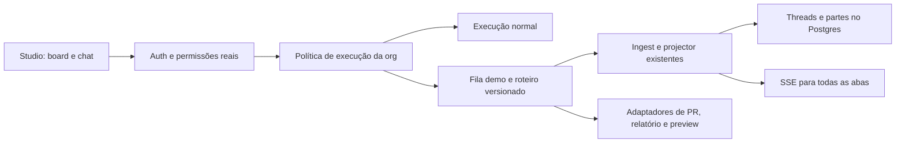

# Proposta: organização de demonstração restaurável

Status: proposta para revisão, sem alteração de runtime ou de produção. Pesquisa de código sobre o commit `e3f6bd963`, complementada por consultas ao banco de produção em 18/09/2026. Os nomes de serviços e contratos novos abaixo são propostas, não APIs disponíveis.

A recomendação é transformar a org de demonstração em um ambiente com **dados persistidos e execução roteirizada no servidor**. O vendedor usa o Studio normal, altera tarefas, acompanha o chat, revisa resultados e abre previews. Um botão "Preparar demonstração" restaura um cenário versionado. Recarregar a página mantém as mudanças da apresentação.

O caminho principal não chama modelos, não provisiona sandbox e não depende de GitHub, OAuth ou serviços de diagnóstico. Essas dependências recebem respostas e artefatos preparados. Autenticação, permissões, banco, API, filas, persistência do chat e atualização entre abas continuam reais.

"Funcionar 100%" aqui significa retirar a variabilidade da execução durante o roteiro coberto. Uma indisponibilidade do próprio Studio, banco, NATS ou rede ainda afeta a apresentação. As metas abaixo são critérios de entrega, não medições já obtidas.

## O que a pesquisa conseguiu verificar

### Fonte e recorte dos dados reais

Consultei o banco de produção pelo MCP `studio-pg-prd` da instalação global do Claude Code. A conexão confirmou `transaction_read_only = on`. As consultas foram limitadas à org de demo e ao schema necessário; não executei tools do produto nem alterei a automação existente.

A janela histórica principal é **11/09/2026 17:38:52 UTC até 18/09/2026 17:38:52 UTC**, com início inclusivo e fim exclusivo. O retrato do board foi consultado às 17:39:35 UTC de 18/09. Consultas adicionais de configuração e mensagens foram feitas na mesma investigação, sem uma única transação compartilhada entre chamadas MCP. Não é um backup consistente nem uma medição de todas as apresentações.

As [consultas de evidência](demo-organization-production-evidence.sql) identificam as fontes E1–E7 usadas abaixo. Os agregados e as descrições foram sanitizados para este repositório público. Não foram publicados IDs de usuários, cards ou runs, prompts completos, nomes de clientes, repositórios externos ou credenciais. Os exemplos do futuro manifesto continuam sintéticos.

### O reset já existe, mas deixa o estado acumular

Existe uma automação ativa de reset desde agosto, agendada para `0 9 * * *`. Os disparos observados ocorrem às 09:00 UTC, 06:00 em São Paulo. Ela usa um agente para comparar o repositório com um commit de referência, decidir quais diferenças preservar, abrir e mesclar PRs de restauração e ajustar cards. Se não encontrar um PR aberto para a busca, o roteiro pede uma nova execução do agente. **O reset depende das mesmas partes variáveis que a apresentação.**

O prompt contém 28 IDs de cards. Um já não existe e 42 cards não dispensados ficam fora dessa lista, conforme E2. O próprio prompt manda preservar cards extras e não limpar threads, comentários ou PRs adquiridos pelos cards de backlog. Logo, o acúmulo não é apenas uma hipótese de falha do scheduler: o contrato atual de reset permite esse estado.

| Retrato persistido, E1 e E7 | Quantidade |
| --- | --- |
| Cards não dispensados | 69: 44 em triagem, 15 em revisão, 8 concluídos e 2 arquivados |
| Cards dispensados ainda retidos | 137, separados dos 69 acima |
| Chats no histórico da org | 719: 639 concluídos, 77 com status de falha, 2 em execução e 1 aguardando ação |
| Chats ainda marcados em execução | Ambos com último `updated_at` em 05/08; isso é estado antigo, não prova de workers ainda ativos |
| Automações configuradas | Uma, o reset diário; não apareceu uma automação comercial separada |

Em 18/09, o reset chegou ao estado `completed`, mas uma chamada persistida de `TASK_BOARD_ITEM_UPDATE` terminou em `output-error` porque o card referenciado não existia. O agente depois escolheu outro card. Isso confirma que **concluir o job não prova que o cenário corresponde ao manifesto**. O relato final de 16/09 também descreve uma reversão indevida de mudança legítima seguida de correção; esse relato não foi validado contra o Git e não é tratado como prova independente de alteração do repositório.

Também existem scripts locais anteriores de snapshot/reset e edição do diagnóstico. Eles não cobrem integralmente threads, partes modificadas, workers, workspace e preview. Sua presença não prova uso atual; a automação descrita acima foi verificada diretamente no banco.

### O que está demorando na amostra

Cruzei `threads` com `dbos.workflow_status` pelo ID da thread nos workflows `hostedHarnessWorkflow`, sem confundir gate, projector e executor como três execuções diferentes. E3 usa os timestamps do DBOS: espera = início menos criação; execução = conclusão menos início. A janela contém 16 desses workflows, todos `SUCCESS`.

| Tipo de execução | Amostra | Menor duração | Maior duração | Maior espera na fila do executor |
| --- | --- | --- | --- | --- |
| Implementação de tarefa | 5 | 1m09s | 14m33s | 370 ms |
| Revisão | 4 | 1m51s | 5m40s | 281 ms |
| Reset diário | 7 | 3m49s | 31m31s | 755 ms |

Esses tempos incluem o trabalho dentro do executor, não apenas o modelo. O DBOS registra uma step `runHostedHarness` para cada um desses 16 workflows, sem separar preparo de sandbox, modelo e ferramentas nessa tabela. **A fila desse executor não explica os minutos de espera observados; a contribuição exata do cold start ainda não foi medida.** Não usar essa amostra pequena para prometer ausência de congestionamento futuro.

Os 16 chats correspondentes têm uma mensagem de usuário cada. Duas outras threads criadas na janela estão vazias e foram excluídas da contagem de execução. Nenhuma dessas 18 threads estava em `failed` no recorte consultado. Há, porém, 18 partes de ferramenta `output-error` persistidas na janela, distribuídas por sete dos 16 chats executados: seis erros em duas implementações, dez em três revisões e dois em dois resets, conforme E4. Incluem timeouts de testes de navegador, comandos que falharam, ferramenta indisponível e card inexistente. São falhas intermediárias, não 18 demos fracassadas; o status terminal esconde esse atrito.

`threads.updated_at` não serve como duração: houve atualização horas depois do término real. Também não dá para medir primeiro token com `persisted_at`: nessa amostra, a primeira parte de assistente e a parte final de cada chat foram persistidas juntas. O `run_id` pode ser reutilizado em follow-ups; métricas futuras devem usar workflow/fence e instrumentar o primeiro evento recebido pelo cliente.

### Como o uso real muda os roteiros

E5 mostra nove cards criados na janela: dois manuais, seis de diagnóstico e um da automação. Os dois pedidos manuais tratam de **busca mais visível no cabeçalho** e **barra promocional colorida com contagem regressiva**. As outras implementações da amostra vieram de tarefas técnicas do diagnóstico, como metadados e headers. Há 34 eventos retidos de atividade em seis cards, segundo E6; esses eventos não identificam sessões de apresentação ou todos os cliques.

Ler as respostas finais também revelou uma fonte de demo sem resultado visível: uma tarefa de diagnóstico terminou sem alteração nem PR porque, segundo o agente, o problema já estava corrigido. Outra reconheceu que o diagnóstico estava desatualizado e trabalhou em um caso de fallback. Não refiz essas verificações no site real. A evidência é o conteúdo persistido da execução e justifica um requisito do cenário: **diagnóstico, baseline, tarefa, diff e preview precisam pertencer à mesma versão**. Não basta congelar o relatório e continuar alterando o site.

Com esses dados, priorizo busca, promoção visual e diagnóstico até correção. A única automação observada é manutenção, então demonstrar automações comerciais fica opcional. Ajustes por follow-up continuam possíveis em roteiro limitado, mas a amostra recente não os estabelece como uso principal.

A [consulta geral de diagnóstico](demo-organization-audit.sql) continua disponível. Ela foi validada em Postgres 16.14 temporário com as migrations reais e duas orgs sintéticas; a pesquisa de produção usou SELECTs equivalentes e os agregados de evidência via MCP. Dados excluídos não podem ser reconstruídos, atividade pode estar coalescida e os agregados mudam conforme a org continua sendo usada.

### Por que restaurar só o board não resolve

| Fato verificado no código | Consequência para a demo |
| --- | --- |
| [`TASK_BOARD_ITEM_LIST`](../src/tools/task-board/list.ts) chama `recoverStalledTasks` ao abrir o board. | Uma leitura pode disparar recuperação e alterar o cenário. |
| [`attachThreads`](../src/storage/task-board.ts) compõe cards com status, última resposta, mensagens, progresso e custo. | É preciso restaurar o histórico e as relações, além da tarefa. |
| [`enqueueSuperAgentForTask`](../src/tools/task-board/enqueue-super-agent.ts), [`enqueueAgentRunForTask`](../src/tools/task-board/enqueue-task-run.ts) e o [POST de chat](../src/api/routes/decopilot/routes.ts) resolvem quota, plano ou modelos antes do executor. | Mockar a resposta final do modelo ainda permite falha antes de começar. |
| [`prepareRun`](../src/api/routes/decopilot/dispatch-run.ts) resolve contexto e credenciais; [`SandboxDispatchClient`](../src/harnesses/sandbox-dispatch-client.ts) prepara workspace e provisiona sandbox. | O modo demo precisa desviar antes dessas dependências. Aquecer um sandbox sozinho não basta. |
| [`review-sweeper`](../src/tools/task-board/review-sweeper.ts), [`run-reactions`](../src/tools/task-board/run-reactions.ts), [automações de coluna](../src/tools/task-board/run-column-automation.ts) e [arquivamento](../src/tools/task-board/dbos-archive-sweep.ts) continuam trabalhando sem interação humana. | A política demo precisa alcançar leituras e consumidores assíncronos, não apenas o botão de executar. |
| [`prs-get`](../src/tools/task-board/prs-get.ts) busca informações externas mesmo quando existe um link de PR no banco. | Semear uma URL de PR não torna checks, revisão ou preview determinísticos. |
| [`TaskBoardStorage.delete`](../src/storage/task-board.ts) deixa threads vinculadas; cards de reports podem ser apenas dispensados. | Um loop de create/delete de tarefas não é um restaurador completo. |
| [Schedules de automação](../src/automations/dbos-sync.ts) também existem no DBOS. | Excluir triggers no Postgres não cancela, por si só, os schedules. |

## Experiência proposta para o vendedor

1. Entrar na org e clicar em "Preparar demonstração". O botão informa que as alterações da apresentação anterior serão removidas. O comando já autoriza esse reset; não exige terminal, SQL ou outra ferramenta.
2. O servidor restaura e verifica a versão publicada do cenário. Só mostra "Pronta para demonstrar" após validar board, históricos e artefatos.
3. Iniciar a apresentação. O vendedor pode navegar livremente pelos dados e usar as ações cobertas pelo roteiro. Uma identificação discreta "Ambiente de demonstração" deixa clara a natureza dos dados.
4. Delegar uma tarefa produz progresso real pela mesma infraestrutura de stream e persistência. A execução termina com resultado coerente, revisão e preview preparado.
5. Recarregar ou abrir outra aba mantém o estado. Encerrar a apresentação também mantém o resultado até o próximo reset explícito.

O estado inicial sugerido contém dez tarefas: duas em triagem, três a fazer, duas aguardando revisão humana, uma aprovada e duas concluídas. Os cards históricos têm chats completos, comentários, atividade e resultados relacionados. A contagem é uma escolha inicial ajustável no manifesto. Não haverá thread eternamente `in_progress` para decorar o board.

Três roteiros iniciais, com conteúdo sintético baseado nas categorias observadas:

| Roteiro | Ação e resultado |
| --- | --- |
| Busca visível no cabeçalho | Delegar uma tarefa manual, acompanhar execução e revisão, abrir diff e preview com busca funcional e sugestões sintéticas. Aprovar ativa a versão demonstrativa. |
| Barra promocional | Criar a tarefa por um exemplo de pedido, executar e comparar a barra colorida com contagem regressiva. Uma continuação suportada ajusta a mensagem da promoção. |
| Diagnóstico até correção | Abrir relatório curado, selecionar um problema de SEO ou acessibilidade que exista na baseline do cenário, executar e mostrar a correção correspondente. |

A agenda e seus horários futuros fazem parte do estado restaurável. Uma demonstração específica de automação pode ser acrescentada depois; ela não é um dos três roteiros principais identificados nesta pesquisa.

O cenário define exemplos de pedidos suportados e opções visíveis de continuação. O vínculo entre tarefa e roteiro usa uma chave explícita, sem um modelo para classificar intenções. Um pedido fora do roteiro recebe uma resposta clara sobre o que pode ser demonstrado. Não deve inventar uma entrega para texto arbitrário, nem cair automaticamente em execução real.

## O que continua real e o que é simulado

| Parte | Tratamento |
| --- | --- |
| Login, associação à org, RBAC e isolamento entre tenants | Reais, sem atalhos de autenticação. |
| Board, comentários, chats, navegação, aprovação e histórico | UI e APIs normais, com dados persistidos. |
| Run, ordenação de mensagens, cancelamento, reconexão e SSE | Contratos reais, recebendo eventos determinísticos. |
| Respostas do agente e resultados de ferramentas | Fixtures sintéticas versionadas, produzidas pelo executor demo. Exibir uma tool part não executa a ferramenta real. |
| Diagnóstico, métricas comerciais e resultado de conectar uma integração | Dados curados. A ação de conectar demonstra o fluxo sem solicitar credenciais ou executar OAuth externo. |
| PR, diff, checks e aprovação | Adaptador demo com estados coerentes. Abrir detalhes e aprovar não chama GitHub nem faz merge real. |
| Site e preview antes/depois | Artefatos estáticos pré-publicados, versionados e servidos por infraestrutura controlada. Aprovar muda a versão demonstrativa ativa. |
| Sandbox, terminal e edição arbitrária de código | Fora do roteiro garantido inicial. O fluxo coberto nunca chama `ensureSandbox`. |
| Billing, quota e envio de notificações externas | Não cobrar nem enviar. Métricas ilustrativas ficam identificadas como demo; eventos internos carregam classificação demo. |

Preview não pode ser uma URL temporária ou um deploy que precisa nascer durante a apresentação. Assets, imagens, fontes e scripts necessários também devem estar disponíveis sem serviços de terceiros. O botão que hoje abre um preview via sandbox precisa resolver a URL do artefato demo antes de tentar subir o ambiente.

O diagnóstico possui dados fora do banco do Studio. A versão demo deve consumir o relatório e seus assets pelo mesmo contrato de leitura, com fonte curada controlada. "Regenerar relatório" reproduz esse roteiro e não chama o serviço externo. Reset de Postgres sozinho não restaura esse conteúdo.

Se for necessário demonstrar terminal, construção real ou prompts livres, usar uma org de laboratório separada, com dependências reais. Ela não integra a promessa de previsibilidade do roteiro principal.

## Arquitetura de execução

### Seleção no servidor

Adicionar uma política interna consultada a partir do ID imutável da org. A habilitação exige um cadastro administrativo explícito da organização como demo e a flag default-off `demo_mode_enabled` em `OrgFlagsSchema`. A flag é gating de produto, não autorização. Usuários comuns não conseguem cadastrar uma org nem escapar da política alterando um parâmetro de request.

O cadastro persistido proposto, `demo_organizations`, guarda cenário/versão, geração, estado operacional, configuração do reset e a sessão de apresentação. Isso não cabe no bag de flags booleanas. `demo_reset_operations` guarda idempotência, auditoria e resultado dos resets, com FK e política de retenção. Ambos têm lifecycle de criação, atualização e remoção.

Desligar a flag de uma org cadastrada suspende as ações demo. **Não converte essa org automaticamente para execução real.** Ausência de manifesto, fixture ou artefato também bloqueia a ação com erro operacional claro. Orgs sem cadastro seguem o caminho atual.

Aplicar a política antes de quota e resolução de modelo na delegação e no chat, incluindo follow-ups, automações e reexecuções. Extrair do preparo atual as etapas comuns de autorização, identidade da thread, ordenação, cancelamento e stream. O executor demo não recebe vault, clientes de modelo, MCP ou provider de sandbox.

Manter o gate por thread, o fence e limites por org. A prioridade é retirar o trabalho externo do executor: a espera na fila dos 16 jobs medidos foi inferior a um segundo. Reservar capacidade ou separar a fila demo é uma proteção a validar sob carga, não a correção comprovada para a demora desta amostra. Uma fila separada tampouco isola CPU ou banco por si só.

Os eventos roteirizados passam pelo [`ingestRun`](../src/api/routes/decopilot/ingest-run.ts) e pelo [projector existente](../src/api/routes/decopilot/projector-workflow.ts). Identidade da execução, sequência e avanço do roteiro ficam persistidos. Um replay retoma o progresso confirmado, sem duplicar mensagens, comentários ou resultado. Tempos de apresentação usam primitivas duráveis dentro de workflows e `@decocms/shared/std` fora deles. Alterações de sequência nos workflows existentes exigem tratar a [versão DBOS](../src/dbos/workflow-version.ts).

### Fontes de alteração e efeitos externos

Centralizar a decisão em um serviço, em vez de espalhar comparações com o slug da demo. Os seguintes caminhos precisam consultar essa política:

- Execução e admissão de tarefas/chats; crons, eventos, webhooks e automações de coluna.
- Recuperação ao listar o board; review, retries, arquivamento e reconciliação de merged/deploy.
- Importação de reports e sincronização de Jira/GitHub, inclusive webhooks recebidos.
- Leitura de PR/checks/diff e ações de merge, publish, promoção e preview iniciadas por pessoas.
- Resolução de sandbox, conexão/OAuth, envio de notificações e contabilização de uso.

Cada caminho deve ou executar uma transição do roteiro, ou permanecer inerte, ou recusar explicitamente uma ação fora do escopo. Validar a política novamente na fronteira de efeitos externos cobre jobs já enfileirados e chamadas diretas de tools. Não usar apenas o bloqueio visual de botões.

A agenda inicial é demonstrativa. Os próximos horários aparecem na UI, mas os triggers demo não viram schedules de produção. "Executar agora" e o avanço de cenário passam pelo executor demo. O reconciler precisa respeitar essa diferença. Isso evita que tarefas futuras envelheçam e executem sozinhas durante a noite.

## Manifesto do cenário

Versionar um manifesto sintético `storefront-v1`, validado com Zod, separado dos IDs reais da org. Ele deve incluir:

- Cards, ordem, prioridade, tipo, responsável lógico, tags e datas relativas.
- Chats históricos completos, partes de mensagem, resultados, comentários e atividade.
- Relações task/thread/PR, revisão e versões de preview compatíveis entre si.
- Automações demonstrativas, suas últimas execuções e próximos horários.
- Relatório curado, referências de assets, roteiro de cada ação e pedidos suportados.

O manifesto também declara requisitos de configuração. Por exemplo, o card aprovado exige `delivery_lanes_enabled` para aparecer na UI normal. O provisionamento configura esses requisitos e `DEMO_STATUS`/reset os validam; a restauração não sobrescreve flags arbitrárias da org. Uma configuração incompatível impede anunciar o cenário como pronto. A versão liga relatório, baseline, diff e preview; cada tarefa de correção deve ter uma mudança demonstrável nessa baseline, evitando o caso observado de diagnóstico já resolvido.

Cada entidade tem uma chave lógica estável no manifesto. Cada reset gera IDs físicos novos para tarefas, threads, mensagens, execuções e entidades dependentes. As chaves visíveis do board podem ser reproduzidas transacionalmente dentro da org, sem reutilizar IDs de execução. Escritas de uma aba antiga incluem a geração esperada e são rejeitadas quando ela mudou.

Datas históricas e futuras são calculadas a partir de uma âncora do reset. Para a agenda demonstrativa, uma leitura pode apresentar a próxima ocorrência futura sem dispará-la; os instantes reais de auditoria não são falsificados. Evitar prazos vencidos no seed e não reescrever todo o cenário a cada abertura.

Não importar snapshots brutos de produção para o Git. O manifesto deve usar conteúdo sintético, sem clientes, emails, prompts privados, tokens, URLs assinadas ou repositórios reais. Atores de atividade respeitam a FK de usuário: usar o ator de sistema onde apropriado e resolver referências a membros existentes, sem fabricar contas.

## Restaurar com segurança

Uma única operação atende botão, API administrativa e nightly. Propor tools `DEMO_RESET`, `DEMO_STATUS` e `DEMO_SESSION_START/END` via `defineTool`, com `ctx.access.check()` e persistência por `ctx.storage`. A UI usa os contratos normais da org. A habilitação inicial é administrativa; membros com permissão explícita de apresentar podem preparar o ambiente sem acesso ao banco.

O reset recebe chave de idempotência e geração esperada. A resposta identifica a operação, a versão e seu estado. Repetir a mesma chave retorna a mesma operação; duas restaurações concorrentes não iniciam duas limpezas.

Protocolo proposto:

1. Validar manifesto e artefatos antes de tocar no estado. Capturar o plano e suas contagens. Adquirir exclusão por org no banco, compartilhada com admissão de mutações; uma flag em memória não protege múltiplos pods.
2. Registrar a operação e marcar a org como `resetting`. Fechar admissão de novas mutações e execuções. Revogar a geração anterior para jobs e callbacks. A UI ainda pode ler o estado anterior com indicação de preparação.
3. Cancelar execução ativa, mensagens pendentes, jobs relacionados e schedules reais herdados de uma eventual migração. Usar o serviço comum extraído de `cancelActiveThreadRun`, incluindo broadcast e abort, não apenas `DBOS.cancelWorkflow`. Enumerar também a cauda do [thread gate](../src/dispatch-queue/thread-gate-queue.ts).
4. Esperar a quiescência por um limite operacional. Se não for possível comprová-la, manter a org indisponível para apresentação e registrar falha. Não anunciar sucesso após um simples `202` de cancelamento.
5. Em uma transação, substituir o conjunto de dados demonstrativos e suas relações, com IDs novos. Validar as invariantes do grafo restaurado e os requisitos de configuração antes de publicar a nova geração e marcar `ready`. Se alguma verificação obrigatória exigir trabalho posterior, manter `verifying` e a admissão fechada até ela terminar. Preservar org, membros, login, permissões e credenciais. Reset não é delete/recreate da organização.
6. Após commit, emitir um evento compartilhado `demo.organization.restored`, com geração e versão. Invalidar board, chats, detalhes abertos, comentários, atividade, PRs, automações e leituras do relatório. Conectar ao watch SSE existente com `useSyncExternalStore`. Em reconexão, comparar geração pelo servidor; SSE perdido não pode deixar cache antigo válido indefinidamente.
7. Registrar duração, contagens e resultado na auditoria que sobrevive ao reset. A verificação de disponibilidade de artefatos acontece antes do commit; falhas posteriores de transporte podem ser recuperadas por leitura do status da operação. Sucesso só é comunicado depois de todas as verificações obrigatórias.

Todos os escritores demo e callbacks devem validar geração no mesmo limite transacional da gravação. Jobs antigos que chegam depois do reset viram no-op auditável; não podem recriar cards por chave lógica ou disparar efeitos externos. As gravações de admissão e o reset precisam disputar o mesmo lock/estado persistido, eliminando a corrida entre "verifiquei ready" e "comecei a escrever".

O fence de run existente não prova isolamento de reset. O [projector](../src/api/routes/decopilot/projector-workflow.ts) verifica o fence ao consumir, mas operações terminais em [`threads.ts`](../src/storage/threads.ts) não fazem todas um CAS desse fence na gravação. Além disso, `setRunFence` também altera o status. Por isso IDs novos, geração e interrupção dos escritores são requisitos, não alternativas.

O conjunto removido deve ser explícito e tenant-scoped: cards e relações, comentários, atividade, claims de review, tags demonstrativas, threads/partes, filas/runs demo e automações/triggers demo. Tabelas sem `organization_id` são alcançadas somente por IDs de pais dessa org. Nada de `TRUNCATE`, limpeza global do DBOS/NATS ou exclusão de conexões fora do conjunto gerenciado pelo cenário. Assets imutáveis podem ser compartilhados por versão; uploads temporários recebem namespace de org/geração e coleta posterior com TTL e limite.

Se o processo cair entre etapas, outro worker retoma a operação persistida. Uma falha antes do commit mantém os dados anteriores, mas não reativa jobs cancelados. A org continua em estado de preparação com erro até repetir o reset e validar. Nunca liberar automaticamente o executor real como recuperação.

## Apresentações simultâneas e manutenção

O primeiro escopo tem uma apresentação por org. "Iniciar apresentação" reserva a org para a sessão do vendedor por até 90 minutos, com renovação explícita. Outras sessões podem acompanhar, mas não alterar ou restaurar durante essa reserva. Abas da mesma sessão compartilham a reserva. Tomada administrativa exige ação explícita e auditada; a simples passagem de tempo não interrompe uma execução ativa.

Essa escolha evita que um vendedor apague a demo do outro sem exigir clones por usuário no primeiro lançamento. Se houver apresentações simultâneas frequentes, instanciar o mesmo manifesto em orgs distintas por vendedor é a expansão prevista. Não simular isolamento com estado local do navegador.

Reset manual é o mecanismo principal. Na migração, desativar a automação de agente existente e remover seu schedule DBOS antes de habilitar a nova política. Não manter dois resets competindo. Isso é parte da futura implementação, não foi feito nesta pesquisa.

O novo nightly fica desabilitado inicialmente. Quando habilitado, preserva o horário observado de 06:00 no fuso `America/Sao_Paulo`, usando DBOS e o mesmo serviço determinístico de reset. Verificar janela local e deduplicar por org/data local, sem assumir que o cron do processo usa esse fuso. Pular e registrar o motivo quando houver reserva de apresentação, execução ativa ou outro reset. Não acumular resets perdidos nem executá-los assim que o vendedor abrir a org.

Um check diário pode abrir o roteiro em uma org técnica separada. Não consumir o próprio cenário dos vendedores para testar sua saúde.

## Entrega e critérios de aceite

Dividir a implementação em três entregas. Nenhuma habilita automaticamente a org existente.

1. **Execução determinística vertical.** Cadastro/política default-off e o roteiro de busca, com chat, revisão e preview funcional, protegendo pontos de entrada e efeitos externos. Exercitar com credenciais de modelo ausentes e provider de sandbox indisponível. O resultado já precisa persistir entre refreshes.
2. **Cenário completo e restauração.** Adicionar promoção e diagnóstico, manifesto, relatório, históricos, agenda, reset transacional, proteção por geração, cancelamento e invalidação entre abas. Incluir a migração da automação antiga, a reserva de apresentação e controles em pt-BR/en. Esta é a primeira entrega utilizável pelos vendedores.
3. **Operação recorrente.** Nightly opcional, verificação em org técnica, métricas de prontidão e documentação curta dos roteiros. Expandir ações somente com novos cenários testados.

Testes de aceitação propostos:

| Caso | Prova necessária |
| --- | --- |
| Reset depois de criar, editar, mover, executar e comentar | Volta ao manifesto completo, inclusive relacionamentos e históricos. Segundo reset produz o mesmo estado lógico, desconsiderando IDs e datas ancoradas. |
| Refresh, segunda aba e reconexão | Mudanças da apresentação permanecem; reset atualiza as abas, inclusive após perder o evento SSE. |
| Demo sem IA, sandbox, GitHub ou serviço de relatório | Os três roteiros terminam. Contadores de chamadas nessas fronteiras ficam em zero. |
| Concorrência e recuperação | Duplo clique, dois pods, callback antigo, mensagens pendentes, restart entre fases e replay não duplicam nem contaminam o cenário novo. |
| Isolamento e permissão | Outra org não sofre alteração; membro sem permissão não restaura; forjar flag, geração ou modo no cliente não habilita demo ou execução real. |
| Efeitos externos | Approve/publish/OAuth, sweeps, webhooks e imports não produzem chamada externa nem cobrança. Validar chamadas diretas à API, não só navegação. |
| Cenário em repouso | Após 24 horas e execuções dos sweeps, o estado lógico continua curado; não surgem retries, erros, arquivamentos ou tarefas espontâneas. |
| Casos observados em produção | Card referenciado inexistente impede prontidão; cards extras e chats antigos saem do conjunto demo; baseline e diagnóstico incompatíveis falham na validação; um job concluído com invariantes quebradas não recebe `ready`. |
| Migração do reset existente | A automação antiga e seu schedule não podem disparar, recriar cards ou mesclar PRs depois do primeiro reset novo. |
| Falhas do próprio Studio | Queda do worker retoma ou termina com erro recuperável; falta de DB/NATS não gera falso sucesso nem fallback live. |
| Apresentação e nightly | Reserva ativa impede reset por outro vendedor e pelo scheduler. Horário local e repetição do tick não geram dois resets. |

Metas iniciais em ambiente saudável: primeira atualização visível em até 1 segundo, roteiro de execução em até 10 segundos, reset de org ociosa em até 15 segundos. Medir p95 com carga compartilhada, além de rodar 100 ciclos consecutivos sem falha em ambiente controlado. Esses ensaios são uma condição de lançamento, não uma garantia estatística de disponibilidade absoluta. Reset com execução ativa tem orçamento separado para cancelamento e pode falhar de modo explícito.

Usar unit tests para validação e materialização pura do manifesto. Comportamentos de autorização, persistência, concorrência, stream e UI devem ser provados em E2E por HTTP, banco real e navegador, conforme [TESTING.md](../../../TESTING.md). Isolar as dependências externas na fronteira e observar ausência de chamadas; não substituir `StudioContext` ou storage por mocks.

Métricas propostas: duração/resultado do reset, tempo até primeiro evento e conclusão, versão/geração, ações fora do roteiro, motivo de nightly pulado e tentativas bloqueadas de efeito externo. Separar eventos demo dos funis de adoção e custo de clientes.

## Migração, reversão e decisões tomadas

Validar primeiro em uma nova org técnica. Antes de converter a org atual, capturar backup privado consistente, registrar recursos externos associados, desativar suas entradas automáticas e esvaziar trabalho pendente. Só então cadastrar e aplicar o primeiro cenário. Este PR não faz essa conversão nem pede que alguém a faça agora.

Uma versão ruim do manifesto pode voltar à anterior com o mesmo reset. Uma falha de runtime permite suspender a demo. Restaurar o modo live é uma operação administrativa separada, com revisão das integrações e do estado a recuperar; não é um toggle casual. Reverter dados no Postgres não desfaz ações externas que tenham acontecido antes da migração.

| Decisão | Motivo |
| --- | --- |
| Proposta em PR, sem mudar produção nesta pesquisa | O pedido é uma proposta revisável. Os dados foram consultados em modo somente leitura; nenhum reset ou mock foi implementado ou habilitado. |
| Estado real no servidor, executor roteirizado | Mantém o produto demonstrável e a persistência, removendo a variabilidade do trabalho externo. |
| Mock antes da admissão dependente de modelo | Evita que quota, credenciais ou filas de execução real impeçam o começo do roteiro. |
| Artefatos prontos para preview e relatório | Evita cold start, build, deploy e regeneração do conteúdo curado durante a apresentação. |
| Reset explícito e nightly opcional | O vendedor escolhe quando perder as alterações; uma apresentação em uso não é interrompida pelo relógio. |
| Substituir o reset por agente | A rotina atual preserva extras, referencia um card inexistente e levou até 31m31s na amostra. Um contrato validado substitui decisões por interpretação de prompt. |
| Dez cards e três roteiros como ponto inicial | A contagem é uma escolha de curadoria, não uma estatística. Busca, promoção e diagnóstico refletem os pedidos e execuções observados. |
| Versão única para diagnóstico e resultado | O histórico contém diagnóstico que já não reproduzia na baseline; um roteiro de correção precisa apresentar um problema e uma mudança coerentes. |
| Não priorizar aumento de capacidade de fila | A maior espera dos executores medidos foi 755 ms. A demora observada está dentro da execução; cold start exige instrumentação separada. |
| Sem execução fictícia permanente no board | Mantém o estado estável e evita simular atividade que reapers e reconcilers interpretariam como travada. |
| Uma apresentação por org inicialmente | Resolve colisão entre vendedores sem antecipar um sistema de clones. |
| IDs novos e geração em cada reset | Impede que callbacks antigos atinjam entidades novas com IDs reaproveitados. |
| Sem fallback automático para live | Um roteiro ausente não pode voltar a depender da infraestrutura que a demo pretende evitar. |

Ainda faltam medições de cold start isolado, primeiro evento no navegador e sessões de apresentação efetivas. As consultas não provam que cada tarefa executada estava sendo mostrada a um cliente, nem que uma reserva de 90 minutos corresponde à duração típica de uma demo. Essas escolhas permanecem explícitas e ajustáveis. O dado real já permite decidir os primeiros roteiros e mostra por que o reset precisa validar o cenário inteiro, em vez de concluir um prompt de manutenção.
