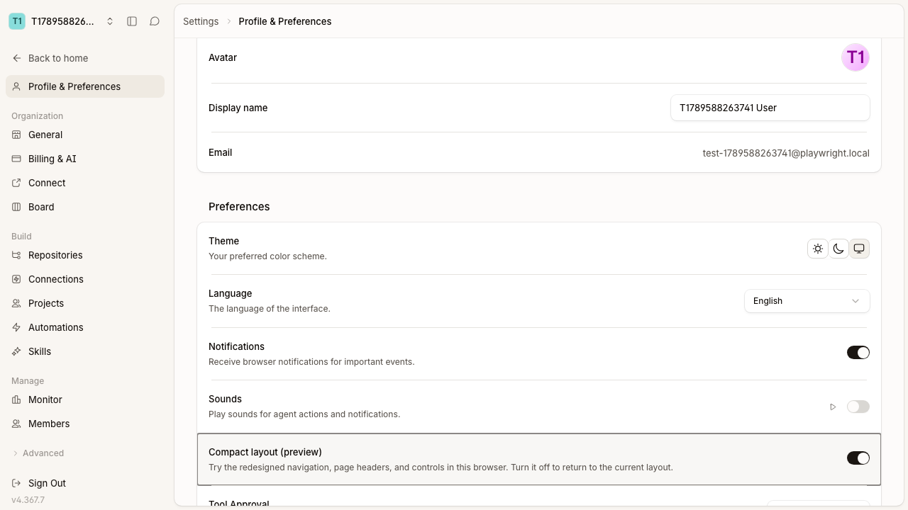
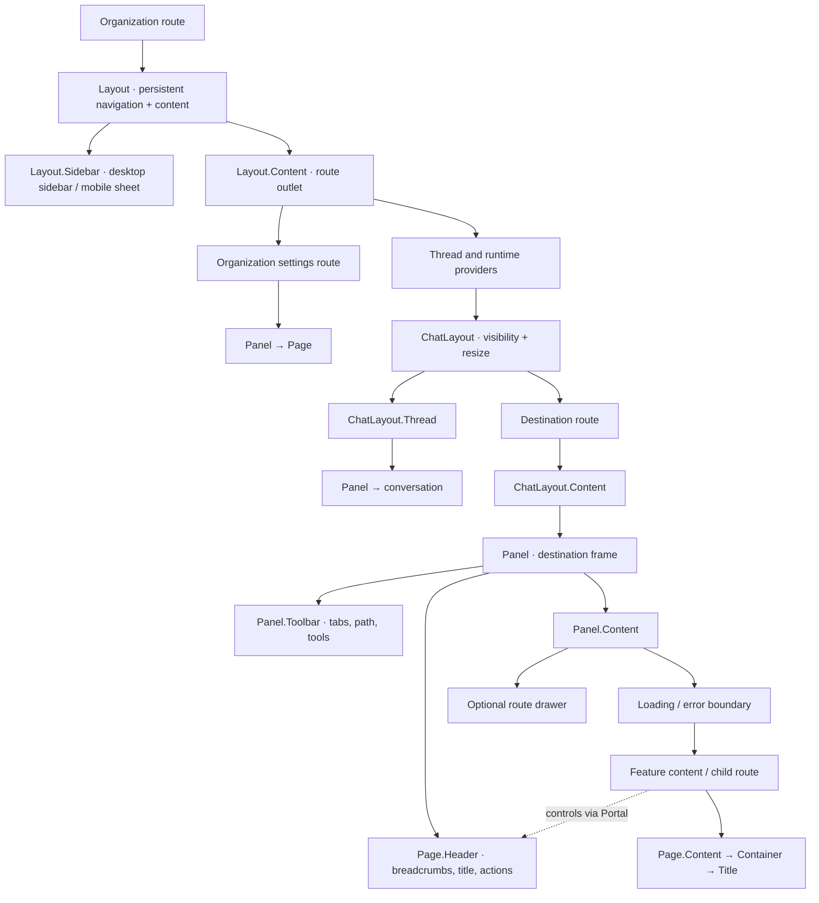
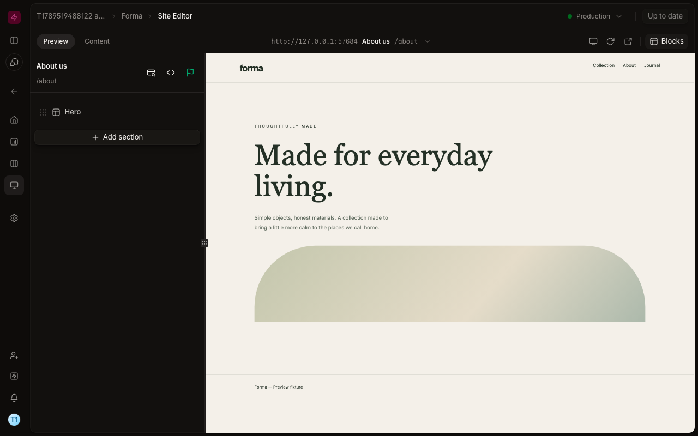
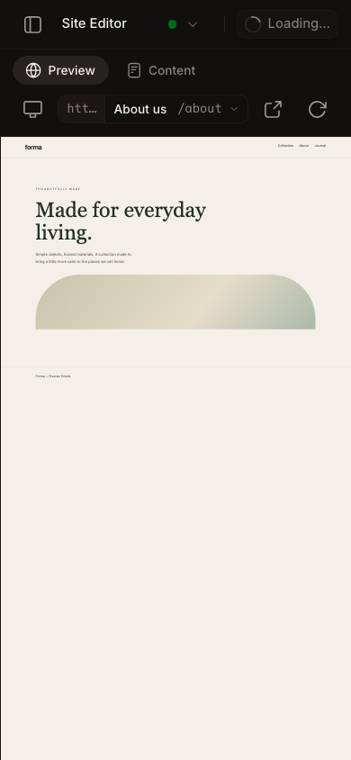
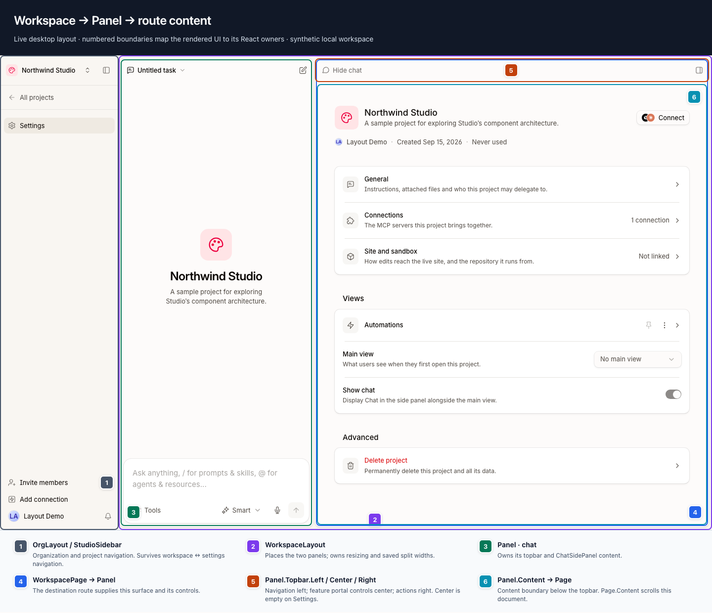
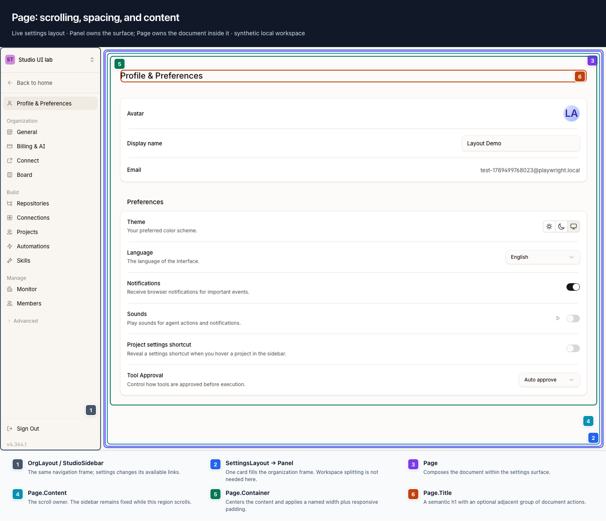
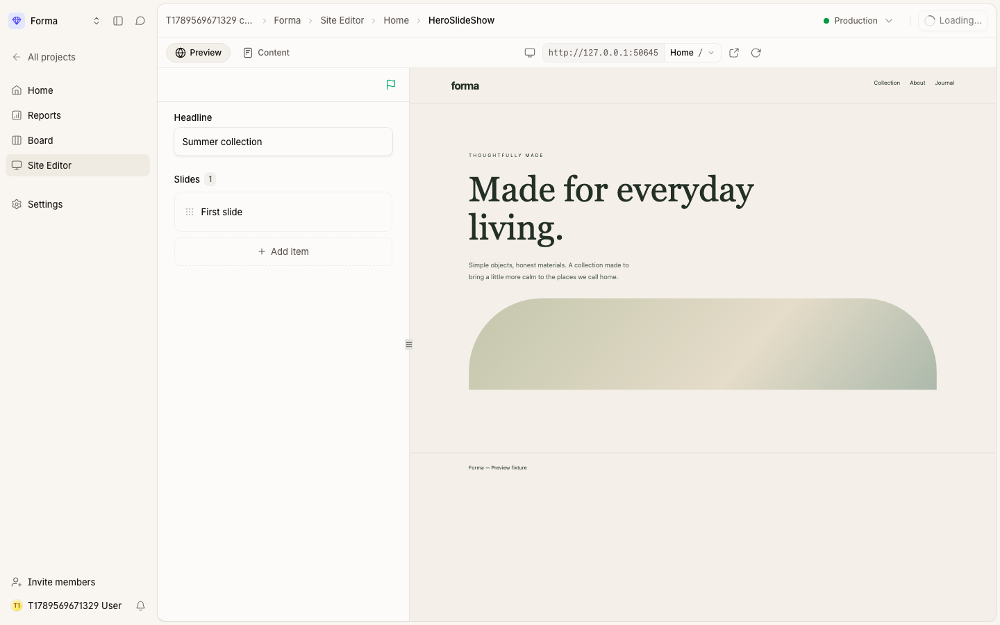
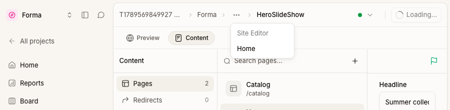

# Layout, ChatLayout, Panel, and Page

Studio uses four components to separate the application frame, the optional
chat arrangement, panel surfaces, and document content.

## Compact layout preference

The compact presentation is opt-in through **Profile & Preferences → Consistent
Layout (beta)**. `usePreferences().compactPageLayout` defaults to `false`
and persists in this browser alongside theme and language. Changing it applies
immediately; turning it off restores the classic presentation without changing
project data, navigation URLs, or other preferences.

Components read `useCompactPageLayout()` when their structure differs between
layouts. `ThemeProvider` sets `data-compact-layout` on the document root so
`compact:` and `classic:` styles also cover dialogs and other portals. Shared
control defaults use CSS variables where callers need to override them through
`className`. Data hooks and mutation handlers are shared by both presentations.

The compact headers and toolbars described below render only when opted in.
Browser tests default to the classic layout; compact-specific specs use
`test.use({ compactPageLayout: true })` from the shared Playwright fixture.



## Ownership and naming

| Component | Owns |
| --- | --- |
| [`Layout`](../src/components/layout/index.tsx) | Persistent application frame: sidebar, resizing, mobile navigation, and content area |
| [`ChatLayout`](../src/components/chat-layout/index.tsx) | Placement, visibility, and resizing of its `Thread` and `Content` regions |
| [`Panel`](../src/components/panel/index.tsx) | A surface, its topbar and toolbar regions, and its body |
| [`Page`](../src/components/page/index.tsx) | Shared breadcrumbs, heading, actions, tabs, and document scrolling, spacing, and width |
| `*Route` | Route composition and feature-specific controls |
| `*Page` | A feature screen rendered inside a route's panel |
| `*Provider` / `*Context` | Shared state with an explicit lifetime; layout and domain state stay separate |

Use PascalCase symbols and kebab-case files. Name feature components for their
domain: `OrgGeneralPage` describes a screen, and `SiteEditorActions`
describes its controls. `*Content` can isolate feature data reads below a loading
or error boundary.

`Chat` and `ChatLayout` describe UI composition. Domain identifiers and contracts
still use `thread`, including `threadId`. The `ChatLayout.Content` region holds
the current route; `Chat.Main` remains the conversation's body.

## One application frame, optional chat

Every organization destination shares the same `Layout`. The organization
route supplies navigation and an `Outlet`; changing between Home and Settings
keeps this frame mounted, preserving the sidebar's size and open preference.

```tsx
<Layout notice={<OrgNoticeBanner />}>
  <Layout.Sidebar
    renderMobile={({ onClose }) => <StudioSidebarMobile onClose={onClose} />}
  >
    <StudioSidebar />
  </Layout.Sidebar>
  <Layout.Content>
    <Outlet />
  </Layout.Content>
</Layout>
```

| Destination | Composition inside `Layout.Content` |
| --- | --- |
| `/:org/home`, `/tasks`, `/library`, `/reports` | `ChatLayout` with conversation and routed panels |
| `/:org/projects/:agentId/...`, including project Settings | The same `ChatLayout` arrangement |
| `/:org/settings/...` | A `Panel` containing the settings page |

The `/settings` parent route composes its panel directly. It needs no separate
layout component. Thread and runtime providers belong to the lazy route branch
that uses chat; a direct organization Settings visit does not initialize that
branch.



On mobile, each visible page or conversation header opens the same navigation
sheet. `ChatLayout` shows one region at a time. The sidebar chat button selects
the conversation; its header lets the user return to the page.

Home headers use the current scope as their title: the organization name on org
home, or organization → project on project home. Ancestor scopes remain links;
the current scope is the heading, without an extra Home or Overview segment.

## The layout on screen

These captures show the compact layout running against the local E2E server
with synthetic project and page data. The desktop sidebar is collapsed;
mobile shows the preview canvas, with editing available through Content.





Additional captures:

- [Organization home header](assets/compact-org-home-header.png)
- [Project home header](assets/compact-project-home-header.png)
- [Sidebar and chat controls with the shared button radius](assets/compact-sidebar-controls.png)
- [Chat header with visibility controlled from the sidebar](assets/compact-chat-header.png)
- [Expanded project sidebar](assets/compact-editor-expanded.png)
- [Page picker with name and path on one line](assets/compact-editor-page-picker.png)
- [Tasks with Board / List tabs and filters beside New task](assets/compact-tasks-list.png)
- [Library file list and shared toolbar](assets/compact-library-files.png)
- [Library folders in the shared breadcrumb trail](assets/compact-library-breadcrumbs.png)
- [Library on mobile](assets/compact-library-mobile.png)
- [Project settings — General](assets/project-settings-general.png)
- [Project settings — CMS](assets/project-settings-site.png)
- [Project settings — Project layout](assets/project-settings-views.png)
- [Project settings on mobile](assets/project-settings-mobile.png)

| Visible region | Component and purpose |
| --- | --- |
| Left icon rail | `Layout.Sidebar`: project navigation, collapse control, and chat entry point |
| Breadcrumb and action row | `Page.Header`: route identity and primary actions in the panel topbar |
| Preview / Content, path, and view controls | `Panel.Toolbar`: shared `Page.Tabs`, page picker, and feature-owned tools |
| Blocks and website | `Panel.Content`: the existing Blocks editor beside the preview canvas on desktop |

### Component boundaries before the compact header update

The annotated captures below document the original shared-layout refactor. Their
component boundaries still apply; the current headers and navigation are shown
above. Colored outlines and labels were added to the DOM for these captures.





## Compose a route

The chat route branch supplies a `ChatLayout` with a conversation in
`ChatLayout.Thread` and a destination outlet. It passes presentation controls
as React nodes, leaving agent and thread data in their domain providers:

```tsx
<ChatLayout
  {...layout}
  contentKey={routeId}
  contentNavigation={navigation}
  contentActions={projectActions}
>
  <ChatLayout.Thread topbar={threadTopbar}>{conversation}</ChatLayout.Thread>
  <Outlet />
</ChatLayout>
```

Each destination composes `ChatLayout.Content`, which supplies the adjacent
region and its standard `Panel`. Keep feature data reads in its children:

```tsx
function ProjectSettingsContent() {
  const projectId = useRouteVirtualMcpId();
  return <SettingsTab virtualMcpId={projectId} />;
}

export default function ProjectSettingsRoute() {
  return (
    <ChatLayout.Content>
      <ProjectSettingsContent />
    </ChatLayout.Content>
  );
}
```

Loading and render errors replace the body below the topbar. Routes use
`ChatLayoutPending` while a destination chunk loads and `ChatLayoutError` for
route validation or loading failures. Both keep the content region registered
in the split and retain navigation. Keep feature data reads below the content
boundaries so the surrounding controls remain available.

The Site Editor parent groups Preview, Content, and Code. Its private
`SiteEditorActions` and `SiteEditorDrawer` components own branch/publish controls
and the runtime drawer:

```tsx
export default function SiteEditorRoute() {
  return (
    <ChatLayout.Content
      actions={<SiteEditorActions />}
      drawer={<SiteEditorDrawer />}
    >
      <Outlet />
    </ChatLayout.Content>
  );
}
```

The drawer stays outside the body's error boundary. The Develop/Live project
switch is supplied by the session route to the common topbar because it changes
project identity on every destination, including project Settings.

`useChatLayout()` exposes layout visibility and toggles. Read agent and thread
data from their domain providers and SDK hooks; the layout context does not own
that data.

## Compose a panel

Use children directly when the route has its controls at hand. Use a portal
when a deeper feature owns the state for those controls.

```tsx
<Panel>
  <Panel.Topbar>
    <Panel.Topbar.Left>{navigation}</Panel.Topbar.Left>
    <Panel.Topbar.Center>
      <Panel.Topbar.Center.Target />
    </Panel.Topbar.Center>
    <Panel.Topbar.Right>{actions}</Panel.Topbar.Right>
  </Panel.Topbar>
  <Panel.Content mode="canvas">{editor}</Panel.Content>
</Panel>

// Inside the editor: React state and event ownership stay with the feature.
<Panel.Topbar.Center.Portal fallback={inlineControls}>
  {previewControls}
</Panel.Topbar.Center.Portal>
```

Each topbar region has `Target` and `Portal` members. Each `Panel` isolates its
targets from surrounding panels; mount at most one target per region. Targets
register through React 19 callback refs and remove their registration on
unmount. Without a target, a portal renders its optional inline fallback. This
keeps preview controls available on mobile and in standalone editors.

The default `card` variant supplies rounded corners and a shadow. `plain`
supplies the same composition without the card decoration. The topbar stays
outside the scroll area and provides the existing panel-width container query.
`DetailPanel` composes these same primitives for connection, tool, collection,
and prompt details.

## Choose one scroll owner

`Panel.Content` defaults to `mode="canvas"`: it fills the remaining space and
clips overflow, letting an editor manage its own panes. Use `mode="scroll"`
when the panel directly contains a simple scrolling body.

Document pages inside a canvas panel use `Page.Content` as their scroll owner:

```tsx
<Page>
  <Page.Content>
    <Page.Container width="reading">
      <Page.Title actions={actions}>{title}</Page.Title>
      {form}
    </Page.Container>
  </Page.Content>
</Page>
```

`Page.Container` owns responsive padding and a named width: `reading` (720px),
`standard` (the design system's `max-w-5xl`), `wide` (1200px, default), or
`fluid`. `Page.Title` supplies the current `h1` to `Page.Header`; its `actions`
prop and `Page.Actions` supply the header's right slot. Outside a header they
render inline. Use `h2` for document sections and welcome text.

## Compact page headers and views

`RoutePageHeader` adapts router `staticData.pageTitle`, organization, and project
identity into the same `Page.Header` on org, settings, and project routes. It
stays outside the content loading/error boundary. A feature's `Page.Title`
replaces the fallback heading while mounted; navigating away removes the portal
and restores the next route's fallback. Empty toolbars occupy no space.

`Page.Header` owns one breadcrumb navigation region. The route supplies the
organization/project ancestors, `Page.Breadcrumbs` adds feature ancestors through
`Panel.Topbar.Breadcrumbs`, and `Page.Title` names the current location. Long
feature paths collapse their middle ancestors into a menu. Narrow panels put
all feature ancestors in that menu, keeping the current title and actions visible.

```tsx
<Page.Breadcrumbs
  items={[
    { key: "library", label: t("library.library.title"), onClick: openLibrary },
    { key: parent.path, label: parent.name, onClick: openParent },
  ]}
/>
<Page.Title>{folder.name}</Page.Title>
```

Site Editor uses the same slots through `BlockBreadcrumbs`. The mounted editor
contributes its current selection after the route identity:

```text
Organization > Project > Site Editor > Home
Organization > Project > Site Editor > Home > HeroSlideShow
Organization > Project > Site Editor > Home > HeroSlideShow > First slide
```

`SectionsEditor`, `SavedSectionEditor`, and `RunnableBlockEditor` own their
selection state. `BlockBreadcrumbs` renders ancestors through `Page.Breadcrumbs`
and the selected block or field through `Page.Title`. Clicking Home selects the
page's section list; clicking HeroSlideShow selects that section's form. These
callbacks update the editor directly and do not use browser history. There is no
separate editing breadcrumb or back arrow inside these editors.

The page is included as soon as its editor mounts. Switching pages, choosing a
global section or loader, or opening another view replaces or removes the
contribution with the editor. Shared-block notices and editing actions remain
inside the editor. Long paths use the shared ancestor menu on narrow panels.





```tsx
<Panel>
  <RoutePageHeader actions={<SiteEditorActions />} navigation={<MainPanelTabsBar {...context} />} />
  <Panel.Content>{/* content boundary + route outlet */}</Panel.Content>
</Panel>

// Deep inside the Preview feature, with its existing state and callbacks:
<Panel.Toolbar.Center.Portal>{previewNavigation}</Panel.Toolbar.Center.Portal>
<Panel.Toolbar.Right.Portal>{previewTools}</Panel.Toolbar.Right.Portal>
```

- The first row is 48px tall: breadcrumbs and title on the left, actions on the right.
- `Panel.Toolbar.Left` holds `Page.Tabs` / `Page.Tab`; Center holds the device-size
  toggle, page selector, Open in new tab, and Refresh, in that order. Right holds
  the visual editing control. All three support `Target` / `Portal`.
- Route links use `<Page.Tab asChild><Link /></Page.Tab>` and `aria-current`.
  In-place views use buttons with `aria-pressed`. Selecting an active view leaves
  it open. Labels remain visible; long sets scroll horizontally.
- Collection tabs opt into the shared row with `placement="page"`. Dialog tabs
  remain inline. Feature actions use the shared `Button` sizes; primary create,
  import, and publish actions use its `brand` variant.
- Detail screens contribute to the surrounding header instead of adding another
  panel and title bar.

## Sidebar and Preview

The sidebar keeps the existing organization/project picker and project-only
navigation. Its 48px header aligns with the page header; section labels and
spacing separate navigation instead of horizontal rules. At organization scope,
Projects includes an Add project shortcut and Organization holds Settings.
Members is available inside Settings, subject to the existing capabilities.
Its width and collapse preference persist across Settings. The 52px
rail retains the picker, expand button, chat button, and destinations. Opening
chat preserves the current project, page, and thread; starting a new chat is a
separate action inside the conversation.
The sidebar chat toggle renders from `ChatLayout` through a shared slot, so its
background and pressed state follow the visible chat, including on mobile.
It also closes the conversation; the chat header has no separate close button.
Settings supplies an inactive fallback that opens chat on Home.

Preview and Content tabs show their globe and document icons beside the labels,
using the shared tab icon mapping.
Project settings, organization settings, and role tabs use matching 16px icons
beside their labels, defined with each tab's metadata. Icons are decorative for
screen readers, and the tab strips scroll horizontally on narrow screens.

Preview uses the existing `BlocksPanel` and `BlocksPreviewWorkspaceProvider`.
The compact page picker uses one button with two visual regions: a muted origin
box (including protocol), followed by the page name, path, and dropdown arrow.
Clicking either region opens the same picker; the origin is not a separate link.
The text stays on one line and truncates when space is tight, with the full value
available in the tooltip. The popover starts with
search and uses the hover background to mark the current selection, without
repeating the origin or adding a checkmark.
Each popover row places the page name first and aligns its muted path to the
right. On narrow panels the trigger sits in its own toolbar row.
The shared popover/command picker includes page names and paths,
global sections, global loaders, creation, and dynamic path parameter inputs.
Arrow keys, Enter, Escape, and focus restoration come from the existing shared
UI primitives.

Blocks is part of the desktop Preview when CMS is enabled, without a separate
toolbar toggle. Its resizable split follows the existing main-branch behavior;
mobile keeps the canvas visible and uses Content for editing. CMS off removes
both editing surfaces. A page restored from the shared selection keeps its path
even before metadata finishes loading.

Action buttons use the design system's `rounded-lg` radius. `ToolbarIconButton`
composes the shared ghost `Button`, so sidebar, chat, and editor controls inherit
the same corners and interaction states. Its `active` state supplies the selected
background; callers supply placement and size without radius overrides.

Tasks uses `Page.Tabs` for Board and List, with filters in the header beside
New task through `Page.Actions secondary={…}`. Narrow panels use the existing
filters drawer in the same action group. Library uses the same tabs for
All files, Documents, and Media, with folder, document, and image icons beside
the labels. Search and refresh sit on the right. Its upload
action lives in the header, separated from New folder by a vertical divider.
`Page.Actions secondary={…}` provides that grouping to other pages too.

Project settings uses the same header and `Page.Tabs` for General, Connections,
CMS, and Project layout. General opens directly to labelled identity fields,
followed by instructions, files, delegation, and deletion. Connections contributes
its Add connection action through `Page.Actions`; Project layout separates the
default layout from sidebar view controls. Existing `?section=` links remain
valid; Project layout uses `?section=views`, and absent or unknown selections open
General. Tab changes keep the same form and autosave queue while resetting the
content scroll position.
The previous settings index and its second breadcrumb have been removed.

Library's file view is saved in `?fileView=` and applies to the current folder,
search results, and the recent feed. All files and Documents use compact rows;
Media uses thumbnails. Folders remain available in every view. Existing upload,
sharing, download, rename, and drag-and-drop handlers stay with their entries.
Its folder trail lives only in the shared header: organization → Library →
folder ancestors → current folder. Library returns to the home volume, and the
internal `home` segment is omitted. Other volumes retain their visible ancestor
and path. Breadcrumb navigation preserves the file view and browser history.

## Migration map

| Previous API | Replacement |
| --- | --- |
| `OrgLayout`, `SettingsLayout` | One `Layout`; each parent route composes its content |
| `WorkspacePanelGroup`, `WorkspaceLayout` | `ChatLayout.Thread` / `ChatLayout.Content` for placement |
| `WorkspacePage`, `MainPanelContent`, `MainPanelWithDrawer` | `ChatLayout.Content` with route-owned feature content, actions, and drawer |
| `WorkspaceContext`, `useWorkspace()`, `useInsetContext()` | `useChatLayout()` for placement; domain providers and SDK hooks for agent/thread data |
| `PanelCard`, `SidePanel`, `PanelHeader` | `Panel`, `Panel.Content`, `Panel.Topbar` |
| `Toolbar.*` and `MainPanelHeader*` portals | `Panel.Topbar.{Left,Center,Right}.{Target,Portal}` |
| `ViewLayout`, `ViewTabs`, `ViewActions` | `DetailPanel`, `Page.Tabs`, `Page.Actions` |
| Former `Page.Header.Left/Right` | `Page.Header` composes the surrounding panel's title and actions |
| `Page.Body maxWidth={…}` | `Page.Container width="…"` |
| `PageContentClassNameProvider` | Explicit `Page.Content` props |

The route-owned compound composition follows the direction of
[PR #7002](https://github.com/decocms/studio/pull/7002). This implementation is
standalone on `main`; it uses `Panel` as the surface name and implements the
slots needed by migrated consumers.
