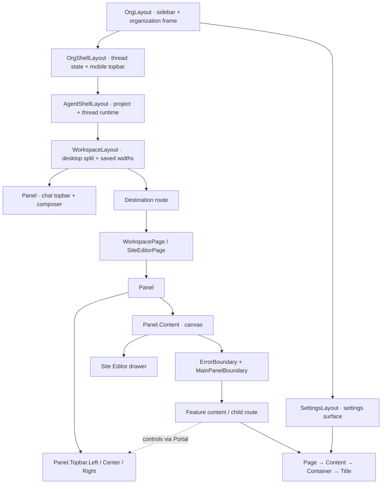

# Workspace, Panel, and Page

Studio separates layout, surfaces, and route content so a feature can compose
its controls without adding another branch to the application shell.

## Ownership and naming

| Name | Owns | Examples |
| --- | --- | --- |
| `*Layout` | Placement and providers shared by descendant routes | `OrgLayout`, `WorkspaceLayout`, `SettingsLayout` |
| `Panel` | A bounded surface, its topbar regions, and its body | Chat card, routed workspace card, detail view |
| `*Page` | A route or a reusable recipe for composing a route | `HomePage`, `WorkspacePage`, `SiteEditorPage` |
| `Page` | Document content: scrolling, spacing, width, and heading | Settings, project configuration, lists |
| `*Content` | Feature rendering and data reads below the route's boundary | `AgentSettingsContent` |
| `*Provider` / `*Context` | Runtime state with an explicit lifetime | `WorkspaceContext`, `Chat.Provider` |

Use PascalCase symbols and kebab-case files. Name feature components for their
domain; use these suffixes when they explain ownership. Existing `*Tab` feature
components remain the implementations behind destination pages. The router's
path selects the page; `thread`, `sidepanel`, and `mainpanel` describe its
workspace arrangement.



Mobile uses the organization topbar and one workspace surface at a time. Its
view selector portals into that topbar; the route's own `Panel` scopes feature
controls separately.

## The layout on screen

These are captures of the running app with synthetic local data. Colored
outlines and labels were added to the DOM only for the screenshots.


## Compose a route

`WorkspacePage` supplies the common panel frame, navigation and collapse
controls. Put data reads inside its children so suspension or a render error
replaces the content while the topbar stays available.

```tsx
function ProjectSettingsContent() {
  const projectId = useRouteVirtualMcpId();
  return <SettingsTab virtualMcpId={projectId} />;
}

export default function ProjectSettingsPage() {
  return (
    <WorkspacePage>
      <ProjectSettingsContent />
    </WorkspacePage>
  );
}
```

Workspace destination routes also use `WorkspacePagePending` as their router
pending component, retaining the standard frame while a route chunk loads.
That component is lazy so settings-only visits do not eagerly load workspace
features. The shared Site Editor parent owns its Preview, Content, and Code
children, its branch/publish actions, and its runtime drawer.
The Develop/Live project switch remains in the shared workspace topbar because
it switches project identity on every destination, including Settings.

`WorkspaceContext` exposes project/thread identity and panel visibility. The
shell creates it; layouts and routes consume it. Editors that can also render
standalone use `useOptionalWorkspace()`.

## Compose a panel

Use children directly when the route has its controls at hand. Use a portal
when a deeper feature owns the state for those controls.

```tsx
<Panel>
  <Panel.Topbar>
    <Panel.Topbar.Left>{navigation}</Panel.Topbar.Left>
    <Panel.Topbar.Center>
      <Panel.Topbar.Center.Target />
    </Panel.Topbar.Center>
    <Panel.Topbar.Right>{actions}</Panel.Topbar.Right>
  </Panel.Topbar>
  <Panel.Content mode="canvas">{editor}</Panel.Content>
</Panel>

// Inside the editor: React state and event ownership stay with the feature.
<Panel.Topbar.Center.Portal fallback={inlineControls}>
  {previewControls}
</Panel.Topbar.Center.Portal>
```

Each region has `Target` and `Portal` members. Each `Panel` isolates its targets
from surrounding panels; mount at most one target per region. Targets register
through React 19 callback refs and remove their registration on unmount. Without
a target, a portal renders its optional inline fallback. This is how preview
controls remain available on mobile and in standalone editors.

The default `card` variant supplies rounded corners and a shadow. `plain`
supplies the same composition without the card decoration. The topbar stays
outside the scroll area and provides the existing panel-width container query.
`DetailPanel` composes these same primitives for connection, tool, collection,
and prompt details.

## Choose one scroll owner

`Panel.Content` defaults to `mode="canvas"`: it fills the remaining space and
clips overflow, letting an editor manage its own panes. Use `mode="scroll"`
when the panel directly contains a simple scrolling body.

Document pages inside a canvas panel use `Page.Content` as their scroll owner:

```tsx
<Page>
  <Page.Content>
    <Page.Container width="reading">
      <Page.Title actions={actions}>{title}</Page.Title>
      {form}
    </Page.Container>
  </Page.Content>
</Page>
```

`Page.Container` owns responsive padding and a named width: `reading` (720px),
`standard` (the design system's `max-w-5xl`), `wide` (1200px, default), or
`fluid`. `Page.Title` renders an `h1` and an optional adjacent action group.
Keep persistent navigation in the panel topbar; keep document headings and
form actions with the document.

## Migration map

| Previous API | Replacement |
| --- | --- |
| `WorkspacePanelGroup` | `WorkspaceLayout` for placement; route recipes for main-panel content |
| `PanelCard`, `SidePanel`, `PanelHeader` | `Panel`, `Panel.Content`, `Panel.Topbar` |
| `Toolbar.*` and `MainPanelHeader*` portals | `Panel.Topbar.{Left,Center,Right}.{Target,Portal}` |
| `MainPanelContent`, `MainPanelWithDrawer` | `WorkspacePage`, `SiteEditorPage` |
| `ViewLayout`, `ViewTabs`, `ViewActions` | `DetailPanel` and `Panel.Topbar` portals |
| `Page.Header`, `Page.Header.Left/Right` | The surrounding panel's topbar |
| `Page.Body maxWidth={…}` | `Page.Container width="…"` |
| `PageContentClassNameProvider` | Explicit `Page.Content` props |
| `useInsetContext()` imported from the shell | `useWorkspace()` / `useOptionalWorkspace()` from `workspace-context` |

The route-owned compound composition follows the direction of
[PR #7002](https://github.com/decocms/studio/pull/7002). This implementation is
standalone on `main`; it uses `Panel` as the surface name and implements the
slots needed by migrated consumers.
