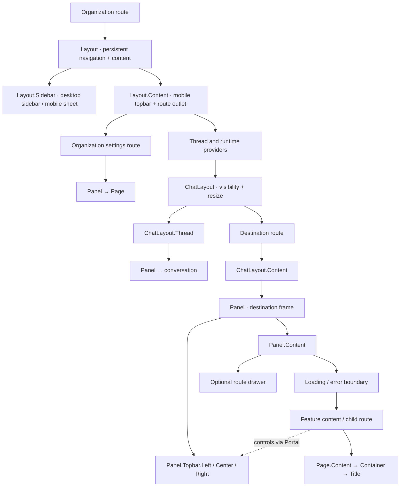

# Layout, ChatLayout, Panel, and Page

Studio uses four components to separate the application frame, the optional
chat arrangement, panel surfaces, and document content.

## Ownership and naming

| Component | Owns |
| --- | --- |
| [`Layout`](../src/components/layout/index.tsx) | Persistent application frame: sidebar, resizing, mobile navigation, and content area |
| [`ChatLayout`](../src/components/chat-layout/index.tsx) | Placement, visibility, and resizing of its `Thread` and `Content` regions |
| [`Panel`](../src/components/panel/index.tsx) | A surface, its topbar regions, and its body |
| [`Page`](../src/components/page/index.tsx) | Document content: scrolling, spacing, width, and heading |
| `*Route` | Route composition and feature-specific controls |
| `*Page` | A feature screen rendered inside a route's panel |
| `*Provider` / `*Context` | Shared state with an explicit lifetime; layout and domain state stay separate |

Use PascalCase symbols and kebab-case files. Name feature components for their
domain: `OrgGeneralPage` describes a screen, and `SiteEditorActions`
describes its controls. `*Content` can isolate feature data reads below a loading
or error boundary.

`Chat` and `ChatLayout` describe UI composition. Domain identifiers and contracts
still use `thread`, including `threadId`. The `ChatLayout.Content` region holds
the current route; `Chat.Main` remains the conversation's body.

## One application frame, optional chat

Every organization destination shares the same `Layout`. The organization
route supplies navigation and an `Outlet`; changing between Home and Settings
keeps this frame mounted, preserving the sidebar's size and open preference.

```tsx
<Layout expandedSidebar={inSettings} notice={<OrgNoticeBanner />}>
  <Layout.Sidebar
    renderMobile={({ onClose }) => <StudioSidebarMobile onClose={onClose} />}
  >
    <StudioSidebar />
  </Layout.Sidebar>
  <Layout.Content>
    <Outlet />
  </Layout.Content>
</Layout>
```

| Destination | Composition inside `Layout.Content` |
| --- | --- |
| `/:org/home`, `/tasks`, `/library`, `/reports` | `ChatLayout` with conversation and routed panels |
| `/:org/projects/:agentId/...`, including project Settings | The same `ChatLayout` arrangement |
| `/:org/settings/...` | A `Panel` containing the settings page |

The `/settings` parent route composes its panel directly. It needs no separate
layout component. Thread and runtime providers belong to the lazy route branch
that uses chat; a direct organization Settings visit does not initialize that
branch.



On mobile, `Layout` supplies navigation and the shared topbar. `ChatLayout`
shows one region at a time; its destination selector uses the shared topbar's
center portal target. Each inner `Panel` scopes feature controls separately.

## The layout on screen

These are captures of the running app with synthetic local data. Colored
outlines and labels were added to the DOM only for the screenshots.


## Compose a route

The chat route branch supplies a `ChatLayout` with a conversation in
`ChatLayout.Thread` and a destination outlet. It passes presentation controls
as React nodes, leaving agent and thread data in their domain providers:

```tsx
<ChatLayout
  {...layout}
  contentKey={routeId}
  contentNavigation={navigation}
  contentActions={projectActions}
>
  <ChatLayout.Thread topbar={threadTopbar}>{conversation}</ChatLayout.Thread>
  <Outlet />
</ChatLayout>
```

Each destination composes `ChatLayout.Content`, which supplies the adjacent
region and its standard `Panel`. Keep feature data reads in its children:

```tsx
function ProjectSettingsContent() {
  const projectId = useRouteVirtualMcpId();
  return <SettingsTab virtualMcpId={projectId} />;
}

export default function ProjectSettingsRoute() {
  return (
    <ChatLayout.Content>
      <ProjectSettingsContent />
    </ChatLayout.Content>
  );
}
```

Loading and render errors replace the body below the topbar. Routes use
`ChatLayoutPending` while a destination chunk loads and `ChatLayoutError` for
route validation or loading failures. Both keep the content region registered
in the split and retain navigation. Keep feature data reads below the content
boundaries so the surrounding controls remain available.

The Site Editor parent groups Preview, Content, and Code. Its private
`SiteEditorActions` and `SiteEditorDrawer` components own branch/publish controls
and the runtime drawer:

```tsx
export default function SiteEditorRoute() {
  return (
    <ChatLayout.Content
      actions={<SiteEditorActions />}
      drawer={<SiteEditorDrawer />}
    >
      <Outlet />
    </ChatLayout.Content>
  );
}
```

The drawer stays outside the body's error boundary. The Develop/Live project
switch is supplied by the session route to the common topbar because it changes
project identity on every destination, including project Settings.

`useChatLayout()` exposes layout visibility and toggles. Read agent and thread
data from their domain providers and SDK hooks; the layout context does not own
that data.

## Compose a panel

Use children directly when the route has its controls at hand. Use a portal
when a deeper feature owns the state for those controls.

```tsx
<Panel>
  <Panel.Topbar>
    <Panel.Topbar.Left>{navigation}</Panel.Topbar.Left>
    <Panel.Topbar.Center>
      <Panel.Topbar.Center.Target />
    </Panel.Topbar.Center>
    <Panel.Topbar.Right>{actions}</Panel.Topbar.Right>
  </Panel.Topbar>
  <Panel.Content mode="canvas">{editor}</Panel.Content>
</Panel>

// Inside the editor: React state and event ownership stay with the feature.
<Panel.Topbar.Center.Portal fallback={inlineControls}>
  {previewControls}
</Panel.Topbar.Center.Portal>
```

Each topbar region has `Target` and `Portal` members. Each `Panel` isolates its
targets from surrounding panels; mount at most one target per region. Targets
register through React 19 callback refs and remove their registration on
unmount. Without a target, a portal renders its optional inline fallback. This
keeps preview controls available on mobile and in standalone editors.

The default `card` variant supplies rounded corners and a shadow. `plain`
supplies the same composition without the card decoration. The topbar stays
outside the scroll area and provides the existing panel-width container query.
`DetailPanel` composes these same primitives for connection, tool, collection,
and prompt details.

## Choose one scroll owner

`Panel.Content` defaults to `mode="canvas"`: it fills the remaining space and
clips overflow, letting an editor manage its own panes. Use `mode="scroll"`
when the panel directly contains a simple scrolling body.

Document pages inside a canvas panel use `Page.Content` as their scroll owner:

```tsx
<Page>
  <Page.Content>
    <Page.Container width="reading">
      <Page.Title actions={actions}>{title}</Page.Title>
      {form}
    </Page.Container>
  </Page.Content>
</Page>
```

`Page.Container` owns responsive padding and a named width: `reading` (720px),
`standard` (the design system's `max-w-5xl`), `wide` (1200px, default), or
`fluid`. `Page.Title` renders an `h1` and an optional adjacent action group.
Keep persistent navigation in the panel topbar; keep document headings and
form actions with the document.

## Migration map

| Previous API | Replacement |
| --- | --- |
| `OrgLayout`, `SettingsLayout` | One `Layout`; each parent route composes its content |
| `WorkspacePanelGroup`, `WorkspaceLayout` | `ChatLayout.Thread` / `ChatLayout.Content` for placement |
| `WorkspacePage`, `MainPanelContent`, `MainPanelWithDrawer` | `ChatLayout.Content` with route-owned feature content, actions, and drawer |
| `WorkspaceContext`, `useWorkspace()`, `useInsetContext()` | `useChatLayout()` for placement; domain providers and SDK hooks for agent/thread data |
| `PanelCard`, `SidePanel`, `PanelHeader` | `Panel`, `Panel.Content`, `Panel.Topbar` |
| `Toolbar.*` and `MainPanelHeader*` portals | `Panel.Topbar.{Left,Center,Right}.{Target,Portal}` |
| `ViewLayout`, `ViewTabs`, `ViewActions` | `DetailPanel` and `Panel.Topbar` portals |
| `Page.Header`, `Page.Header.Left/Right` | The surrounding panel's topbar |
| `Page.Body maxWidth={…}` | `Page.Container width="…"` |
| `PageContentClassNameProvider` | Explicit `Page.Content` props |

The route-owned compound composition follows the direction of
[PR #7002](https://github.com/decocms/studio/pull/7002). This implementation is
standalone on `main`; it uses `Panel` as the surface name and implements the
slots needed by migrated consumers.
