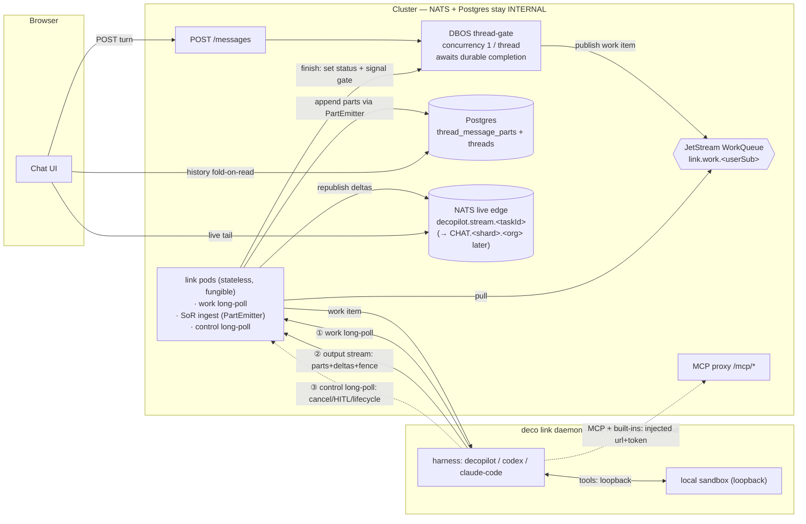

# Spec — Local-Link Pull Inversion (axis b)

**Status:** Draft for review · **Companion to:** [`proposals.md`](proposals.md) (axis b — "Desktop-as-pull-worker inversion") and [`stream-of-record-spec.md`](stream-of-record-spec.md) (axis c — the durable record this rides on) · **Grounds against:** [`report.md`](report.md) issue catalog `A1`–`I1`.

This spec makes **axis (b)** concrete for our existing **DBOS + NATS + Postgres** stack — **no Temporal, Restate, or Dapr, no new stateful system.** It inverts the local-link chat leg from a cluster-**pushed** reverse-WebSocket into a desktop-**pulled** long-poll, relocates **every** harness (including `decopilot`) onto the desktop, and **deletes the two-pod NATS middle-man** (`dispatcher.ts` + `ws-gateway.ts` + the reply inbox). It sits *on top of* the stream-of-record work already landing on this branch — it changes **who produces** the record (cluster dispatcher → desktop) and **how a turn is delivered** (push → pull), not the record itself.

---

## 1. TL;DR — the one change

> **The desktop stops being pushed to and starts pulling.** Today a turn is published to `links.dispatch.<userSub>` and a *gateway pod* bridges NATS⇄a reverse-WebSocket it owns, while a *dispatching pod* blocks on a NATS reply inbox — two pods glued by NATS. We replace that with **three outbound HTTPS connections the desktop opens itself**: a **work long-poll** (pull the next turn), a **run output stream** (push parts+deltas into the stream-of-record), and a **control long-poll** (cancel / HITL / lifecycle commands). The work queue is a JetStream **WorkQueue** drained by a *stateless, fungible* pod on the desktop's behalf; the result is a **durable append** to `thread_message_parts`, never a reply inbox a specific pod is blocked on. Because nothing is cluster→desktop anymore, the **reverse-WebSocket is fully retired** — which requires relocating the `decopilot` harness onto the desktop so its sandbox-tool tunnel collapses to **loopback**.

This trades **operational surface today** (a public NATS endpoint) for an **HTTP-only laptop**: NATS stays sealed inside the cluster, the daemon speaks only to the already-hardened `/api`. Direct-NATS-on-desktop (the proposals' north star) is preserved as a **documented, transport-only later upgrade** behind the same JetStream WorkQueue.

---

## 2. What changes vs. `proposals.md` axis-b

`proposals.md` settles axis (b) as *"invert the chat leg to pull; keep a per-request-auth reverse-tunnel only for the sandbox/tunnel leg"* and frames the tunnel as **irreducible**. This spec makes two concrete choices on top:

| Aspect | `proposals.md` axis-b (engine-agnostic) | **This spec (DBOS+NATS+Postgres)** |
|---|---|---|
| **Pull transport** | desktop pulls a durable queue/lease (engine-specific: Temporal task queue / Restate pull endpoint / JetStream WorkQueue) | **JetStream WorkQueue** fronted by an **HTTP long-poll** — laptop stays dumb HTTP; **NATS never exposed publicly** |
| **The "irreducible" reverse-tunnel** | survives for sandbox-lifecycle + decopilot tunnel | **eliminated** — decopilot relocates to the desktop (Option C), so its tunnel becomes loopback; lifecycle becomes pull-triggered + control-poll commands |
| **Control plane** | a bought/built engine owns the gate + completion | **the existing DBOS thread-gate**, with its blocking step changed from *await-the-stream* to *delegate + await-durable-completion* |
| **Lease / fence / liveness** | engine lease (Temporal heartbeat / Restate journal / `run_fence` CAS) | **Postgres fence token + `threads.last_progress_at`** (reuses the SoR liveness already wired); JetStream `AckWait` lease is deferred with direct-NATS |
| **Re-attach** | cluster-pod re-attach is the win; desktop-death re-run is irreducible | same verdict — **cluster-pod death becomes recoverable** (DBOS replay, desktop never notices), **desktop death re-runs** bounded by cursor + fence + workdir lock |
| **Daemon credential** | daemon-scoped short-lived creds (`H3`) | **deferred** — reuse today's OAuth bearer on the new `/api` calls (per-call refresh kills `D1`); `H3` hardening is a follow-up |

The headline: this is the **P5/P3 flavor** of axis (b) — own the machinery on the incumbent stack — taken to its clean Option-C end state where the reverse-WS disappears entirely.

---

## 3. The design

### 3.1 End-state topology — three outbound connections

The desktop's **entire** cluster-facing surface is three outbound HTTPS calls (all org-scoped per the `/api/:org/...` convention):

1. **Work long-poll** — `GET /api/:org/links/work`. Held open ~30 s; returns the next work item (a turn to run) or `204` → repoll. Served by **any** stateless pod, which pulls from the per-user JetStream WorkQueue on the daemon's behalf. Per-*user* delivery (one daemon drains all the user's threads); cross-thread serialization stays the gate's job.
2. **Run output stream** — `POST /api/:org/links/runs/:runId/stream`. One chunked upload per turn carrying completed **parts** + token **deltas** + the **fence token** as the harness produces them.
3. **Control long-poll** — `GET /api/:org/links/control`. Returns cancel / HITL-approval / sandbox-lifecycle frames.

Everything else the harness needs is the harness doing its own job over outbound HTTPS, **not** "link" traffic: **model** (injected secret), **MCP + cluster-coupled built-ins** (injected `url`+token → the cluster MCP proxy), **sandbox** (loopback). The reverse-WS is gone because nothing is cluster→desktop anymore.

**The browser side is 100% unchanged** — it tails the live edge and folds `thread_message_parts` on read exactly as the SoR spec defines. It has no idea the producer moved to the laptop. The inversion is invisible downstream of the stream-of-record.

### 3.2 Work delivery — WorkQueue + long-poll + presence

- **Substrate = JetStream WorkQueue** `link.work.<userSub>` (a durable, at-least-once work stream). Chosen over a Postgres `link_work` table specifically so the **direct-NATS promotion is a transport-only swap** — the desktop later drains *the same stream* directly (§3.10). Tolerates the **current per-task live-edge subject**; it does not depend on the not-yet-landed sharded `CHAT.<shard>.<org>` subjects.
- **The long-poll pod is the NATS consumer, not the laptop.** A stateless pod serving `GET .../work` does the JetStream pull and hands the item down the HTTP response. The pod is **fungible** — any pod can serve any user's poll, because the work lives in the shared stream, not in a pinned socket. This is what deletes the gateway-pod pinning.
- **Presence replaces the WS claim.** Today the reverse-WS's *existence* is the online/capability signal (`studio_links` KV, 60 s TTL) that `resolveDispatchTarget` checks to return `409 link_unavailable` up-front. With no persistent WS, **the daemon holds the work long-poll continuously (even idle)**, and each poll cycle refreshes a `studio_links`-shaped claim with a TTL (carrying `machineId`, `cliVersion`, `capabilities`, `previewPort`). Stop polling → claim expires → `POST /messages` still fails fast with `409`. **Poll-presence replaces WS-presence.**

### 3.3 Return path — the SoR ingest reuses `PartEmitter`

The single most important reuse: **the cluster already consumes a desktop-produced chunk stream today.** For `codex`/`claude-code`, `remoteDispatch` returns the harness chunk `AsyncIterable` (reassembled from NATS reply frames) and the cluster feeds it into the v2 `PartEmitter` + the NATS live-edge pump. This spec changes **only how that `AsyncIterable` is fed** — from reply-inbox reassembly to an **HTTP request body**. The producer logic is unchanged.

- `POST /api/:org/links/runs/:runId/stream` parses the chunked body into an `AsyncIterable<UIMessageChunk>` and hands it to the **existing `PartEmitter`** (`emitUserMessage`/`emitStepParts`/`emitFinal`/`emitError`, idempotent `ON CONFLICT (id)`, monotonic `created_at = base + seq`) and the existing live-edge pump.
- **Append-before-emit is not required** (the SoR spec dropped it): completed parts commit durably; transient deltas publish best-effort; the client self-heals by reconciling against the durable parts. The one retained ordering is `R3` — the `finish` part commits **before** the subject is purged / the gate is signalled.
- **Fence check on every append** (§3.5): a stale fence token → `409 Fenced`, the request is rejected, no parts written.

> **Dependency: pull transport is gated to v2 threads.** The ingest *is* the `PartEmitter` path, which is v2-only (`message_storage_version = 2`). A pull run therefore requires a v2 thread. This aligns the two cutovers cleanly: **pull ⊆ v2** — the pull canary advances inside the SoR v2 canary, never ahead of it. v1 threads stay on the existing WS path until they upgrade.

### 3.4 The DBOS thread-gate — delegate, then await durable completion

The thread-gate keeps its **per-thread `concurrency 1` partition** (serialization; the git workdir stays single-writer). Its one step stops *executing the run* and starts *delegating + awaiting*:

1. **`prepareRun`** — claim the run (`threads.status = in_progress` via `claimRunStart`), **mint a fence token**, build the injected `HarnessStreamInput` (resolve model secret, mint `mcp.url`+token).
2. **Publish the work item** to `link.work.<userSub>` — **idempotent, keyed by `runId`** (a replay never double-dispatches).
3. **Await durable completion** — block the step on a durable signal (DBOS `send`/`recv` or `setEvent`/`getEvent`), set by the ingest's *finish* handler — **not** on a live stream.

The slot is held the whole turn → serialization preserved. Two properties get strictly better than today:

- **Cluster-pod death becomes recoverable, not fatal.** Because the desktop streams to a *fungible* ingest pod (not to the gate's pod), it never notices which pod hosts the waiting workflow. DBOS recovers the workflow elsewhere; it re-enters, sees "work already published + run in-progress (or already terminal)" from durable state, and **resumes waiting** — it does **not** re-dispatch. This is the genuine **cluster-pod re-attach** win, and it lets us drop today's `retriesAllowed: false` clean-fail.
- **No pinned streaming connection** anywhere in the cluster.

**Honest risks (carried into the plan):** DBOS `send`/`recv` are **net-new to this codebase** (`proposals.md` flags this for P5); and the blocked-await must **suspend durably without pinning a DB connection per run** (the system-DB pool defaults to 5/pod). The simpler-but-chattier fallback is the gate **polling `threads.status`**; the spec mandates the event/recv mechanism with that as the documented fallback.

### 3.5 Liveness, lease, fence, re-attach — Postgres-owned

All correctness lives in Postgres (unit-testable with embedded-postgres + an injectable clock); only delivery (WorkQueue) and the live edge (NATS) are infra.

- **Fence token** (Postgres, on the run) is the single-writer guarantee *at the write layer*: the ingest **rejects any append whose token isn't current → `409 Fenced`**, independent of routing. Plain SQL CAS.
- **Liveness = `threads.last_progress_at`** (already wired on this branch via the `~3 s` throttled `bumpProgress` + `isRunStuck` reaper). The ingest bumps it per append. "Stuck" = no progress past the idle deadline (`10 min` today) — legitimate hours-long runs never trip, and there is no `startedAt` for a resume to game (`A1`/`A2`/`A4`).
- **Re-attach, the two cases** (the irreducible split every proposal hits):
  - **Cluster-pod death → true re-attach, no re-run** (§3.4). ✅
  - **Desktop death → re-run, bounded.** Progress goes stale → the sweeper **re-publishes the work item with a *new* fence token** (the old laptop's late writes now `409`); the harness **resumes from the SoR cursor** (`MAX(seq)` over the run's parts) + a daemon-side **`threadId`-scoped workdir lock** so a half-alive laptop can't double-mutate the tree. This re-run is the **irreducible** desktop-death cost — bounded, never eliminated. (Per the SoR spec, parts are coarse, so the replay window is "deltas since the last durable part" — its accepted tradeoff.)
- **The gate is freed by progress, not wall-clock.** When the sweeper exhausts re-deliveries (or chooses to fail), it sets `threads.status = failed` and signals the gate → the slot releases. A dead/wedged desktop can no longer lock a thread forever — a direct hit on the `A2`/`A3` lockout class.

### 3.6 Cancel / HITL — on the control long-poll

- Browser `POST /api/:org/cancel` (ownership-checked — `H1` is its own one-line fix, see §6) → the cluster records a **durable cancel flag** on the run **and** nudges a control channel for immediacy.
- The daemon's held-open **control long-poll** returns `{type:"cancel", runId}` (or `{type:"approval", runId, decision}`); the daemon aborts/resumes the local harness via the **AbortController it already keys by `runId`** (the existing `DELETE /_sandbox/runs/:runId` + 60 s tombstone path). Locally nothing changes — only the delivery channel moves off the WS.
- **Belt-and-suspenders:** cancel also flips the run terminal cluster-side, so the **ingest `409`s any further appends**. A desktop that missed the control frame still cannot keep writing — cancel is correct even if delivery lags. HITL approval is the same shape: the harness's existing approval-pause surfaces as a part; the browser approves; the decision arrives as a control frame.

### 3.7 Sandbox lifecycle — pull-triggered; reverse-WS retirement

The reverse-WS carried five traffic types; in Option C every one has a new home:

| WS traffic today | New home |
|---|---|
| chat dispatch (cluster→desktop) | **work long-poll** (pull) |
| reply frames (desktop→cluster) | **output stream** (durable append) |
| cancel | **control long-poll** |
| decopilot tunnel (sandbox tools call back) | **loopback** — gone (decopilot runs on the desktop, §3.8) |
| sandbox lifecycle `POST/DELETE /_sandbox` | **pull-triggered + control-poll commands** |

- **Bring-up is pull-triggered + daemon-local.** When the daemon pulls a work item naming a sandbox/branch, its existing `DesktopSandboxProvider.ensureSandbox()` brings the sandbox up locally on demand (spawn / health / LRU already exist). No cluster→desktop push for the chat path.
- **Out-of-band lifecycle** (preview spin-up outside a turn, explicit stop) rides the control poll as `{type:"ensure_sandbox" | "delete_sandbox", ...}` frames.

**Net: the reverse-WS is fully deleted.** Three outbound HTTP connections are the entire transport. If a future synchronous low-latency cluster→desktop need surfaces that we've missed, a slim per-request-auth reverse channel can return — but Option C removes the last one we know of.

### 3.8 Decopilot portability — sever `processLocal`

Today `decopilot` is the **one** harness deliberately excluded from the daemon registry (`packages/sandbox/daemon/entry.ts`): it depends on a cluster-only `processLocal` bag and hard-throws without a full `StudioContext` (`harnesses/decopilot/index.ts` — `if (!("storage" in ctx) || !("db" in ctx)) throw`). `codex`/`claude-code` already run on the daemon by consuming **only** the wire-serializable `HarnessStreamInput`. The refactor makes `decopilot` join them.

Its built-in tool set (`harnesses/decopilot/built-in-tools/`) splits into three buckets:

| Bucket | Tools | Disposition on desktop |
|---|---|---|
| **LOCAL-OK (15)** | the 6 VM tools (`read/write/edit/grep/glob/bash`), `user_ask`, `todo_write`, `propose_plan`, `read_tool_output`, `enable_tool`, `scrape_url`, `inspect_page` | **unchanged.** VM tools are provider-agnostic (`SandboxProvider.proxyDaemonRequest`) — just bind the runner to the **loopback** daemon. The rest are client/scratch/public-HTTP. |
| **MCP-passthrough (2)** | `read_resource`, `read_prompt` | **unchanged** — already route through the injected `mcp.url`. |
| **Cluster-coupled (~7)** | `update_interests`, `web_search`, `generate_image`, `subtask`, `take_screenshot`, `copy_to_sandbox`, `share_with_user` | **fold into the injected `mcp.url`** (expose as MCP tools behind the minted token); object storage via **presigned URLs**. |

**Decision — fold cluster-coupled built-ins into `mcp.url`.** The desktop already has that channel (codex/claude-code use it), it needs **no new creds**, and it makes decopilot's cluster surface identical to the other harnesses: exactly **two injected things — `mcp.url`+token and the main chat-model secret.** The main chat-completion model is the **injected secret, re-activated locally** (the `MeshProvider` is built from a resolved secret rather than read from vault).

**Carve-out — sub-provider-backed built-ins stay cluster-run.** Built-ins that drive a *secondary* model — `web_search` (deep-research, also entangled with the `asyncResearchJobs` table + a poll that must survive pod death) and `generate_image` (image model) — remain **cluster-run MCP tools** (the desktop calls them; the cluster runs them). This keeps their **model secrets inside the cluster** and limits desktop secret exposure to the single main chat-completion key. Rule of thumb: *agent loop + main model run on the desktop; stateful or extra-secret-bearing sub-capabilities stay cluster-side behind MCP.*

> **Security note (new exposure).** Injecting the main chat-model secret means an **org provider key now transits to the user's desktop** — something that does *not* happen today (decopilot's provider stays in-cluster; codex/claude-code use the user's *own* local CLI creds). Accepted for now per the inject-secrets decision, scoped to the **single** chat-completion key by the carve-out above. The hardening alternative — a **cluster model-proxy** the desktop calls with the daemon token (no provider key ever leaving the cluster) — is the documented follow-up, parallel to `H3` (§3.9); none exists today.

Result: `processLocal` is deleted, the `storage/db` guard is removed, decopilot registers in the daemon registry next to codex, and `resolveDispatchTarget` routes user-desktop decopilot to the **desktop** (and cloud-sandbox decopilot stays in-cluster — **dual-homed**, both producing the same `thread_message_parts` rows, one in-process, one via the §3.3 ingest). Converting ~5 built-ins to MCP tools is the **bulk of this phase** — bounded, on-pattern, and several are cleaner as MCP tools regardless.

### 3.9 Auth & credentials

The daemon reuses **today's OAuth bearer** on the three new `/api` calls (they hit org-scoped routes already behind auth) — re-resolved per call, which kills the `D1` token-pin reconnect loop *for the inverted leg by construction* (there is no long-lived pinned connection to outlive a token). The injected `mcp.url` carries its own 1 h-TTL minted token (unchanged from today). **Daemon-scoped short-lived credentials (`H3`) are deferred** — a follow-up that swaps the bearer without touching the transport.

### 3.10 Direct-NATS — the deferred north star

The server-side design is **identical** whether the desktop pulls via HTTP or via NATS: a JetStream WorkQueue + the SoR ingest. Promotion to a **direct NATS pull consumer** on the desktop (the proposals' axis-b ideal) becomes a **transport-only swap on one leg**, flippable per-org, once the supporting infra exists:

- a public **TLS / NATS-over-WSS** listener (new ingress to harden + DoS-protect),
- **decentralized JWT/NKEY/Accounts** (org = account → broker-enforced isolation, the real `H2` fix) with **NATS auth-callout** bridging the existing OAuth identity → a short-TTL scoped User JWT,
- credential rotation on reconnect.

At that point the JetStream `AckWait` becomes the lease (redelivery = re-attach handle), and the delta firehose can publish straight to the live edge. **This spec does not build it** — it only keeps the door open by choosing the WorkQueue substrate now.

---

## 4. Requirements satisfied

Against the ten axis requirements in `proposals.md`:

- ✅ **Async turn model** (unchanged — `202 {taskId}`), **local-link to NAT'd desktop** (outbound-only pull, NAT by construction), **durable per-thread serialization** (DBOS gate retained), **hours-long sessions** (progress liveness, reused), **runs on K8s** (no new stateful system), **testability** (fence/completion/liveness are Postgres logic, unit-testable; ingest = the already-tested `PartEmitter`).
- ✅ **Re-attach on pod loss** — *cluster-pod* loss genuinely re-attaches (§3.4).
- ✅ **Human-in-the-loop + cancel** — control long-poll + durable backstop (§3.6).
- 🟡 **Multi-tenancy & fairness** — per-user WorkQueue + reused org-scoped `/api` auth; **broker-enforced isolation (`H2`) waits for direct-NATS** (§3.10). `A3`/`A6`/`E1` unchanged (§6).
- 🟡 **Resumable live stream** — inherited verbatim from the SoR spec (resumable *result*, best-effort *stream*); this spec doesn't change it.

---

## 5. What this SOLVES

| Issue | Verdict | Why |
|---|---|---|
| **NATS two-pod middle-man** (the `report.md` §6 seam) | ✅ | `dispatcher.ts` + `ws-gateway.ts` + `links.dispatch.*` + reply inboxes + reply-leg chunking are **deleted**. Forward path = a durable WorkQueue drained by a fungible pod; return path = a durable Postgres append. No pinned gateway pod, no correlated reply inbox. |
| **A5** no re-attach (cluster pod) | ✅ | The gate awaits *durable completion*, not a stream; the desktop streams to a fungible ingest pod, so a cluster-pod death is recovered by DBOS replay with no re-run (§3.4). |
| **D1** daemon token reconnect loop | ✅ (inverted leg) | No long-lived pinned connection; the bearer is re-resolved per `/api` call. The WS token-pin failure mode is gone with the WS. |
| **D2** uncoordinated heartbeat vs. link-claim TTLs | ✅ | One presence mechanism (poll-refreshed claim, §3.2) replaces the WS-claim + separate pod-heartbeat coupling for the link path. |
| **F1** unguarded request-leg frame split | ✅ | No NATS publish on the dispatch leg → no `MAX_PAYLOAD_EXCEEDED`; the work item is an HTTP body. |
| **A2/A3** reaper-evasion lockout / head-of-line (partial) | 🟡 | The gate is now freed by **progress staleness** (§3.5) rather than only by a 30-min wall-clock cap, so a dead/wedged desktop no longer locks a thread forever. The per-thread `concurrency 1` blocking itself is unchanged (`A3` proper is out of scope). |
| **H2** NATS subject isolation | 🟡 | NATS stops being desktop-reachable at all in this phase (sealed internal), removing the cross-tenant-injection surface *from the desktop*; broker-ACL isolation lands with direct-NATS (§3.10). |
| **D3** NATS SPOF | 🟡 | Recovery no longer rides a NATS reply inbox; but dispatch delivery (WorkQueue) + the live edge still depend on NATS. Inherits the SoR spec's posture. |

The entire **B-class / C-class** verdict is **inherited unchanged** from `stream-of-record-spec.md` — this spec reuses that producer, it does not alter it.

---

## 6. What this does NOT solve (and accepted scope)

- ⬜ **`A5`/`C3` desktop-death continuity (HIGH).** Irreducible. A slept/crashed laptop's in-flight turn **re-runs**, bounded by cursor + fence + the `threadId`-scoped workdir lock + daemon-side tool dedupe. No engine — and not this transport — removes it (`proposals.md` "irreducible truth"). The daemon-side workdir fence + tool idempotency keys are **required work this spec scopes but does not hand to an engine.**
- ⬜ **`A3` head-of-line blocking / `A6` automation-vs-user (HIGH/MED).** The per-thread `concurrency 1` gate is retained for workdir safety; this spec only lets a sweeper *free* a wedged slot sooner. Gate redesign is out of scope.
- ⬜ **`H1` authz asymmetry (HIGH).** Orthogonal one-line ownership fix at the mutating entry points (`POST /messages`, `/stream`, `/cancel`); shippable independently, credited to no transport.
- ⬜ **`H3` daemon holds full OAuth token (MED).** Deferred (§3.9).
- ⚠️ **New exposure — main chat-model secret transits to the desktop (MED).** Required by the inject-secrets decision for desktop-decopilot; scoped to the single chat-completion key (sub-provider secrets stay cluster-side, §3.8). Hardening = a cluster model-proxy; deferred.
- ⬜ **`E1`/`E2` rate limits / SSE fan-out (MED).** Untouched.
- 🟡 **Broker-enforced multi-tenancy (`H2`/account-ACLs).** Deferred to the direct-NATS phase (§3.10); this phase removes desktop NATS reachability rather than scoping it.
- ⚠️ **Accepted operational note.** The long-poll/output-stream/control-poll add app-pod load (the delta firehose flows through an ingest pod). Mitigated by streaming deltas up **one chunked POST** (not one request per token) and by deltas being explicitly loss-tolerant. Re-evaluated when direct-NATS offloads the firehose.

---

## 7. Phasing (strangler-fig, on top of the landed SoR work)

The branch already has ✅ `thread_message_parts` + `appendParts`, ✅ `message_storage_version` + `last_progress_at`, ✅ `PartEmitter`, ✅ fold-on-read, ✅ the v2 canary, ✅ `isRunStuck` reaper, ✅ `detectGap`/`reconcileDurable`. Pending and **not depended on here**: sharded `CHAT.<shard>.<org>` subjects, claim-check, v1→v2 backfill-on-touch. This phasing tolerates the **current per-task subject + inline payloads**.

| Phase | Scope | Effort |
|---|---|---|
| **A — SoR ingest endpoint** | `POST .../runs/:runId/stream`: parse chunked body → `AsyncIterable<UIMessageChunk>` → feed the **existing `PartEmitter` + live-edge pump**; fence-token check (`409 Fenced`). Return path only; in-cluster dispatcher can route through it for parity testing. | **S** |
| **B — WorkQueue + work long-poll + presence** | JetStream `link.work.<userSub>`; `GET .../work` (stateless-pod pull); daemon holds it continuously → refreshes the `studio_links`-shaped presence claim. DBOS gate step → **publish (idempotent by `runId`) + await durable completion** (`send`/`recv`, poll-`status` fallback); fence minted in `prepareRun`. | **L** |
| **C — Control long-poll** | `GET .../control` for cancel + HITL; durable cancel flag + ingest `409` backstop; sandbox lifecycle → pull-triggered `ensureSandbox` + control commands. | **M** |
| **D — Cut codex/claude-code to pull** | Flip the *already-portable* harnesses off `remoteDispatch`-over-WS onto the pull transport (no harness changes). Canary per-user; **per-thread cutover at turn boundaries**; **pull ⊆ v2**. The middle-man is deleted for these harnesses here. | **M** |
| **E — Decopilot portability (§3.8)** | Sever `processLocal`; fold cluster-coupled built-ins into `mcp.url`; inject model secret; register in the daemon; route user-desktop decopilot to the desktop. **Tunnel dies → reverse-WS fully retired.** | **XL** |
| **F — Cleanup** | Delete `dispatcher.ts` / `ws-gateway.ts` / reply-inbox / reply-leg chunking / the WS gateway route / the legacy reaper. Direct-NATS promotion (§3.10) is a separate, later, transport-only change. | **S** |

**Cutover discipline.** A per-user/per-thread **`link_transport` flag** (`pull` vs `ws`), canaried independently and gated **pull ⊆ v2**, with **turn-boundary cutover** so one `threadId` is never served by two transports at once. Phases A–D ship the entire middle-man deletion for the portable harnesses *before* the decopilot refactor; E is where Option-C's tunnel-kill lands. Phases A–D are valuable even if E is deferred.

---

## 8. Correctness requirements & invariants

MUST/SHOULD the implementation honors. (SoR invariants `R1`–`R24` continue to apply to the record itself; these add the **link/transport** layer, prefixed `L`.)

**Delivery & presence**
- **L1.** The work item is published **idempotently keyed by `runId`** (WorkQueue dedup / `ON CONFLICT`); a gate replay or pod recovery MUST NOT enqueue a second item for the same run.
- **L2.** The long-poll-serving pod is **stateless**: any pod may serve any user's work/control poll by reading shared state; no per-user affinity is assumed or required.
- **L3.** Daemon **presence** is a TTL claim refreshed each work-poll cycle; `resolveDispatchTarget` reads it for the up-front `409 link_unavailable`. Expiry ⇒ link offline.

**Fence, completion & the gate**
- **L4.** Every append on `POST .../stream` carries the run's **fence token**; the ingest rejects a non-current token with `409 Fenced` and writes **nothing**.
- **L5.** Desktop-death re-delivery mints a **new fence token**; the prior token is thereby invalidated atomically (its in-flight writes start failing `409`).
- **L6.** The gate step holds the per-thread slot until **durable completion** (`threads.status` terminal), signalled by the ingest finish handler **after** the `finish` part commits (`R3`).
- **L7.** A recovered gate workflow MUST re-derive state from durable storage (work-published? run terminal?) and **resume waiting / return** — it MUST NOT re-dispatch (depends on L1).
- **L8.** The gate is freed on desktop-death by **progress staleness** (`isRunStuck`) → `status = failed` + signal, never only by absolute age.

**Harness portability (Option C)**
- **L9.** `decopilot` consumes **only** the wire-serializable `HarnessStreamInput` (+ injected model secret) once portable; it MUST NOT reference `processLocal`, `ctx.storage`, or `ctx.db`. The daemon registry includes it.
- **L10.** Cluster-coupled built-ins are reached through the injected `mcp.url` (or, for `web_search`, remain a cluster-run MCP tool); object storage is reached via presigned URLs. No DB/vault credential ships to the desktop.
- **L11.** VM tools bind to the **loopback** `SandboxProvider` runner on the desktop with **no tool-code change**.

**Transport cutover & cancel**
- **L12.** A `threadId` is served by exactly one transport at a time; cutover happens only at a **turn boundary**, and **pull ⊆ v2** (a pull run implies `message_storage_version = 2`).
- **L13.** Cancel is durable (a run flag) **and** promptly delivered (control frame); a cancelled run's ingest **`409`s further appends** regardless of whether the control frame was delivered.
- **L14.** The reverse-WS and its code (`dispatcher.ts`, `ws-gateway.ts`, reply inbox, reply-leg split) are removed only after **all** traffic types (chat, reply, cancel, lifecycle, tunnel) have a pull/loopback home (Phases C–E complete).

---

## 9. Grounding (current code, for implementers)

| Area | Where it lives today |
|---|---|
| Dispatcher (publish `links.dispatch.<userSub>` + reply inbox, 30 s first-reply) | `apps/mesh/src/links/dispatcher.ts` |
| WS gateway (owns daemon WS, NATS⇄WS bridge, `reqId→reply` map, 768 KiB split) | `apps/mesh/src/links/ws-gateway.ts`; `nats/payload-chunking.ts` |
| DBOS thread-gate (partition `threadId`, concurrency 1, `retriesAllowed:false`, blocking `dispatchRunAndWait`) | `apps/mesh/src/dispatch-queue/thread-gate-workflow.ts` |
| Dispatch orchestration / `prepareRun` / `claimRunStart` / live pump | `apps/mesh/src/api/routes/decopilot/dispatch-run.ts`; `run-reactor.ts`; `storage/threads.ts` |
| **v2 producer (reuse target)** — `PartEmitter`, append hooks | `apps/mesh/src/api/routes/decopilot/part-emitter.ts`; `storage/thread-message-parts.ts` |
| Progress liveness (`bumpProgress`, `isRunStuck` reaper) | `apps/mesh/src/api/routes/decopilot/progress-bump.ts`; `run-registry.ts`; `storage/threads.ts` |
| v2 canary / version pin | `apps/mesh/src/api/routes/decopilot/v2-canary.ts`; `routes.ts`; `migrations/098-thread-message-parts.ts` |
| Transport selection (cluster vs user-desktop; decopilot vs cli) | `apps/mesh/src/links/resolve-dispatch-target.ts` |
| Remote dispatch transport (chunk `AsyncIterable` the ingest will mimic) | `apps/mesh/src/harnesses/remote-dispatch.ts` |
| Harness interface + wire schema | `apps/mesh/src/harnesses/types.ts`; `apps/mesh/src/links/protocol/schemas.ts` |
| Decopilot harness + `processLocal` guard + built-in tools | `apps/mesh/src/harnesses/decopilot/index.ts`; `harnesses/decopilot/built-in-tools/` |
| Daemon harness registry (decopilot excluded) | `packages/sandbox/daemon/entry.ts`; `routes/dispatch.ts` |
| Link daemon outbound WS + desktop sandbox provider | `apps/mesh/src/link-daemon/*`; `cli/lib/cluster-connection.ts`; `link-daemon/user-desktop-provider.ts` |
| Link claim / presence | `apps/mesh/src/links/link-claim-registry.ts` (`studio_links` KV) |
| Live-edge buffer (per-task subject today) | `apps/mesh/src/api/routes/decopilot/nats-stream-buffer.ts` |

---

*Generated from the design discussion + a grounding pass over `report.md`, `proposals.md`, `stream-of-record-spec.md`, and the `apps/mesh` codebase. Companion to the axis-c spec; together they specify the engine-free (DBOS+NATS+Postgres) path through `proposals.md`.*
