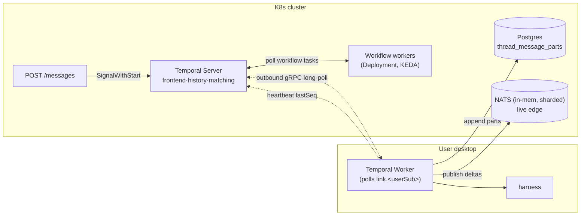

# Studio Chat — Architecture Proposals

## Purpose & how to read this

This is the companion to [`report.md`](report.md), the current-state analysis of the Studio chat dataflow and its `A1`–`I1` issue catalog. Where `report.md` documents how the system works today and where it hurts, this document proposes **target architectures** that meet the same requirements while leveraging the fact that we run on Kubernetes. It consolidates five previously separate proposals into one narrative: a shared foundation that every option builds (stated once), then five architectures discussed by what makes each *different* and what it costs.

Read it top-to-bottom for the argument, or jump to [The five architectures](#the-five-architectures), the [Master comparison matrix](#master-comparison-matrix), or the [Recommendation](#recommendation--the-hybrid).

## The problem in brief

A chat turn is **not** request/response. The browser `POST`s a message and immediately gets `202 {taskId}`; the work runs asynchronously in a durable DBOS workflow, and the assistant's output returns over **three independent channels** with different lifetimes and no shared cursor: an ephemeral in-memory JetStream live stream (`decopilot.stream.<taskId>`, 5-min `max_age`, single replica), best-effort sampled writes to Postgres `thread_messages` (the only durable record, saved every 5th step), and an org-wide SSE status hub. For the **local-link** case the agent doesn't run in the cluster at all — the cluster relays the run over NATS to a daemon on the user's NAT'd desktop (Claude Code / Codex), which runs the harness locally and streams back. Two cooperating pods are glued by NATS: a *dispatching pod* owns the workflow and reply inbox, a *gateway pod* owns the daemon's reverse-WebSocket.

The headline pain is concentrated in long-running sessions. Liveness is a **wall-clock reaper**: any run alive >30 minutes is force-failed (`A1`), and because a resume resets `startedAt`, a flapping run evades the reaper forever while holding the thread's only slot (`A2`, `A3`). The live transport is deliberately ephemeral — a disconnect >5 min finds an empty subject and the UI hangs silently, a NATS restart wipes every active thread's chunks, and a global 500 MB cap lets one org evict another's in-flight output (`B1`–`B4`). The durable record is sampled and best-effort, so the final message can vanish and side-effecting tool calls can run twice on resume (`C1`, `C2`). And recovery **re-runs** the turn from saved history rather than **re-attaching** to the still-running desktop daemon — spawning a second agent loop that races the first one's git workdir (`A5`, `C3`). The two-pod NATS seam, shared subjects, and the daemon carrying the user's full OAuth token round out the multi-tenancy and security gaps (`D`-, `E`-, `H`-class).

`report.md` traces these to five structural roots: **(1)** liveness is wall-clock, not progress; **(2)** the live transport is ephemeral and in-memory; **(3)** recovery re-runs instead of re-attaching; **(4)** three return channels with no shared cursor; **(5)** single-tenant assumptions in a multi-tenant backbone. Every architecture below is scored against these themes and the `A1`–`I1` catalog.

## Requirements & the four axes

Ten non-negotiable requirements fall out of the report. A target architecture must support:

1. **Async turn model** — `POST` returns `202 {taskId}` fast; the answer arrives out-of-band.
2. **Local-link to a NAT'd desktop** — reach an agent on the user's machine with no inbound port, and stream its output back.
3. **Durable per-thread serialization** — one turn at a time per thread (the git workdir is single-writer), and "you can always post."
4. **Hours-long sessions** — agent loops routinely outlast any fixed wall-clock cap.
5. **Resumable live stream** — reconnect after any gap and catch up with no silent loss.
6. **Re-attach on pod loss** — a cluster pod dying mid-run must not re-run the turn or spawn a second agent.
7. **Multi-tenancy & fairness** — per-org isolation and concurrency caps; no cross-tenant eviction or starvation.
8. **Human-in-the-loop + cancel** — tool-approval pauses and responsive cancellation.
9. **Runs on Kubernetes** — fits our existing K8s + Postgres + NATS platform.
10. **Testability** — the orchestration/liveness/recovery logic must be unit-testable, not integration-only.

The rebuild decomposes into **four independent axes**. The single most important meta-observation across all five proposals is that these do *not* have to be answered by one product — and the best real answer **mixes** them:

- **(a) Control plane / durable orchestration** — what owns the per-thread gate, run state, retries, and recovery (Temporal / Restate / Dapr / evolved-DBOS / a hand-rolled sticky-owner state machine).
- **(b) Local-link dispatch** — how a turn reaches a NAT'd desktop and how the result returns (a desktop that *pulls* work over a durable queue/lease vs. a cluster-owned reverse-tunnel that *pushes*).
- **(c) Stream-of-record** — the durable, cursor-addressed log that history, live view, and reconnect all derive from.
- **(d) K8s topology + testability** — sticky-shard owners vs. stateless workers + KEDA, CRD-per-run vs. not, and how much of the correctness story is unit-testable.

The strongest single signal in the entire analysis is that **all five proposals independently converge on the same answer for axis (c)** — a Postgres append-log as the record of truth, with a NATS live edge beside it. That shared answer has since been **revised** (see [`stream-of-record-spec.md`](stream-of-record-spec.md)): the durable record is `thread_message_parts` holding **completed message parts, not token-deltas**, and the live edge is **in-memory but per-org-sharded NATS** rather than a file-backed/persistent mirror. The convergence — and the "build axis (c) first" conclusion — stands; only the mechanics changed. The proposals still differ almost entirely on (a), (b), and (d), so the right framing is not "pick a proposal" but "pick the best option on each axis and compose them," which is exactly what the [recommendation](#recommendation--the-hybrid) does.

## Shared foundation — what every option does the same way

Because the five proposals share roughly 70% of their analysis, that shared substance is stated **once**, here. Each architecture section below describes only its *deltas* from this foundation.

### Stream-of-record (axis c) — revised, and the first thing being built

> **This foundation was revised and is now being implemented.** The authoritative design is [`stream-of-record-spec.md`](stream-of-record-spec.md); the summary below **supersedes** the original "every chunk is one append / file-backed JetStream R3 / one `seq` cursor" sketch. The revision splits the log by **durability**: completed message *parts* are durable in Postgres; transient token-*deltas* live only in NATS. See [Implementation status](#implementation-status) for what is coded today.

Every proposal still collapses the three return channels into **one cursor-addressed record of truth** — but the record holds **completed message parts, not token-deltas**. This genuinely fixes `C1`/`C2`/`C5` and keeps `B3`; it deliberately **relaxes** the live-stream guarantees (`B1`/`B2`/`B4` → 🟡, `B2` an accepted regression) in exchange for near-zero Postgres write amplification and operational simplicity. The design every proposal now shares:

- **Record of truth = Postgres `thread_message_parts`** (renamed from `run_events` to fit the `thread_*` convention and avoid colliding with the event-bus `events`/`event_deliveries` tables): `id` PRIMARY KEY (`<run_id>:<seq>`), `seq` (UNIQUE `(run_id, seq)`, monotonic per run), `org_id`, `thread_id` (FK → `threads` ON DELETE CASCADE), `run_id`, `message_id` (groups parts into one logical message), `role`, `kind`, `payload` jsonb, `payload_ref` (claim-check pointer, nullable), `metadata` jsonb, `created_at` (ISO text derived from durable order — **append-only, no `updated_at`**). Each *completed* part — `text`/`reasoning`/`tool_call`/`tool_result`/`file`/`error` plus a tiny per-message `finish` marker — is **one idempotent append** via `INSERT … ON CONFLICT (id) DO NOTHING`. A handful of rows per message (single-digit× `thread_messages`), **not** one per token (~100×). Run/turn status stays on `threads.status`; there is no separate "final" row — the message is the **fold of its parts**. No `% 5` sampling.
- **Token-deltas → NATS only (transient, loss-tolerant).** Streamed `text-delta`/`tool-input-delta`/reasoning chunks are published to the live edge and **never written to Postgres**. So there is **no append-before-emit and no hole-free-by-construction log** — the durable parts land independently and the client **self-heals** by reconciling live partials against durable parts keyed by `message_id` (durable unconditionally wins). The only completion-ordering retained: the `finish` part MUST commit to Postgres **before** the NATS subject is purged / the finish frame is emitted (`R3`).
- **Live edge = in-memory NATS, but sharded per-org.** `StorageType.Memory`, `max_age` ~5 min, `num_replicas: 1` — **not** file-backed R3 — while keeping the sharded subjects `CHAT.<shard>.<org>.>` (a fixed pool, orgs hashed to shards; ephemeral non-RAFT browser consumers under NATS's ~2k-HA-asset ceiling). Memory-only retention is the cost win; **sharding is the free isolation we keep** (closes `B3`). The residual: a full NATS restart wipes all in-flight deltas at once (`B2`), recovered when the next durable part lands.
- **Two-tier cursor.** No single unified `seq`: the durable cursor = last applied `thread_message_parts.seq`; the live cursor = last NATS/JetStream sequence. On (re)connect the client reads authoritative `threads.status` and mirrors the existing `deliverPolicy` logic — if `in_progress`, drain Postgres `WHERE run_id=? AND seq > pg_cursor` to the durable head **then** tail NATS; if terminal, load parts from Postgres and open **no** tail. The live view is a separate transient channel reconciled against the record, not derived hole-free from it; the DB is authoritative for the **result**.
- **Heavy payloads → claim-check.** Payloads over a threshold go to a **durable, retention-managed** object-storage bucket (object PUT confirmed **before** the row commits; row/partition deleted **before** the object is GC'd); the row keeps `metadata` + a `payload_ref` pointer. Reuses the existing `messagesRef` offload mechanism but on a durable bucket, not the 600 s transient TTL.
- **Gaps are arithmetic, not silent.** A missing `seq` is a sequence comparison → backfill from Postgres **if covered by a durable part**, else render the partial **as in-progress** and reload on the next part. Never present a truncated partial as finished. Deltas may be genuinely lost; the glitch is bounded to **≤ one step's worth** (`B4` → 🟡, mitigated, not killed).
- **Reads — fold-on-read; `thread_messages` is the frozen v1 archive.** v2 threads **never write** `thread_messages`; one `loadMessages` loader branches v1 (query the frozen `thread_messages`) vs v2 (windowed fold of `thread_message_parts` over the per-message `finish` anchors, `LIMIT/OFFSET`). **No maintained projection ⇒ no dual-write, no staleness.** Threads migrate by **versioning** (strangler-fig): a `message_storage_version` column pinned per thread, v1 frozen-never-deleted, v1→v2 by an idempotent **upgrade-on-touch** backfill at a turn boundary.

This is still the **recommended first move** under every proposal — it requires **no new engine**, de-risks the engine decision, and is the one axis all five share. It now ships a **genuinely durable result** (the C-class) rather than a clean B-class sweep; the live stream stays deliberately best-effort.

#### Implementation status

As coded on this branch, the **durable record-of-truth is functional end-to-end behind a default-off canary**, and progress-based liveness is live for **all** runs. What remains is the **live-edge half**, plus claim-check and partitioning:

- **Built (committed, unit/integration-tested):** migration `098` (`thread_message_parts` table + 4 indexes + `threads.message_storage_version`/`last_progress_at` — **not partitioned**); pure `foldParts`, `isRunStuck`, `detectGap`, `reconcileDurable`; `SqlThreadMessagePartStorage` (`appendParts` / `loadWindow` finish-anchor paging + fold / `backfillFromMessages`); and the **v2 read path** — `Memory.loadHistory` and the UI transcript reader both fork on `message_storage_version` and fold parts (the `R23` org predicate kept). Tests assert `C1`, `C2`, `C5`, `R8`, `R14`, `R18`, `A1`, `A2`, `B4`, `R5`, `R6` (`R16` is asserted in code comments, not yet test-covered).
- **Wired (working tree), behind the canary:** the **write path** — `dispatch-run` builds a `PartEmitter` for v2 threads that appends only *final* parts (stable per-part `seq`, idempotent `ON CONFLICT (id)`, `created_at = base + seq` for `C5`) at the `onStepFinish`/`onFinish`/`onError` hooks *instead of* the v1 `saveMessages`. The **v2 canary** (`STREAM_OF_RECORD_V2_PERCENT`, **default `0` = off**) pins `message_storage_version = 2` only on brand-new threads, so production stays v1 byte-for-byte until the knob is dialed up.
- **Wired (working tree), for ALL runs (not canary-gated):** progress liveness — a `~3 s` throttled `bumpProgress(taskId)` heartbeat wraps every run's stream, and the reaper now force-fails only when `isRunStuck` (idle `> 10 min` on `last_progress_at`), **replacing the 30-min wall-clock cap**.
- **Pending:** the **NATS live-edge changes** (memory-only/sharding retention, two-tier cursor, read-tier selection — `nats-stream-buffer` unchanged) and the **client reconciliation hookup** (`detectGap`/`reconcileDurable` are not yet wired into the SSE merge — `thread-connection` unchanged); **claim-check** offload (`payload_ref` stays null — "a later phase"); and **time-range partitioning**.

### Progress-based liveness

Every proposal **deletes the 30-min wall-clock reaper** and replaces it with a progress signal — a heartbeat or a throttled `threads.last_progress_at` timestamp bumped as progress arrives (a cheap HOT `UPDATE`, not a per-token write). The shared revision codifies this as a pure `isRunStuck(lastProgressAt, now, idleTimeoutMs)` predicate (built, and now wired into the reaper on this branch — a `~3 s` throttled `last_progress_at` heartbeat with a `10 min` idle timeout replaces the 30-min wall-clock cap; see [Implementation status](#implementation-status)). "Stuck" becomes *definitionally* "no progress past the idle deadline," not "old." This dissolves `A1` (legitimate hours-long runs heartbeat forever and never trip), `A2` (there is no `startedAt` for a resume to game), and `A4` (the idle deadline is continuous for the whole run, not just the first chunk). The mechanism's shape — a progress cursor checked by a sweeper, an engine timer, or a heartbeat timeout — is the only thing that varies.

### Desktop-as-pull-worker inversion (axis b)

Today the cluster *pushes* work to the desktop over a reverse-WebSocket owned by a *separate gateway pod* — the source of the NAT problem, the two-pod seam, `D1`/`D2`, and `H2`. Every proposal inverts the **chat-agent-loop leg** so the desktop **pulls** work from a per-user durable queue/lease over an **outbound-only** connection:

- It traverses NAT by construction (outbound only, no inbound port).
- The lease/connection is owned by *whoever holds the work* (the desktop), not a cluster pod — which dissolves the dispatch seam and makes the lease the **re-attach handle**.
- Auth refreshes **per pull**, killing the `D1` token-pin reconnect loop.

**The irreducible catch** (best named by P3): the daemon is *also* a bidirectional reverse-proxy for sandbox lifecycle (`POST/DELETE /api/sandboxes`) and the decopilot tunnel (cluster→desktop request/response where sandbox tools call *back* into the desktop). That leg is **not** queue-drainable, so a hardened reverse-tunnel survives for it under every engine. Best practice: invert the chat leg to pull; keep a per-request-auth reverse-tunnel only for the sandbox/tunnel leg.

### The irreducible truth about re-attach

This is the report's hard case (`A5`/`C3`), and **no engine eliminates it** — they only structure and bound it:

- **On CLUSTER pod loss**, a pull/lease model genuinely re-attaches. The agent loop runs *on the desktop*; when the cluster pod owning the workflow dies, the desktop keeps its lease and keeps streaming, and a surviving pod replays state and re-attaches. No re-run, no second loop, no workdir race. This is the clean win — but cluster-pod loss was never the report's hard case.
- **On DESKTOP/laptop death mid-turn**, **every option re-runs the turn.** LLM agent harnesses (Claude Code / Codex) cannot resume an in-flight turn in place, so a slept/crashed laptop's turn restarts from a resume cursor. The differences between proposals are only in how the re-run is *bounded*: a resume cursor (`lastSeq`/`MAX(seq)`), a fencing/supersede token, and — critically — **daemon-side idempotency** (run-dedupe keys + a `threadId`-scoped workdir lock) so committed tool side-effects and the git tree are not double-applied.

That daemon-side dedupe + workdir fence is **irreducible work the chosen engine does not supply, in any proposal.** Any reading of a proposal's headline as "no re-run, no workdir race" is false for the case that matters. Be explicit: the engine choice does not decide whether you build this — only how cleanly it bounds it.

### Multi-tenancy & security primitives (shared)

- **Daemon-scoped short-lived credentials** replace the user's full OAuth token (fixes `H3`, and the per-request-auth model fixes the `D1` token-pin loop on the inverted leg).
- **Per-org queue/stream scoping with broker ACLs** (NATS account-per-org + per-user subject permissions) replaces isolation-by-convention (fixes `H2`/`E1`/`E3`-adjacent).
- **`H1` (authz asymmetry — any org member can post to/stream another member's thread, but only the owner can cancel) is an org-policy/authz fix orthogonal to every engine choice.** It is a one-line change from org-member to ownership at the mutating entry points, shippable today, and **no proposal's engine should be credited with solving it.** The "single admission point" framing some proposals use is hygiene, not the fix; the ownership check is.

## The five architectures

Each section covers only the deltas from the shared foundation. Order: Temporal, Restate, K8s-native, Dapr, Postgres-first.

### 1. Temporal Durable Execution + Desktop-as-Worker

**Thesis.** *Buy* the control plane. One Workflow Execution per thread (`workflowId = thread:<threadId>`) *is* the gate; messages arrive as **Signals**, not new runs, so serialization and "you can always post" fall out for free. The agent loop is a single long-running **Activity** that runs on the user's desktop, because the desktop runs an embedded Temporal **Worker** that long-polls a per-user Task Queue (`link.<userSub>`) over an outbound gRPC connection. Activity **heartbeats** (carrying `lastSeq`) are the progress liveness signal that retires the reaper.

| Axis | Choice |
|---|---|
| Control plane | Temporal — entity workflow per thread; agent run as a heartbeating Activity; Signals for messages/approval/cancel; `continueAsNew` (signal-drained) for long threads |
| Local-link | Desktop-as-Temporal-Worker (PULL) — outbound gRPC long-poll on per-user task queue; heartbeat = lease; daemon-scoped API key / mTLS |
| Stream-of-record | Shared foundation (`thread_message_parts` parts-only record + in-memory sharded per-org NATS edge); token-deltas **never** enter Postgres or Temporal history |
| K8s + testing | Self-hosted Temporal on K8s (Helm) or Cloud pilot; stateless workflow workers + KEDA on task-queue lag; **`TestWorkflowEnvironment` time-skipping** |

**What it uniquely brings.** The most mature durable-execution engine, free cluster-pod re-attach via workflow replay, and — decisively — **deterministic time-skipping tests**: workflow timeout, approval-timeout, `continueAsNew`-signal-loss, and re-attach logic run in milliseconds, in-process, no Docker. This is the one axis where every other option is strictly worse.

**How it differs from the shared foundation.** The gate is a *workflow*, not a queue slot — and a turn on an already-running thread is just a Signal, so the canonical idempotency key is augmented by an **app-level signal dedupe** inside the workflow (the start-reuse policy doesn't fire for in-flight signals). Liveness is a Temporal `heartbeatTimeout` rather than a sweeper. The desktop participates as a **first-class Temporal Worker** (the only proposal where the laptop runs the engine SDK), making the heartbeat-as-lease and per-call auth refresh engine-managed. History/payload limits are hard (**2 MB payload, 50 MB / 51.2k-event history**), which *forces* token-deltas out of history — correct anyway, since deltas are NATS-only and heavy part payloads are claim-checked to object storage — and **mandates** `continueAsNew` with an explicit signal-drain to avoid the known message-loss footgun.



**Testability.** Best in class. The orchestration logic genuinely becomes Tier-1 unit tests. One must-know caveat: time does **not** skip *while an Activity executes*, so the "heartbeating run is not reaped" assertion drives the fake activity's own heartbeat loop rather than skipping wall-clock while it streams.

**Operational burden / new infra.** A full Temporal cluster (frontend/history/matching) + its own Postgres persistence + visibility store. SQL visibility avoids the Elasticsearch dependency initially; advanced search later needs ES. The honest cost surprise: **a server-reaching heartbeat is a billable Cloud Action** — at a 60 s `heartbeatTimeout`, ~75 Actions/hour/run for liveness alone, which *dominates* the bill for long-running threads. Mitigate with a longer timeout (same dial as cancel/idle-detection latency) or Local Activities (in-cluster only). The real **XL** is the embedded Rust-core SDK worker on every desktop (per-platform native binary, sleep/resume of in-flight long-polls, version skew), not the wire protocol.

**Tradeoffs & when to choose this.** Choose Temporal when stable run identity, free cluster-pod re-attach, and **first-class deterministic testability** around your own daemon-idempotency work are the load-bearing requirements — which for this system they largely are. Its TS SDK is strong (a real advantage given our Bun/TS stack). It does **not** win the desktop-death continuity case (it re-runs, bounded by `lastSeq` + daemon dedupe). Avoid it if you won't run/pay for a Temporal control plane, can't model the heartbeat-dominated Action cost, or want minimum new infrastructure.

### 2. Restate Virtual Objects + Durable Promises

**Thesis.** A **Virtual Object keyed by `threadId`** is the gate, the durable run record, the idempotency key, and the cluster-side recovery handshake — *all the same primitive*. Restate's runtime gives single-writer turn-based serialization per key for free. The desktop stays an **external resolver** (a NAT'd laptop can't be a dialable Restate service): it long-polls a per-user pull endpoint and resolves a single-shot **durable awakeable** for the terminal result.

| Axis | Choice |
|---|---|
| Control plane | Restate Virtual Object keyed by `threadId` (exclusive + shared handlers); `ctx.run` journals each side effect once; awakeable = durable suspend/resume |
| Local-link | Desktop long-polls a per-user pull endpoint + resolves awakeables via ingress; single-active-daemon via `LinkObject(userSub)` claim |
| Stream-of-record | Shared foundation (`thread_message_parts` parts + NATS-only deltas); awakeables are single-shot so the stream flows *beside* Restate |
| Liveness | **External progress sweeper** reads `threads.last_progress_at` (`isRunStuck`) and `ctx.cancel`s stuck runs; the suspended handler arms no timer |
| K8s + testing | Restate clustered StatefulSet (operator CRD) + stateless handlers + KEDA on invoke-rate; testcontainers + `stateOf`/`alwaysReplay`; **no time-skip** |

**What it uniquely brings.** The most *elegant* control plane: one primitive collapses four hand-built mechanisms (DBOS gate, idempotency key, orphan recovery, reply inbox). Lighter ops than Temporal — **no Elasticsearch**, single-binary local DX, built-in `Idempotency-Key` ingress dedup.

**How it differs from the shared foundation.** Liveness is moved **out** of the handler into an external sweeper precisely so that "suspended = zero compute" is literally true (an in-handler `ctx.sleep` loop would churn Restate's inactivity/abort timers and grow the journal per-tick). The desktop participates as a resolver, not a worker — it resolves a `doneAtSeq:N` awakeable (never the message body, keeping the journal small). The object's *shared* `status()`/`eventsSince()` handlers run concurrently with the exclusive run, so reads are never blocked even while a turn is in flight. `runId` is minted by the API pod and passed in (so an idempotency-deduped retry returns the same `runId`).

**Testability.** Real-runtime testcontainers spin an actual Restate server; `stateOf` reads durable object state and `alwaysReplay` proves replay-safety. But there is **no documented timer time-skip** (liveness is tested by driving the sweeper with a ~200 ms `IDLE_MS`), and the headline crash-resume test is a **self-built** stop/start harness, not a documented Restate feature. This is the one place Temporal is strictly better.

**Operational burden / new infra.** A **new quorum-replicated stateful system** (Bifrost segmented log + Raft metadata + RocksDB + S3 snapshots). Distributed mode is younger and less battle-tested than Temporal/Postgres; the MinIO-metadata-corruption footgun is a hard prod gotcha (use Raft metadata + real S3). The central operational bet: **Restate quorum loss = no resolves, no new submits = a full chat-control-plane outage** — arguably a *worse* blast radius than today's NATS soft-dependency (which only degrades streaming). A daemon-side buffer/pause contract keeps the durable record intact through an outage.

**Tradeoffs & when to choose this.** Choose Restate when you want re-attach (cluster path) + a single elegant primitive but cannot stomach Temporal's ops/ES/Cloud-cost, and lock-in aversion to the Temporal *model* is high. Its weaknesses vs. Temporal are purely testability (no time-skip) and blast radius. Like all five, it re-runs on desktop death — bounded here by `IDLE_MS` + a `threadId`-scoped workdir lock.

### 3. Kubernetes-Native: Sharded Sticky Owner + (optional) Run CRD

**Thesis.** Add **zero new stateful systems.** Consistent-hash each thread to exactly one **owning pod** in a `StatefulSet` (Istio ring-hash on `x-thread-id`, with an in-app ring as the authoritative tiebreak). That single move collapses the dispatcher+gateway two-pod seam *for the chat path*. Durable state moves to Postgres (`thread_message_parts` + a `runs` state machine + a `run_fence` table); the chat leg inverts to a JetStream **WorkQueue** the daemon pulls; and a Postgres **fence CAS** — not a runtime — provides single-activation.

| Axis | Choice |
|---|---|
| Control plane | Postgres-backed per-thread state machine owned by a sharded sticky pod; serialization via shard lease + `run_fence` CAS, not a runtime |
| Local-link | Chat-agent-loop = durable PULL WorkQueue (lease owned by the **daemon**); sandbox lifecycle + tunnel stay on the **existing reverse-WS** |
| Stream-of-record | Shared foundation (`thread_message_parts` + in-memory sharded NATS); ephemeral (non-RAFT) push consumers per browser tab |
| K8s + testing | `StatefulSet` owners + Istio ring-hash + KEDA(JetStream lag) + `preStop` drain + an explicit **307 ring-vs-Istio fence/redirect** protocol; fence/fold/clock units; re-attach is integration-only |

**What it uniquely brings.** The lowest external-dependency footprint of any *re-architecture* — it re-shapes Postgres, NATS, and K8s, the three systems already in production. The `run_fence` single-activation guarantee is plain SQL, fully under your control, and the most unit-testable correctness primitive of any proposal. `E1` per-org caps are application logic on `runs`, fully owned.

```mermaid
graph TB
  subgraph SS["StatefulSet mesh-owner (hash(threadId))"]
    O0["owner-0<br/>state machine + chat work producer<br/>+ reverse-WS(sandbox) + SSE + fold"]
    O1["owner-1"]
  end
  PG[("Postgres<br/>runs + run_fence + thread_message_parts")]
  WQ{{"JetStream WorkQueue<br/>(lease owned by DAEMON)"}}
  JSC{{"per-org CHAT stream (in-mem)"}}
  subgraph Desktop["Desktop — TWO transports"]
    DW["(1) PULL worker (chat)<br/>(2) reverse-WS (sandbox+tunnel)"]
  end
  O0 <--> PG
  O0 -->|enqueue chat work| WQ
  DW -->|pull + Ack (owns lease)| WQ
  DW -->|append part + fence_token| O0
  O0 <-->|reverse-WS frames| DW
  O0 --> JSC
```

**How it differs from the shared foundation.** Serialization is achieved by the **shard lease + `run_fence` CAS**, not a workflow engine: the daemon must hold the current `fence_token` to append a part; a redelivery to a fresh daemon CAS-claims a new token, atomically invalidating the old loop's writes (`409 Fenced`). Sticky routing is **soft affinity at the routing layer but deterministic at the write layer** — a mis-route gets a `307` to the authoritative owner or a fenced rejection, never silent dual-ownership. The **lease is owned by the daemon, not the owner pod**, so an owner-pod death does not trigger redelivery (the daemon keeps renewing). Liveness is a three-signal composite (a distinct harness **heartbeat**, not chunk-silence, so a quiet-but-alive deep tool call is never killed; a daemon-renewed `AckWait` lease; an `attempt`/flap counter to close the progress-spam keepalive evasion). The daemon runs **two transports** explicitly — `F1`/`D1` are "solved" only for the pull leg; the reverse-WS leg keeps the frame-split and token-pin until separately reworked.

**Testability.** Deterministic units for the fence CAS, the fold-on-read, and the injectable-clock sweeper — the fence (the property everything rests on) gets the most direct test. But **pod-death-during-Istio-reshuffle and redelivery-to-a-fresh-daemon are integration-only** (Toxiproxy); the highest-stakes re-attach property is not unit-proven.

**Operational burden / new infra.** No new vendor system — its biggest selling point and its biggest cost: **you build and own the hard parts** — the consistent-hash ring + membership watch, the 307 fence protocol and its split-brain edges, shard handoff, the `run_fence` CAS discipline, the fold-on-read loader, the flap counter, the heartbeat sweeper. the pull **WorkQueue** makes JetStream durably stateful (R3 + PVCs) while the chat live edge stays **in-memory**, plus a durable claim-check bucket for heavy part payloads; NATS stays a SPOF for *new dispatch* during an outage (in-flight runs keep persisting over HTTP). A **`Run` CRD for per-turn state is explicitly rejected** (etcd write-churn); CRDs are reserved for coarse, low-churn config (`MeshShard`/`LinkSession`).

**Tradeoffs & when to choose this.** Choose pure-K8s when the team has deep K8s/NATS/Postgres muscle and wants to *own* the machinery rather than run a vendor engine, and zero-new-vendor-surface is the dominant goal. The residuals stated openly: a bounded local-workdir window under partition (the fence guards the write path with certainty but can't stop a partitioned old desktop process from touching its own tree before its next append returns `409`); `A3`/`A6` head-of-line blocking is unchanged; and a true worker-level single-activation lease (which Temporal *would* give) is the one thing that would close the workdir window this design can only bound.

### 4. Dapr Workflows + Virtual Actors

**Thesis.** A per-thread **virtual actor** (`ThreadActor`) is the serialization gate (turn-based single-activation), owning a tiny critical section: accept a turn, record a start-intent, return — so the thread is *never locked*. A reconciliation reminder then starts a durable **Dapr Workflow** for the run (so the gate never blocks on `startWorkflow` latency). The workflow parks on `waitForExternalEvent("done")`; the agent loop runs in a **separate long-lived process** (desktop daemon or a stateless cloud-harness worker), never in a workflow activity. The desktop is **not** a Dapr node — it's a plain pub/sub subscriber over a WS bridge.

| Axis | Choice |
|---|---|
| Control plane | Dapr Workflow (`durabletask-go`) for the run; virtual actor `ThreadActor` for the gate + single-activation; `waitForExternalEvent`/`raiseEvent` for HITL + done; `terminate` for cancel |
| Local-link | Dapr pub/sub on a per-user topic; desktop is a plain subscriber + HTTP caller (no sidecar on the laptop) |
| Stream-of-record | Shared foundation (`thread_message_parts` parts, per-append; token-deltas NATS-only — no per-chunk durable write to batch) + a fast ephemeral sharded hint |
| K8s + testing | Dapr operator + sidecar injector + placement + scheduler; actor StatefulSet (placement) + stateless cloud-harness + KEDA; mockable contexts; **no TS time-skip** |

**What it uniquely brings.** The actor-as-gate / workflow-as-run separation is genuinely elegant, and **resiliency/retry/timeout/circuit-breaker become declarative YAML** (the Resiliency CRD) instead of hand-rolled code. Placement re-homes the actor on pod loss for cluster re-attach. Multi-language sidecar infrastructure if the broader platform wants it.

**How it differs from the shared foundation.** Two lifetimes are split explicitly: a *short* actor turn (two durable writes, fire-and-forget `startWorkflow` via a reconcile reminder so the gate never blocks on scheduler backpressure) and a *long* workflow. Liveness is a Dapr **reminder** re-armed as progress arrives (persisted in the scheduler, survives failover). The durable append is **per completed part** — "every part is one append" *is* the revised model, so the per-chunk write-amplification wall the old Dapr variant batched around is gone (token-deltas are NATS-only, never durable); on a crash the only loss is the transient deltas since the last durable part (the widened re-run window), never a flushed part or the final. Desktop re-attach requires a `supersede{runId, newToken}` signal that makes the daemon **kill its harness** before a second loop starts — callback-fencing alone is insufficient for `C3`.

**Testability.** Mockable `WorkflowContext`/`WorkflowActivityContext` and mock actors give in-process unit tests of transitions and gate logic. But the TS toolkit has **no time-skipping**, so the two most load-bearing properties — the progress reminder *fires* at the right time (`A1`/`A2`/`A4`) and a parked reminder *survives* placement re-home (`A5`) — are verified by wall-clock integration tests only. A real `R10` deficit versus Temporal.

**Operational burden / new infra.** The heaviest axis. **Five new control-plane services + a sidecar per pod**, and a net-*larger* dependency surface (NATS/Redis + 5 Dapr services + Postgres vs. today's NATS + DBOS + Postgres). Sharp edges that directly undercut the recovery guarantee being sold: Workflows went **GA only in 1.15 (Feb 2025)** with a scale rewrite in 1.16; the **TS SDK is materially less battle-tested than .NET**; the scheduler needs sized persistent storage (16Gi+, default 1Gi insufficient); a 1.14→1.15 upgrade **wiped the scheduler data dir**; and there is a documented bug class where **killing the scheduler pod under load orphaned running workflows** — *exactly the recovery property this proposal depends on*. Single-activation is not split-brain-proof, which is why the fencing token **and** daemon-side preemption are mandatory.

**Tradeoffs & when to choose this.** Choose Dapr **only when the broader platform independently wants K8s-native, declarative, multi-language sidecar infrastructure** — for *this* chat dataflow alone, the maturity risk and net-larger dependency surface make it the hardest to justify on the merits. Its `.NET/Go`-centric Workflows are a poor fit for our Bun/TS stack. The Phase-3 cutover must be hard-gated on verifying scheduler durability + scheduler-kill recovery in the pinned version, or the recovery guarantee should not be adopted.

### 5. Postgres-First Incremental Evolution (Hatchet or evolved-DBOS)

**Thesis.** The **lowest-migration** path. We already run DBOS (`@dbos-inc/dbos-sdk ^4.17.6`) on Postgres and NATS on K8s — keep that backbone and *evolve* it. The centerpiece is the shared-foundation `thread_message_parts` stream-of-record (shippable now, engine-agnostic). The thread-gate workflow is decomposed from one blocking step into a **short, time-sliced control loop** that publishes token-deltas to the NATS edge and appends completed parts to `thread_message_parts` (no per-chunk durable write); liveness becomes `threads.last_progress_at` staleness; recovery uses a trigger *we own*. **Hatchet** is named as the upgrade if `CANCEL_IN_PROGRESS` + dynamic per-org rate limits become hard requirements.

| Axis | Choice |
|---|---|
| Control plane | Evolved DBOS (Postgres-backed; partition keyed by `threadId`; short control loop publishing token-deltas to NATS + appending completed parts (no per-chunk journaling); `recv`/`send` for callback + HITL — **net-new to this codebase**). Upgrade: Hatchet |
| Local-link | Phase 1: keep reverse-WS, sticky-routed. Phase 6: desktop = JetStream WorkQueue pull-worker |
| Stream-of-record | Shared foundation (`thread_message_parts` parts; token-deltas NATS-only); any `writeStreamFromStep`-style mechanism feeds the transient NATS edge, not the durable store (which gets idempotent part appends) |
| K8s + testing | StatefulSet owners + hash-ring + KEDA(lag) + `preStop`; in-process DBOS + embedded-postgres + fake worker + injectable clock; cross-pod recovery integration-only |

**What it uniquely brings.** Zero new stateful control plane (no Temporal+ES, no Restate Raft+S3, no Dapr 5-service plane), the **lowest lock-in**, and **fully in-process tests**: DBOS is a library, so orchestration + liveness run in `bun test` against embedded-postgres with an injectable clock — the liveness/reaper class becomes a millisecond table test because the progress signal is *data*, not a wall clock.

**How it differs from the shared foundation.** Serialization stays a DBOS partition (concurrency 1) but the blocking step is **decomposed into a fixed, time-sliced control loop** — each ~2s slice drains token-deltas to the NATS edge (transient) and appends completed parts to `thread_message_parts` (idempotent, not a batched chunk `INSERT`), and the loop count reads only durable state (`MAX(seq)`, the slice's `finished` flag) so replay can't diverge. Between slices it polls `recv("control")`, bounding cancel/steer latency to ~2s *without* making each chunk a step. Liveness is a denormalized `threads.last_progress_at` column. Recovery is the proposal's **weakest** area, stated plainly: DBOS OSS `getPendingWorkflows` is `executor_id`-scoped, so a surviving pod will **not** auto-recover a dead pod's workflow — re-attach rests on **our own NATS-KV orphan-sweep invoking `/recovery`** on the successor, and the degraded fallback must be **fail-the-run, never re-dispatch** (a blind re-run reintroduces the `C3` workdir race).

**Testability.** Best for *liveness* (data-driven, injectable clock) and good for offset-resume logic via a fake desktop worker. But the in-process test mode has **one `executor_id`**, so the cross-pod recovery *trigger* is "trivially true" and only testable in the multi-pod Toxiproxy tier (the very reason the existing multi-pod tests are `.skip`ped). `R10` is *improved*, not solved in `bun test`.

**Operational burden / new infra.** The **lowest** of all proposals. Genuinely new surface: a durable, retention-managed claim-check object-storage bucket for heavy part payloads (the in-memory NATS live edge needs no R3 PVCs/quorum; later phases add a durable pull WorkQueue); the hash-ring + shard controller + the orphan-sweep recovery trigger (the recovery path is *our* code); write volume on two tables (~single-digit `thread_message_parts` rows per *message* — not per chunk — + ~1 `operation_outputs` row/slice). `recv`/`send` are **net-new** to this codebase (zero current usage) — a real new-primitive risk, not "evolved DBOS." Full `D1`/`H2`/`H3` and `E1` are honestly back-loaded to the XL Phase-6 pull-worker (which needs NATS account-server/JWT/resolver infra) and may never ship.

**Tradeoffs & when to choose this.** Choose Postgres-first when the team is small, ops appetite is low, and migration cost dominates. It ships ~80% of the user-visible wins (`C1`/`C2`/`C5` genuinely durable + `B3` + progress liveness; `B1`/`B2`/`B4`/`C6` mitigated, `B2` a deliberate accepted regression) on the existing stack with zero new stateful systems and the lowest lock-in — and its Phase 0/1 is *identical* to every other proposal's, so it is also the safe way to defer the engine decision indefinitely. The price is honest: cross-pod re-attach is 🟡 (rests on a trigger you own), `A3`/`A6`/`E1` need Hatchet or bespoke two-level queues, and non-idempotent **tool side-effects** (`C3`) are at-least-once (not exactly-once) — the committed parts are durable and idempotent, so `C1` itself is solved; it is re-run tool effects that still need keys + a daemon replay buffer.

## Cross-cutting tradeoffs

**Control-plane heft.** Temporal and Dapr are *heavy bought* control planes (a full cluster / a 5-service sidecar mesh); Restate is *lighter bought* (one quorum system, no ES); K8s-native is *built on infra you run* (own the ring + fence); Postgres-first is *stay where you are* (evolve DBOS, no new stateful system). The heft ranking, lightest → heaviest new operational surface: **P5 < P3 < P2 < P1 < P4.**

**Lock-in.** P5 lowest (incumbent stack), P3 low (your own code on existing infra), then P1/P2/P4 all high (each is a platform/model commitment, with P4 the broadest — a whole sidecar mesh).

**Language fit (we are Bun/TS).** This meaningfully separates the bought engines. **Temporal's TS SDK is strong and first-class** — a real advantage. **Dapr Workflows are `.NET`/Go-centric**; the TS SDK is materially less battle-tested and has no time-skip, which is precisely where this dataflow needs determinism. Restate is TS-native (single-binary, typed clients). P3/P5 are our own TS code throughout.

**Maturity.** Temporal high (battle-tested); P3 infra-mature but our fence is new code; P5 incumbent-mature but `recv`/`send` are net-new; Restate medium (distributed mode young); Dapr low-medium (Workflows ~1 year GA, weak TS SDK, scheduler-orphan bug on the exact recovery path we'd depend on).

**Ops cost & SPOF blast radius.** P5/P3 add no new control-plane SPOF (NATS stays a soft dependency; the durable *result* survives an outage — though with the in-memory edge a NATS restart now loses in-flight *live deltas*, `B2`, recovered on the next durable part). P2 makes Restate quorum loss a *full* control-plane outage (worse blast radius than today). P4 *adds* a placement/scheduler SPOF tier on top of a still-load-bearing NATS/Redis. P1 removes NATS from the recovery path (a genuine `D3` improvement) but adds the Temporal cluster.

**Migration-cost spectrum.** **P5 lowest** (value lands in P0–P3 on the incumbent stack; XL only if the Phase-6 pull-worker is pursued) → P3 (XL dual-stack + per-thread control-plane cutover) ≈ P2 (XL daemon dual-stack + control-plane rewrite) ≈ P1 (XL embedded SDK worker on every desktop) → **P4 highest** (XL gated on Dapr-maturity verification, atop the heaviest new infra). Crucially, **every proposal's Phase 0/1 is the same engine-agnostic stream-of-record**, so the cheap, high-value first slice is identical regardless of the eventual engine.

## Master comparison matrix

| | P1 Temporal | P2 Restate | P3 K8s-Native | P4 Dapr | P5 Postgres-First |
|---|---|---|---|---|---|
| **Control plane** | Temporal server (Postgres + SQL/ES visibility) | Restate cluster (Bifrost/Raft/RocksDB/S3) | None new — sticky owner on Postgres | Dapr (5 svcs + sidecars) | Evolved DBOS (in-Postgres lib); Hatchet optional |
| **Local-link** | Desktop = Temporal worker, **pulls** via gRPC long-poll | Desktop long-polls pull endpoint + resolves awakeable | Daemon **pulls** JetStream WorkQueue; reverse-WS kept for sandbox/tunnel | Daemon = pub/sub subscriber over WS bridge (no sidecar) | P1: reverse-WS sticky; P6: JetStream WorkQueue pull |
| **Stream-of-record** | `thread_message_parts` + in-mem sharded NATS edge | `thread_message_parts` + in-mem sharded NATS | `thread_message_parts` + in-mem sharded NATS | `thread_message_parts` (per-part) + in-mem sharded NATS hint | `thread_message_parts` + in-mem sharded NATS |
| **Key K8s primitive** | Stateless workflow workers + KEDA (task-queue lag) | Restate StatefulSet + stateless handlers + KEDA | Owner StatefulSet + Istio ring-hash + 307 fence + KEDA | Actor StatefulSet (placement) + stateless cloud-harness + KEDA | Owner StatefulSet + Istio ring-hash + KEDA |
| **Progress liveness?** | Yes — activity heartbeat cursor | Yes — external sweeper on `seq` | Yes — harness heartbeat + lease + flap-cap | Yes — actor progress reminder | Yes — `last_progress_at` staleness |
| **True re-attach on POD loss?** | ✅ (replay re-attaches to live activity) | ✅ (journaled awakeable re-attaches) | ✅ (daemon lease + fence + ring handoff) | ✅ (placement re-homes actor) | 🟡 (needs our orphan-sweep `/recovery` trigger) |
| **Re-run on DESKTOP death?** | Yes — bounded by `lastSeq` + daemon dedupe | Yes — checkpointed, bounded by `IDLE_MS` + workdir lock | Yes — redelivery, new fence, resume-from-cursor | Yes — re-run + supersede/fence | Yes — checkpointed resume from `MAX(seq)`; else fail-the-run |
| **Exactly-once-ish** | Idempotent part log; tool dedupe daemon-side | `ctx.run` journaled + `ON CONFLICT (id)` | Idempotent part append + `run:step` keys + fence | Idempotent per-part append (`ON CONFLICT (id)`); deltas NATS-only, no micro-batch to lose | `ON CONFLICT (id)` + fence; tool effects need keys |
| **Multi-tenant fairness** | Namespace-per-tier + concurrency caps | Sharded Postgres token-bucket | App caps on `runs` + NATS account/org | Sharded OrgGate + pub/sub scoping | Two-level org→thread queue; Hatchet for clean primitive |
| **New infra** | Temporal cluster + Postgres + (later) ES | +1 quorum system (Raft/RocksDB/S3) | No new stateful system (in-mem NATS edge — no R3 PVCs; + durable claim-check bucket; Istio) | +5 Dapr svcs + sidecar/pod | No new stateful system (in-mem NATS edge — no R3 PVCs; + durable claim-check bucket; later JWT infra) |
| **Testability** | Best — time-skip (activity-skip caveat) | Testcontainers + `stateOf`; **no time-skip** | Fence/fold/clock units; re-attach integration-only | Mockable contexts; **no TS time-skip** | In-process + injectable clock; cross-pod integration-only |
| **Migration cost** | XL (desktop SDK worker) | XL (daemon dual-stack + rewrite) | XL (dual-stack + gate cutover) | XL (gated on Dapr maturity) | L (value in P0–P3; XL only if P6) |
| **Lock-in** | High | High | Low | High | Lowest |
| **Maturity** | High | Medium | High infra / our-code risk on fence | Low-Medium | High; `recv`/`send` net-new |

**One hard caveat no option escapes:** *no option truly re-attaches on desktop/laptop death.* Every one re-runs the in-flight turn, bounded by a resume cursor + a fencing/supersede token + **daemon-side idempotency the engine does not supply.** The "re-attach" win each proposal sells is real but scoped to **cluster-pod loss**, which was never the report's hard case.

## Requirements-coverage heatmap

✅ solved · 🟡 mitigated · ⬜ unchanged · ❌ worse. Derived from each proposal's own coverage table with over-claims corrected (footnoted).

| Issue | P1 | P2 | P3 | P4 | P5 |
|---|---|---|---|---|---|
| **A1** reaper kills long runs | ✅ | ✅ | ✅ | ✅¹ | ✅ |
| **A2** resume-loop lockout | ✅ | ✅ | 🟡 | ✅¹ | ✅ |
| **A3** head-of-line blocking | 🟡 | 🟡 | 🟡 | 🟡² | 🟡 |
| **A4** no idle timeout after 1st chunk | ✅ | ✅ | ✅ | ✅¹ | ✅ |
| **A5** no re-attach (cluster pod) | ✅ | ✅ | ✅ | 🟡 | 🟡³ |
| **A5/C3** desktop-death continuity | 🟡⁴ | 🟡⁴ | 🟡⁴ | 🟡⁴ | 🟡⁴ |
| **A6** automation vs user starvation | 🟡 | 🟡 | 🟡 | 🟡 | 🟡 |
| **B1** 5-min ephemeral stream | 🟡¹⁵ | 🟡¹⁵ | 🟡¹⁵ | 🟡¹⁵ | 🟡¹⁵ |
| **B2** in-mem + 1-replica loss | 🟡¹⁶ | 🟡¹⁶ | 🟡¹⁶ | 🟡¹⁶ | 🟡¹⁶ |
| **B3** global cap cross-org eviction | ✅ | ✅ | ✅ | ✅ | ✅ |
| **B4** silent ordered-consumer gap | 🟡¹⁷ | 🟡¹⁷ | 🟡¹⁷ | 🟡¹⁷ | 🟡¹⁷ |
| **B5** swallowed pump failures | 🟡 | 🟡 | 🟡 | 🟡 | 🟡⁵ |
| **C1** final message can vanish | ✅⁶ | ✅ | ✅⁷ | ✅ | ✅ |
| **C2** sampled saves → dup side effects | ✅ | ✅ | ✅ | ✅⁸ | ✅⁹ |
| **C3** resume races desktop workdir | 🟡⁴ | 🟡 | 🟡 | 🟡 | 🟡 |
| **D1** daemon token reconnect loop | ✅¹⁰ | ✅ | 🟡¹¹ | ✅ | 🟡¹¹ |
| **D3** NATS SPOF / silent degradation | ✅ | 🟡¹² | 🟡 | 🟡¹² | 🟡 |
| **E1** no per-org rate limit | 🟡 | 🟡 | ✅¹³ | 🟡 | 🟡 |
| **H1** authz asymmetry | 🟡¹⁴ | 🟡¹⁴ | 🟡¹⁴ | 🟡¹⁴ | 🟡¹⁴ |

The **C-class durability is now the clean win** (`C1`/`C2`/`C5` ✅) precisely because all five build the *same* `thread_message_parts` parts-only record-of-truth — the strongest signal that this axis is settled and engine-agnostic. The **B-class is deliberately relaxed**: `B3` stays ✅ (per-org sharding retained), but `B1`/`B2`/`B4` are 🟡 — the in-memory edge keeps the live stream best-effort and a NATS restart loses in-flight deltas (`B2`, an accepted regression), self-healing when the next durable part lands. The remaining differences collapse to a single axis: cluster-pod re-attach (P1–P4 ✅, P5 🟡) vs. the irreducible desktop-death 🟡 that binds all five equally — now with a slightly *wider* re-run window, since part-granularity persistence replays everything since the last durable part.

**Footnotes (corrected over-claims):**

1. **P4 A1/A2/A4** — design solves them, but P4's own analysis admits the TS SDK has **no time-skipping**, so reminder firing and survives-failover are integration-tested only, never deterministically unit-tested. The weakest "solved" of the five; a real `R10` deficit.
2. **P4 A3** — P4 rates A3 "Solved" (the actor turn is short). True for *posting*, but execution of a queued turn still serializes behind the in-flight turn for workdir safety. Downgraded to 🟡 to match the honest universal verdict (post-always-succeeds, execution-still-serialized).
3. **P5 A5 (cluster pod)** — the only proposal without free cross-pod re-attach. DBOS OSS recovers only an executor's *own* pending workflows; re-attach rests on P5's orphan-sweep invoking `/recovery`. Honestly 🟡.
4. **A5/C3 desktop-death — 🟡 for ALL FIVE (irreducible).** No engine re-attaches a slept/crashed laptop's in-flight turn; all five re-run it, bounded by cursor + fence/supersede + **daemon-side dedupe the engine does not provide.**
5. **P5 B5** — P5 rates B5 "Solved"; the others rate the equivalent 🟡 mainly because metric wiring is still ours to build. A labeling difference, not a capability gap — all effectively 🟡.
6. **P1 C1 — now ✅.** Per-part idempotent appends (incl. the per-message `finish`) make the message durable; a lost `RespondActivityTaskCompleted` still triggers a turn re-run, but that is the desktop-death/`C3` window (the `A5/C3` row), not message loss.
7. **P3 C1 — now ✅.** Per-part durability makes the message durable; the terminal handoff is the `finish`-part-before-purge ordering (`R3`) — a harmless idempotent re-fold, not a vanish risk.
8. **P4 C2 — now ✅ for persistence.** Per-part idempotent appends; token-deltas are NATS-only, so there is no batched durable micro-batch to lose. Non-idempotent tool side-effects on re-run remain a daemon-dedup concern (`C3`).
9. **P5 C2 — ✅ for *persistence*** (per-part idempotent appends, no `% 5` sampling); the residual is non-idempotent *tool effects* (still need keys) — orthogonal to the durable record (`C3`).
10. **P1 D1** — solved *only if* the poll wrapper classifies `PERMISSION_DENIED` as terminal; the SDK poller retries it by default. The fix lives in our wrapper.
11. **P3/P5 D1** — solved for the *pull/chat* leg only; the retained reverse-WS leg keeps the token-pin failure mode until separately reworked.
12. **P2/P4 D3** — recovery moves off NATS, but P2 makes Restate a new control-plane SPOF (quorum loss = full outage, worse blast radius) and P4 *adds* a placement/scheduler SPOF tier atop a still-load-bearing NATS/Redis. Net dependency surface is larger — 🟡, not ✅.
13. **P3 E1** — "Solved" via app caps on `runs` at admission; defensible but it is application code the team owns, like everyone else's. Optimism, not mechanism.
14. **H1 — 🟡 (org-policy/authz, orthogonal to the engine) for ALL FIVE.** Fixed by changing the access check from org-member to ownership at the mutating entry points — a one-line policy change shippable today, independent of any control plane. No proposal's engine should be credited with solving it.
15. **B1 (all five) — now 🟡.** The *answer* survives past 5 min (durable part) and self-heals on reload; the *live stream* is still ephemeral, now loss-tolerant by design.
16. **B2 (all five) — 🟡, a deliberate accepted regression.** The in-memory edge (vs. the old file-backed R3) means a NATS restart wipes in-flight deltas; the result stays durable and only live smoothness degrades until the next durable part lands. Sharding still fixes the cross-org-eviction half (`B3` ✅).
17. **B4 (all five) — now 🟡.** Mandatory gap detection + reload-from-Postgres forbids truncated-as-final, but in-flight deltas can still be genuinely lost (glitch ≤ one step).

## Axis-by-axis state of the art

**(a) Control plane — best: Temporal; runner-up: Restate.** Temporal is the most mature durable-execution engine, gives free cluster-pod re-attach, and — decisively — ships `TestWorkflowEnvironment` time-skipping that makes the liveness/timeout/approval logic genuine Tier-1 unit tests (the one place every other option is strictly worse). Costs: a heavy cluster or heartbeat-dominated Cloud cost, the 2 MB payload cap, `continueAsNew` discipline. Restate is the lighter-ops runner-up (no Elasticsearch, single-binary DX, one primitive that *is* the gate + idempotency key + recovery handshake) but its distributed mode is younger and its quorum loss is a full-control-plane outage. Dapr is disqualified as a *primary* engine here by maturity; evolved-DBOS is the "no new engine" choice but lacks free cross-pod re-attach.

**(b) Local-link — best: desktop-as-pull-worker over a durable queue/lease; runner-up: reverse-tunnel (kept only where unavoidable).** The pull model traverses NAT by construction, makes the lease owned by whoever holds the work (the desktop), dissolves the two-pod seam, and enables per-pull auth refresh (killing `D1`). The irreducible catch: the sandbox-lifecycle / decopilot-tunnel leg is *not* queue-drainable, so a hardened per-request-auth reverse-tunnel survives for it regardless of engine. The desktop-death re-run + daemon-side workdir fence sits on top of *any* dispatch choice.

**(c) Stream-of-record — best: per-org Postgres `thread_message_parts` + in-memory sharded NATS edge; runner-up: Redis Streams resumable.** Settled, then revised (see [`stream-of-record-spec.md`](stream-of-record-spec.md)): all five land on a Postgres append-only record of truth — `thread_message_parts`, PK `id` = `<run>:<seq>` with `ON CONFLICT (id) DO NOTHING` dedupe and `UNIQUE (run_id, seq)`, storing **completed parts only** (token-deltas excluded) — beside an **in-memory, per-org-sharded NATS** live edge (ephemeral browser consumers) and a **two-tier cursor** (durable `seq` + live NATS sequence) for live/history/reconnect. There is **no append-before-emit**: the live view is reconciled against the record (durable wins by `message_id`), not derived hole-free from it; heavy part payloads are claim-checked to object storage. Redis Streams (`XADD`/`XAUTOCLAIM`) is the credible runner-up live edge; an engine-native stream (Temporal history / Restate awakeables / DBOS `streams`) is explicitly *not* viable (history limits / single-shot / no org scoping), and token-deltas are deliberately **not** persisted to Postgres in any form. **Build this first, before any engine decision.**

**(d) K8s topology — best: stateless workers + KEDA where the engine owns placement (Temporal/Restate); else sticky-shard owner + KEDA; reject CRD-per-run.** If a real engine owns placement, cluster workers are interchangeable stateless Deployments scaled by KEDA on task-queue lag — simplest and most elastic. With no engine, a sticky-shard owner StatefulSet (consistent-hash ring made deterministic by a Postgres fence + 307 redirect) collapses the seam but you own the ring/fence/handoff code. Dapr's actor-placement StatefulSet is the worst of both (can't be backlog-scaled without placement thrash). A `Run` CRD for per-turn state is rejected (etcd write-churn); CRDs are defensible only for coarse, low-churn config. Testability winner is unambiguously Temporal (time-skip).

## Recommendation — the hybrid

**Target: take the best-in-class option on each axis and compose them.**

- **(a) Control plane: Temporal** — entity workflow per thread (`workflowId = thread:<threadId>`), messages as Signals, the agent run as a heartbeating Activity. Bought, not built; free cluster-pod re-attach; best-in-class deterministic testing; strong TS SDK.
- **(b) Local-link: Desktop-as-Temporal-worker (pull)** over an outbound gRPC long-poll on a per-user task queue, with a hardened, per-request-auth reverse-tunnel retained *only* for the non-queue-drainable sandbox-lifecycle / decopilot-tunnel leg.
- **(c) Stream-of-record: per-org Postgres `thread_message_parts` record-of-truth (completed parts only) + in-memory, per-org-sharded NATS live edge for transient token-deltas**, reconciled by `message_id` (durable wins) over a **two-tier cursor** (durable `seq` + live NATS sequence); heavy payloads claim-checked; reads fold parts on read with `thread_messages` frozen as the v1 archive. *Engine-agnostic — built first.*
- **(d) Topology: stateless Temporal workflow workers + KEDA** (task-queue lag) in-cluster; desktop workers on user machines; SSE/status fan-out scoped per-org.

**Why this composition, against the requirements and the five themes:**

- **Theme 1 (liveness = wall-clock):** Temporal activity heartbeats are a true progress signal — `heartbeatTimeout` fails only when heartbeats *stop*, so legitimate hours-long runs never trip and there is no `startedAt` to game (`A1`/`A2`/`A4`).
- **Theme 2 (ephemeral transport):** owned by axis (c). The *result* is made durable via parts (the C-class win), while the live transport stays **deliberately** in-memory/best-effort — a conscious trade, not a clean fix (`B1`/`B2`/`B4` → 🟡, `B2` an accepted regression). Temporal's payload limits *force* token-deltas out of history anyway (they are NATS-only), with heavy part payloads claim-checked.
- **Theme 3 (re-run vs re-attach):** Temporal genuinely re-attaches on cluster-pod loss (the clean win). Desktop death still re-runs — bounded by the `lastSeq` heartbeat cursor + **daemon-side run-dedupe / workdir fence we build regardless of engine.** Honest, and no worse than any alternative.
- **Theme 4 (no shared cursor):** a **two-tier cursor** (durable `seq` + live NATS sequence) across live/history/reconnect, DB-authoritative for the result, the live view **reconciled** (not derived). Wins: `C1`/`C2`/`C5` ✅, `B3` ✅; `B1`/`B2`/`B4`/`B5`/`C6` 🟡 (`B2` an accepted regression).
- **Theme 5 (single-tenant backbone):** Temporal Namespaces (per-tier) + per-user task queues + daemon-scoped credentials + per-org **sharded** (in-memory) NATS subjects — which make per-org NATS-account ACLs *possible* (the scoping unit exists; enforcement is a separate change, so `H2` stays 🟡) + app admission caps (`E1`/`E2`/`H3` mitigated; `H1` fixed by the orthogonal ownership-authz change shipped independently).

### The single change to make FIRST

**Build the engine-agnostic stream-of-record (axis c) + progress liveness before any control-plane decision.** It is the only thing all five proposals agree on, the largest risk reduction available, and it makes the **result genuinely durable** — `C1`/`C2`/`C5` ✅ and `B3` ✅ — while consciously relaxing the live stream (`B1`/`B2`/`B4`/`C6` → 🟡, `B2` an accepted regression) **without committing to Temporal, Restate, Dapr, or anything.** It requires **no new engine**, de-risks every later phase (the engine choice becomes reversible because the durable record is shared and neutral), and ships user-visible value (no cross-org wipe, no lost answer, no silent truncated-as-final; the live stream stays best-effort and self-heals) on day one. *This work is underway — the durable record-of-truth, the v2 read fold, and progress liveness are built (the write path behind a default-off canary); the NATS live-edge half, client reconciliation, claim-check, and partitioning are pending (see [Implementation status](#implementation-status)).*

### Phased roadmap (from today's DBOS + NATS + JetStream)

| Phase | Scope | Ships value | Effort |
|---|---|---|---|
| **Phase 0 — Cheap hardening (engine-independent)** | Canonical idempotency key (`C4`); **ownership authz on POST/stream/cancel (`H1`)**; `isRetriable` terminal-vs-transient classifier killing the revoked-token loop (`D1` reverse-WS half); SSE reconnect jitter (`G2`); guard the request-leg frame split (`F1`). | Real fixes, zero architecture risk | **S** |
| **Phase 1 — Stream-of-record FIRST** | `thread_message_parts` append-log (idempotent `ON CONFLICT (id)`, parts only) + `threads.last_progress_at` + **in-memory sharded** per-org NATS edge + two-tier-cursor `GET /stream` backfill with gap detection + claim-check object storage for heavy payloads + **fold-on-read** loader with `thread_messages` frozen as the v1 archive + thread **versioning** (`message_storage_version`, upgrade-on-touch); **progress `isRunStuck` reaper replaces the 30-min wall-clock reaper.** Dispatcher still on DBOS but appends parts (and publishes deltas to NATS). Fixes `C1`/`C2`/`C5` + `B3` ✅ and `A1`/`A2` ✅; mitigates `B1`/`B2`/`B4`/`B5`/`C6` (🟡, `B2` accepted), `A4` (🟡 signal-only), `G3` — **engine-agnostic.** | The biggest single risk reduction; ships independent of any engine | **L–XL** |
| **Phase 2 — Temporal in-cluster (cloud/decopilot path)** | Stand up Temporal (Cloud pilot or self-host, SQL visibility); move the in-cluster run (cloud + decopilot) to a Thread Workflow + in-cluster `runAgentTurn` activity (Local Activities to cut heartbeat Actions). Local-link stays on DBOS+reverse-WS; shadow-run for parity. | Validates the control plane on low-risk traffic; re-attach for cluster pods | **L** |
| **Phase 3 — Desktop-as-Temporal-worker (local-link) + multi-tenancy** | Ship the embedded Temporal SDK worker in the link daemon (the real **XL**: per-platform native binary, sleep/resume of in-flight long-polls, version skew); cut local-link dispatch to the per-user task queue + heartbeat lease + daemon-scoped credential + **daemon-side run-dedupe / workdir fence** (the irreducible desktop-death mitigation); per-thread cutover at turn boundaries (one `threadId` never gated by two orchestrators). Retire the DBOS thread-gate, reaper, orphan sweep. Namespace-per-tier, NATS account/subject scoping, KEDA on task-queue backlog. | Full re-attach on pod churn + NAT-by-construction dispatch + scoped creds; completes `D1`/`H2`/`H3` | **XL** |

Phases 0 and 1 are the **value floor** — take them even if Temporal is never adopted. Phase 3 is honestly XL (the embedded SDK worker on every desktop, not the wire protocol). The desktop-death continuity mitigation (cursor + fence + daemon dedupe) is built in Phase 1/3 and is required under *any* engine, so it is not Temporal-specific risk — and matters slightly *more* now, since part-granularity persistence widens the re-run replay window (everything since the last durable part) vs. per-chunk.

## Dissent — when NOT the hybrid

The hybrid is the right default, but four credible cases flip the decision:

- **Postgres-First (P5) — when the team is small, ops appetite is low, and migration cost dominates.** It ships ~80% of the user-visible wins (`C1`/`C2`/`C5` genuinely durable + `B3` + progress liveness; `B1`/`B2`/`B4`/`C6` mitigated, `B2` an accepted regression) on the existing DBOS+NATS+Postgres with *zero new stateful systems*, deterministic in-process tests, and the lowest lock-in. The price: cross-pod re-attach is 🟡 (rests on a recovery trigger you own), `A3`/`A6`/`E1` need Hatchet or bespoke two-level queues, and `recv`/`send` are net-new DBOS surface. Its Phase 0/1 is *identical* to the hybrid's, so it is also a safe way to defer the engine decision indefinitely.

- **Restate (P2) — when you want re-attach + a single elegant primitive but cannot stomach Temporal's ops/ES/Cloud-cost.** The Virtual Object *is* the gate + idempotency key + recovery handshake, with no ES and a single-binary DX, TS-native. Prefer it when lock-in aversion to the Temporal model is high and you accept piloting a younger distributed runtime whose quorum loss is a full-control-plane outage. Its only weaknesses vs. Temporal are testability (no time-skip) and blast radius.

- **Pure-K8s sticky-owner (P3) — when the team has deep K8s/NATS/Postgres muscle and wants to *own* the machinery.** Zero new stateful systems, the chat seam collapses, and a Postgres-fence single-activation is fully under your control and fully unit-testable (plain SQL). Pick it when zero-new-vendor-surface is the dominant goal, the team is comfortable owning the ring + fence + handoff + the bounded local-workdir window, and the highest-stakes re-attach property being integration-tested (not unit-proven) is acceptable.

- **Dapr (P4) — only when the broader platform independently wants K8s-native, declarative, multi-language sidecar infrastructure.** Actor-as-gate / workflow-as-run is genuinely elegant, but for *this* chat dataflow alone the maturity risk (Workflows ~1 year GA, weak TS SDK, scheduler-kill-orphans-workflows, no TS time-skip) and the net-larger 5-service + sidecar surface make it the hardest to justify on the merits in isolation. It wins only if Dapr is being adopted platform-wide regardless.

## Decision checklist

Answer these; the answers pick the winner.

- **Expected peak concurrent threads / runs?** Thousands of mostly-idle long-polls favor an engine that owns placement (Temporal/Restate) over a sticky-owner StatefulSet you scale by hand (P3/P5).
- **What fraction of runs are multi-hour?** A high share makes Temporal's heartbeat **Cloud Action cost** material (model it *with* heartbeats included) and pushes toward self-host or a sweeper-based liveness (P2/P5).
- **Team experience — Temporal? Kubernetes/Istio internals? TS-vs-Go?** Strong Temporal → P1; strong K8s/NATS/Postgres + appetite to own distributed-systems code → P3; neither + DBOS already in the stack → P5. Weak TS-SDK tolerance rules out P4's recovery guarantee.
- **Self-host vs. managed-cloud appetite?** Managed-cloud-friendly → Temporal Cloud pilot (P1). Self-host-only with minimal new infra → P5, then P3. Willing to run one new quorum system but not ES → P2.
- **Tolerance for new infrastructure?** Zero new stateful systems → P3 or P5. One new system, no ES → P2. A full engine + (later) ES → P1. Five services + sidecars → only if Dapr is a platform-wide bet (P4).
- **How much does desktop-death continuity actually matter for your tools?** The pivotal question. *No* proposal eliminates desktop-death re-run — all bound it with cursor + fence + daemon dedupe (and the revised part-granularity persistence *widens* the re-run replay window vs. per-chunk, so the daemon-side fence + tool idempotency keys carry even more weight). If the agent's tools are **idempotent or cheaply re-runnable** (read-heavy, declarative, git-stash-clean), the irreducible 🟡 barely matters and the cheapest path (P5) is fine. If tools have **expensive non-idempotent side effects** (deploys, payments, irreversible external writes), invest hardest in the daemon-side workdir fence + tool idempotency keys (required under *every* engine) — and let *that*, not the engine brand, be where the effort goes.
