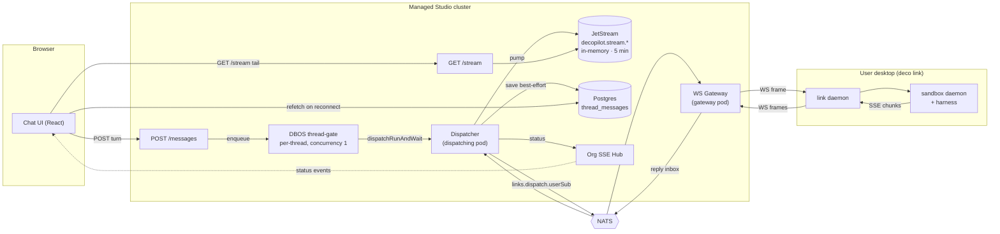
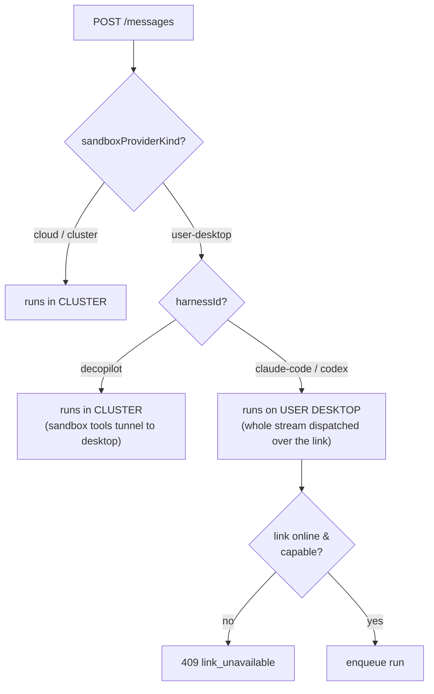
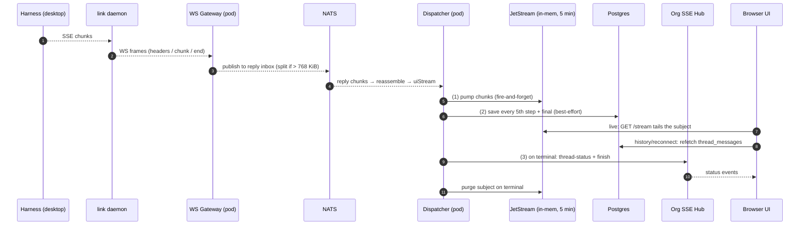
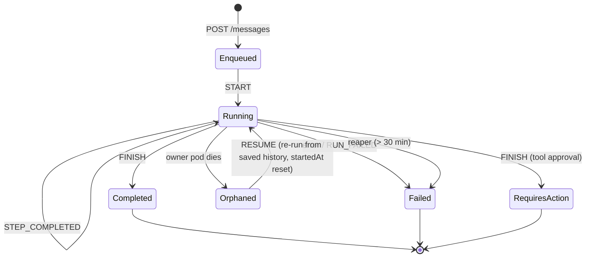
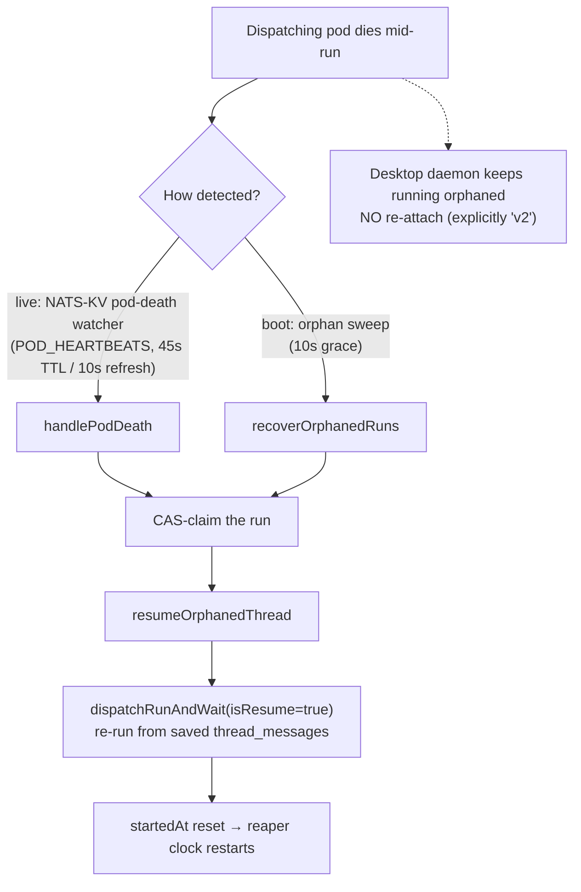

# Studio Chat Architecture — Current State

**Scope.** How a chat message travels from the browser, through the managed Studio cluster, to an agent harness, and back to the user — with a focus on the **local-link** deployment (the agent runs on the *user's own desktop* via the `deco link` daemon, e.g. Claude Code / Codex). It documents the live data flow as it exists today, the run lifecycle, the durability/recovery model, and the known sharp edges — with particular attention to **long-running sessions**.

> All component and line references point at `apps/mesh/` unless noted. This is a description of the current implementation, not a target design.

---

## 1. The big picture in one paragraph

A chat turn is **not** a request/response. The browser `POST`s a message and immediately gets back `202 {taskId}`; the actual work runs asynchronously inside a **durable DBOS workflow**, and the assistant's output comes back over a **completely separate** live channel. For local-link, the agent doesn't run in the cluster at all — the cluster relays the run **over NATS and a WebSocket** to a daemon on the user's machine, which runs the harness locally and streams output back. There are therefore **three independent return channels** (live stream, durable history, status events) and **two cooperating cluster pods** (one owns the workflow, one owns the user's WebSocket). Almost every rough edge below comes from the seams between these moving parts.

---

## 2. Components

| Component | Role | Lives in |
|-----------|------|----------|
| **Chat UI** | React app; POSTs turns, tails a live SSE stream, refetches history | `src/web/components/chat/store/thread-connection.ts` |
| **POST `/messages`** | Validates, pins thread config, resolves transport, enqueues the run, returns `202` | `src/api/routes/decopilot/routes.ts` |
| **DBOS thread-gate** | Durable per-thread workflow; serializes runs (concurrency 1) and blocks for the whole run | `src/dispatch-queue/thread-gate-workflow.ts` |
| **Dispatcher** | On the *dispatching pod*: publishes the run to NATS, awaits the reply stream | `src/links/dispatcher.ts` |
| **WS Gateway** | On the *gateway pod*: owns the daemon's WebSocket; bridges NATS ⇄ WS | `src/links/ws-gateway.ts` |
| **link daemon** | On the user's desktop: holds the WebSocket, reverse-proxies to the local sandbox | `src/link-daemon/*` |
| **sandbox daemon + harness** | On the user's desktop: runs the actual agent (Claude Code / Codex) | `packages/sandbox/daemon/*` |
| **JetStream stream buffer** | In-memory NATS stream carrying live UI chunks (`decopilot.stream.<taskId>`) | `src/api/routes/decopilot/nats-stream-buffer.ts` |
| **`thread_messages` (Postgres)** | The **only durable record** of the conversation | `src/storage/threads.ts` |
| **Org SSE Hub** | Pushes thread-status / finish events to all of an org's browsers | `src/event-bus/sse-hub.ts`, `nats-sse-broadcast.ts` |
| **RunRegistry** | In-memory per-pod run state machine + reaper + orphan recovery | `src/api/routes/decopilot/run-registry.ts` |
| **NATS** | The backbone: dispatch, reply inboxes, live stream, pod heartbeats, link claims | `src/nats/*`, `src/links/*` |

---

## 3. Topology



---

## 4. Transport selection

The thread's pinned `(sandboxProviderKind, harnessId)` decide *where the agent loop runs*. There are **three** outcomes, not two:



`resolveDispatchTarget` (`src/links/resolve-dispatch-target.ts`). This document follows the **`user-desktop` + `claude-code`** path (the local-link case). Link health is checked **up front**, so a `409` is returned before enqueue and DBOS can't silently reroute the run later.

---

## 5. Request path (browser → desktop harness)

```mermaid
sequenceDiagram
  autonumber
  participant UI as Browser UI
  participant API as POST /messages
  participant GATE as DBOS thread-gate
  participant DISP as Dispatcher (pod)
  participant NATS
  participant GW as WS Gateway (pod)
  participant D as link daemon
  participant H as Harness (sandbox)

  UI->>API: POST turn
  API->>API: validate org + model perms; pin harness/branch
  API->>API: resolveDispatchTarget (409 if link offline)
  API->>GATE: enqueueThreadRun (workflowID = idempotency key)
  API-->>UI: 202 {taskId}
  Note over GATE: workflow BLOCKS for the whole run,<br/>holding the per-thread slot (concurrency 1)
  GATE->>DISP: dispatchRunAndWait
  DISP->>DISP: claim run · status=in_progress · build uiStream
  DISP->>NATS: publish request to links.dispatch.userSub (+ reply inbox)
  NATS->>GW: deliver
  GW->>D: WS request frame
  D->>H: POST /dispatch (text/event-stream)
  H-->>D: data: ui-message-chunk ...
```

**What each step is doing.**

1. **POST `/messages`.** The handler validates the request (org membership, model permissions), then **pins** the thread's runtime on the first message: `(sandbox_provider_kind, harness_id, branch)` are written to the thread row and become immutable for that thread's life. It resolves the dispatch target, computes an **idempotency key** from the last message (`workflowID = thread-run:<taskId>:<key>`), enqueues the run, and returns `202` immediately. The HTTP response carries **no** assistant output.
2. **DBOS thread-gate.** `enqueueThreadRun` starts a durable workflow on a queue **partitioned by `threadId` with concurrency 1** — so a thread's runs are strictly serialized. Importantly, the workflow body **does not return when the POST returns**; its single dispatch step `await`s the entire run and **holds the partition slot the whole time**. The step is marked **non-retriable**: if the pod dies, DBOS records a clean failure instead of replaying (a replay would open a second dispatch racing the desktop's working directory).
3. **Dispatch setup.** `dispatchRunAndWait` → `prepareRun` claims the run in the RunRegistry (status → `in_progress`, emits a status SSE event), purges any stale chunks from the thread's JetStream subject, saves the user message, and builds the AI-SDK `uiStream`.
4. **NATS → desktop.** For the desktop case, the dispatcher publishes a `request` frame to `links.dispatch.<userSub>` **with a reply-inbox** and a **30 s first-reply timeout**. The **gateway pod** that owns the daemon's WebSocket is subscribed to that subject; it records `{reqId → reply inbox}` and forwards the frame down the socket. (Large message bodies are offloaded to object storage and replaced with a `messagesRef` first.)
5. **Daemon → harness.** The daemon reverse-proxies the request to the loopback sandbox daemon's `/dispatch`, which returns an SSE `200` immediately (satisfying the first-reply timer) and starts emitting `ui-message-chunk` / `error` / `done` events as the harness runs.

---

## 6. Return path (harness → browser) — three independent channels

The assistant's output **never travels back up the POST call stack.** It fans out into three channels.



- **Channel 1 — live transport (ephemeral).** Each chunk is pumped fire-and-forget into the in-memory JetStream subject `decopilot.stream.<taskId>`. The browser tails it through a **separate persistent `GET /stream`** connection. This subject is **in-memory, capped at a 5-minute `max_age`**, and purged when the run ends. It is for *live viewing only*.
- **Channel 2 — durable record (Postgres).** `saveMessagesToThread` upserts into `thread_messages`. This is the **only durable copy**. It is written for the user message, **every 5th step** (every step on resume), and the final message. The UI reconstructs history by **refetching `thread_messages`** on every reconnect — never from the live stream.
- **Channel 3 — control/status (org SSE hub).** When a run reaches a terminal state, the run-reactor updates the DB status, purges the JetStream subject, and emits `thread-status` + `finish` events to every browser in the org.

**Two pods, glued by NATS.** In the local-link case the *dispatching pod* (runs the workflow, owns the reply inbox) and the *gateway pod* (owns the daemon's WebSocket) are usually **different pods**, communicating only through NATS subjects. The daemon→gateway hop is the WebSocket; the gateway→dispatcher hop is the NATS reply inbox.

---

## 7. Run lifecycle



Liveness is bounded by an **in-memory reaper**: any run that has been `running` for more than **30 minutes** is force-failed (`MAX_RUN_AGE_MS`, swept every 5 minutes). Critically, **user-message runs are given no dispatch timeout by design** — the code reasons that agent loops routinely outlast any fixed cap — so the 30-minute reaper is the *only* backstop for them.

---

## 8. Durability & recovery model

When the pod running a workflow dies, the run is **recovered** (re-run), not re-attached.



Two detectors feed the same recovery path. Recovery **re-dispatches the agent loop from scratch** against the saved conversation — there is **no mechanism to re-attach to the still-running desktop daemon**; that is explicitly future work. The link claim (which daemon belongs to which user) lives in a separate NATS-KV bucket (`studio_links`, 60 s TTL).

---

## 9. Key timeouts & limits

| Setting | Value | Where |
|---------|-------|-------|
| POST `/messages` client timeout | **none** | `thread-connection.ts` |
| SSE keepalive | 15 s | `sse-keepalive.ts` |
| SSE reconnect backoff | 1 s → 30 s, **no jitter** | `thread-connection.ts` |
| Thread-gate partition concurrency | **1 per thread** | `thread-gate-workflow.ts` |
| Dispatch step retries | `retriesAllowed: false` | `thread-gate-workflow.ts` |
| User-message dispatch timeout | **unset (no cap)** | `thread-gate-workflow.ts` |
| Automation dispatch timeout | 5 min | `dbos-workflow.ts` |
| Dispatcher first-reply timeout | 30 s | `dispatcher.ts` |
| Dispatcher idle timeout (after 1st chunk) | **none** | `dispatcher.ts` |
| RunRegistry reaper | force-fail at **30 min**, swept every 5 min | `run-registry.ts` |
| JetStream stream | **in-memory**, `max_age` **5 min**, 500 MB total, 20k msgs/subject, discard Old, **1 replica** | `nats-stream-buffer.ts` |
| Max NATS publish (`MAX_PUBLISH_BYTES`) | 768 KiB | `nats/payload-chunking.ts` |
| Pod heartbeat (NATS KV) | TTL 45 s, refresh 10 s | `nats/pod-heartbeat.ts` |
| Link claim (NATS KV) | TTL 60 s | `links/link-claim-registry.ts` |
| Orphan boot-recovery grace | 10 s | `app.ts` |
| Daemon WS reconnect | 30 s cap, **maxAttempts = Infinity** | `cluster-connection.ts` |
| Access token TTL / refresh skew | 1 h / 60 s (user-scoped OAuth) | `get-valid-session.ts` |
| Sandbox bring-up chain | 5 s detect / 10 s config / 60 s adopt / 180 s ready / 5 min schedule (all hardcoded) | `packages/sandbox/server/*` |
| DBOS system-DB pool | default **5** per pod | `index.ts` |

---

## 10. Known issues & sharp edges

Severity: 🔴 high/critical · 🟠 medium · 🟢 low. **⏳ = especially bites long-running sessions.**

### A. Liveness & long-running sessions (the headline problems)

| # | Issue | Mechanism | Impact | Sev |
|---|-------|-----------|--------|-----|
| A1 | **30-min reaper kills legitimate long runs** ⏳ | User-message runs have no dispatch timeout by design, but the in-memory reaper force-fails any run > 30 min (`run-registry.ts`). | A multi-hour agent loop is killed as "reaped"; can't be extended; can't distinguish stuck vs. slow. | 🔴 |
| A2 | **Reaper evasion via resume loop → permanent thread lockout** ⏳ | `RUN_RESUMED` resets `startedAt = now` (`run-projector.ts:39`). A run that crashes & is recovered every < 30 min never ages into the reaper. | A flapping run (unstable daemon/network) holds the thread's only slot **forever** with no timeout. | 🔴 |
| A3 | **Head-of-line blocking on the thread** ⏳ | Thread-gate concurrency = 1; the workflow holds the slot until the run completes; there's no idle timeout (A4). | A single hung run **locks the user out of their own thread** — no new messages accepted — until it completes, the daemon recovers, or 30 min pass. | 🔴 |
| A4 | **No idle timeout after the first chunk** ⏳ | The dispatcher enforces 30 s only until the *first* reply; after that there's no idle deadline (`dispatcher.ts`). A daemon-WS close publishes a synthetic error, but a pure NATS partition does not. | The run hangs indefinitely; `uiStream` never closes; only the 30-min reaper (if not evaded) frees it. | 🔴 |
| A5 | **No re-attach across a pod handoff** ⏳ | Recovery re-runs from scratch with `isResume` (§8); there's no re-attach to the still-running desktop daemon (v2). | Lost live continuity + a **duplicate agent loop racing the orphaned daemon's git state** + ~5× DB write load on resume. | 🔴 |
| A6 | **Automation vs. user-message starvation** | Both share the per-thread gate; automations have a 5-min cap, user runs have none. The cap covers dispatch, **not** queue-wait. | A hung user run blocks automations on that thread indefinitely; time-sensitive automations miss their window. | 🟠 |

### B. Live streaming transport (ephemeral by design)

| # | Issue | Mechanism | Impact | Sev |
|---|-------|-----------|--------|-----|
| B1 | **5-min ephemeral live stream** ⏳ | JetStream subject is in-memory with a 5-min `max_age` (`nats-stream-buffer.ts`). | Disconnect > 5 min → reconnect finds an **empty subject** → the UI tails nothing and appears hung mid-stream, with no "you missed data" signal. | 🔴 |
| B2 | **In-memory + 1 replica → cluster-wide loss on NATS restart** ⏳ | `StorageType.Memory`, `num_replicas: 1`. | A NATS node restart drops **every active thread's** live chunks at once. Runs continue (DB is truth) but live UIs break. | 🔴 |
| B3 | **Global 500 MB cap → cross-org noisy-neighbor eviction** ⏳ | One shared stream, global `max_bytes` 500 MB, `DiscardPolicy.Old`, no per-org scoping. | A few chatty threads/orgs can evict *other* orgs' in-flight chunks → silent missing output for unrelated tenants. | 🔴 |
| B4 | **Ordered consumer silently self-resets on gaps** ⏳ | The tail uses an ordered consumer; on a sequence gap (overflow/eviction) NATS auto-recreates it and resumes at the next message — no error surfaced. | Chunk loss is **invisible**: the UI shows an incomplete response that looks complete. | 🟠 |
| B5 | **Pump failures swallowed** | Publish errors are sampled (1st + every 100th), fire-and-forget, no retry, **no metric**. | If NATS is unhealthy, live chunks silently vanish; only the periodic DB saves survive. | 🟠 |

### C. Durability & data consistency

| # | Issue | Mechanism | Impact | Sev |
|---|-------|-----------|--------|-----|
| C1 | **Best-effort saves; final message can vanish** ⏳ | `saveMessagesToThread` errors are logged, not retried; the run still transitions FINISHED and purges JetStream. | If the **final** save fails, the last assistant message is unrecoverable; the thread shows `completed` with a missing message. | 🔴 |
| C2 | **Sampled saves → lost work + duplicate side effects on resume** ⏳ | Normal runs save only every 5th step. On crash, up to 4 steps are unsaved; resume re-runs from the last save. | Tool calls with side effects (emails, writes, commits) can execute **twice**; the gap between saves is lost. | 🔴 |
| C3 | **Resume races the orphaned desktop daemon's workdir** ⏳ | Recovery re-dispatches the agent loop on (possibly) a new pod while the orphaned daemon may still be mutating the same working directory; no termination/lock handshake. | Git-state / file corruption from two agents editing the same tree. | 🔴 |
| C4 | **Idempotency key uses non-canonical `JSON.stringify`** | `computeIdempotencyKey` hashes `JSON.stringify(lastMsg)`; key order isn't canonicalized. | Two identical retries can hash differently → two DBOS workflows → duplicate tool calls / split context. | 🟠 |
| C5 | **Synthetic timestamps can reorder on resume** | Saved messages get `now + i` timestamps; multiple save calls + resume can interleave. | Messages can render out of conversational order after a resume. | 🟠 |
| C6 | **FINISH and purge+SSE are not atomic** | Non-transactional: DB update → purge (fire-and-forget) → status SSE → finish SSE. | A crash between steps drops the SSE finish, but DB status is authoritative so clients recover by refetch. Tolerant by design. | 🟢 |

### D. Connection, auth & recovery infrastructure

| # | Issue | Mechanism | Impact | Sev |
|---|-------|-----------|--------|-----|
| D1 | **Daemon token reconnect loops forever** ⏳ | Bearer is re-resolved per attempt, but transient refresh failures (network/5xx) are non-fatal and retried with `maxAttempts = Infinity`; only a 4xx (`invalid_grant`) stops it. | Past token TTL with refresh transiently failing, the daemon loops on a dead token (`401 → Expected 101 → 1006`). Over a dead network it can't tell "server down" from "revoked". | 🔴 |
| D2 | **Uncoordinated heartbeat vs. link-claim TTLs** | `POD_HEARTBEATS` (45 s) and `studio_links` (60 s) expire on independent clocks. | A gateway pod can die independently of run-owner detection → spurious `link_offline` / false orphan detection windows. | 🟠 |
| D3 | **NATS is a system-wide SPOF with silent degradation** ⏳ | Dispatch, reply inboxes, live stream, heartbeats, and link claims all run through NATS. When it's down, pod-heartbeat isn't created and orphan recovery is effectively disabled (`recoverOrphanedRuns` runs once at boot), yet readiness stays green (NATS is a "soft" dependency). | In a multi-pod outage, crashed pods' runs are never recovered and sit `in_progress` until reaped — while traffic keeps being routed. | 🔴 |

### E. Capacity, fairness & multi-tenancy

| # | Issue | Mechanism | Impact | Sev |
|---|-------|-----------|--------|-----|
| E1 | **No per-org/per-user dispatch rate limit** | Different threads run in parallel; the global DBOS pool defaults to 5 per pod; nothing caps an org's total in-flight runs. | One aggressive org can crowd out others' dispatch latency. | 🟠 |
| E2 | **SSE fan-out has no isolation** | `localEmit` iterates an org's listeners synchronously; cross-pod status uses a single global subject `mesh.sse.broadcast`. | A slow listener or a high-volume org can delay/stall status events for others. | 🟠 |
| E3 | **Shared offload bucket** | Body-offload objects live in one bucket; isolation relies on an `<orgId>/…` key prefix plus deployment-level S3 policy, not enforced at the bucket layer. | In a misconfigured multi-tenant deployment, offloaded request bodies (conversation context) are not isolated by bucket policy. | 🟠 |

### F. Payload limits

| # | Issue | Mechanism | Impact | Sev |
|---|-------|-----------|--------|-----|
| F1 | **Dispatcher request leg is unguarded** | `dispatcher.ts` publishes the request frame **without** `splitChunkData` (the response leg *is* split by `ws-gateway`). The code marks this a known follow-up. | A request frame > 768 KiB throws `MAX_PAYLOAD_EXCEEDED`, surfacing as a generic "dispatch timeout". Message bodies are mitigated by offload; large headers are not. | 🟠 |
| F2 | **Offload ref can expire before fetch** | Offloaded body refs have a ~600 s TTL; no daemon-side retry on a 404. | A message queued behind a long run (head-of-line, A3) for > TTL can have its body ref expire before the daemon fetches it. | 🟠 |

### G. Client UX

| # | Issue | Mechanism | Impact | Sev |
|---|-------|-----------|--------|-----|
| G1 | **POST has no timeout** | `fetch` has no `AbortSignal.timeout`; relies on browser/proxy reset. | A slow enqueue looks like a hung session with no diagnostic (the POST is idempotent, so a manual retry is safe). | 🟠 |
| G2 | **SSE reconnect backoff has no jitter** | Hand-rolled `min(1000·2^n, 30000)`. | A cluster-wide drop causes synchronized "thundering herd" reconnects on recovery. | 🟠 |
| G3 | **Chunk buffer leaks on initial-load failure** | If the initial history fetch throws, the catch path skips `drainChunkBuffer()`. | Buffered chunks re-render as **ghost messages** if the connection object is reused. | 🟠 |
| G4 | **`stop()` doesn't abort the live stream** | `stop()` aborts the POST and substream but not the SSE fetch (only `dispose()` does). | A hung SSE read survives "Stop" → leaked connection. | 🟠 |
| G5 | **No adaptive cold-start window** | 30 s first-reply timeout doesn't account for a 5–10 s+ cold sandbox bring-up; no retry. | A cold start that runs long shows a 30 s silent hang, then failure. | 🟠 |

### H. Security & trust boundaries (deployment-dependent — verify before relying)

| # | Issue | Mechanism | Impact | Sev |
|---|-------|-----------|--------|-----|
| H1 | **Authorization asymmetry on thread endpoints** | `POST /messages` and `GET /stream` authorize at **org-member** level (no ownership check; `validateThreadAccess` "does NOT enforce ownership" by its own docstring). `POST /cancel` requires **ownership** (`validateThreadOwnership`, `created_by === userId`). | Within an org, any member can post to / stream another member's thread; for a user-desktop thread the run targets the **owner's** desktop daemon, so a teammate's message executes on the owner's machine. Cross-org is still blocked by the org-scoped context. Whether intra-org sharing is intended is a product decision; the asymmetry with `/cancel` suggests the read/write paths may be under-restricted. | 🔴 |
| H2 | **NATS subjects rely on network isolation** | `links.dispatch.*`, reply inboxes, `decopilot.stream.*`, and the cancel broadcast aren't scoped by NATS account permissions in code. | On a shared NATS cluster without per-account permissions, NATS access implies cross-tenant visibility (dispatch bodies) and the ability to inject cancels. A hardening concern for self-host. | 🟠 |
| H3 | **Daemon bearer is the user's full OAuth token** | The daemon injects the user's OAuth access token (not a daemon-scoped credential) into sandbox requests; refresh keeps the same scopes. | A leaked daemon token grants the user's full cluster permissions (valid until refresh/expiry). | 🟠 |
| H4 | **Reverse-proxy path not fully validated** | The daemon validates the sandbox *handle* but concatenates the trailing path into the loopback URL unchecked. | Possible traversal to non-`/_sandbox` daemon endpoints, but loopback-scoped to the user's own machine. | 🟢 |

### I. Observability blind spots

| # | Issue | Impact | Sev |
|---|-------|--------|-----|
| I1 | **Silent/sampled failures with no metrics** | Swallowed saves (C1/C2), sampled pump errors (B5), silent ordered-consumer resets (B4), and the `reaped` force-fail reason all lack metrics/alerts — making the long-session failures above hard to diagnose in production. | 🟠 |

---

## 11. Themes — the structural roots

Most of the issues above trace back to a handful of design decisions:

1. **Liveness is a wall-clock reaper, not a progress signal.** A1–A4 all stem from "no per-run timeout + a 30-min absolute-age reaper that resumes can reset." Liveness that tracked *last-chunk progress* instead of absolute age would dissolve the lockout and evasion problems.
2. **The live transport is deliberately ephemeral and in-memory.** B1–B4 follow from a 5-minute, single-replica, globally-capped memory stream with loss-hiding consumers. The durable record exists (`thread_messages`) but is written best-effort and only sampled.
3. **Recovery re-runs instead of re-attaching.** A5 + C2 + C3 are the cost of "no stable run identity / no daemon-side dedupe." The detection scaffolding (heartbeats, orphan sweep, CAS-claim) is solid; the missing piece is *continuity*.
4. **Three return channels with different lifetimes and no shared cursor.** A single, durable, resumable, cursor-based stream-of-record would collapse B1, A5, C1, C6, and the client buffer issues into one model — and because DB status is already authoritative, the live view can be *derived* from the log rather than raced against it.
5. **Single-tenant assumptions in a multi-tenant backbone.** B3, E1–E3, and H1–H3 are all "shared resource / shared subject / shared credential, isolation by convention." They matter most for multi-member orgs and shared self-host NATS.

---

## Appendix — where to look

| Area | File(s) |
|------|---------|
| Chat client (POST + SSE tail + buffer) | `src/web/components/chat/store/thread-connection.ts` |
| POST `/messages`, `/stream`, `/cancel`, authz helpers | `src/api/routes/decopilot/routes.ts`, `helpers.ts` |
| Durable workflow / serialization | `src/dispatch-queue/thread-gate-workflow.ts` |
| Dispatch orchestration, saves, onFinish | `src/api/routes/decopilot/dispatch-run.ts` |
| Run state machine / reaper / recovery | `src/api/routes/decopilot/{run-registry,run-projector,run-reactor}.ts` |
| Transport selection | `src/links/resolve-dispatch-target.ts` |
| NATS dispatcher / gateway / payload split | `src/links/{dispatcher,ws-gateway}.ts`, `src/nats/payload-chunking.ts` |
| Live stream buffer (JetStream) | `src/api/routes/decopilot/nats-stream-buffer.ts` |
| Durable history | `src/storage/threads.ts`, `src/api/routes/decopilot/memory.ts` |
| Org SSE hub | `src/event-bus/{sse-hub,nats-sse-broadcast}.ts` |
| Heartbeats / link claims | `src/nats/pod-heartbeat.ts`, `src/links/link-claim-registry.ts` |
| Link daemon (desktop) | `src/link-daemon/*` |
| Sandbox daemon + bring-up | `packages/sandbox/{daemon,server}/*` |
| Token / session refresh | `src/cli/lib/get-valid-session.ts`, `src/oauth/token-refresh.ts` |
